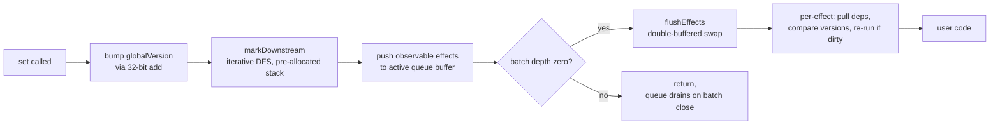
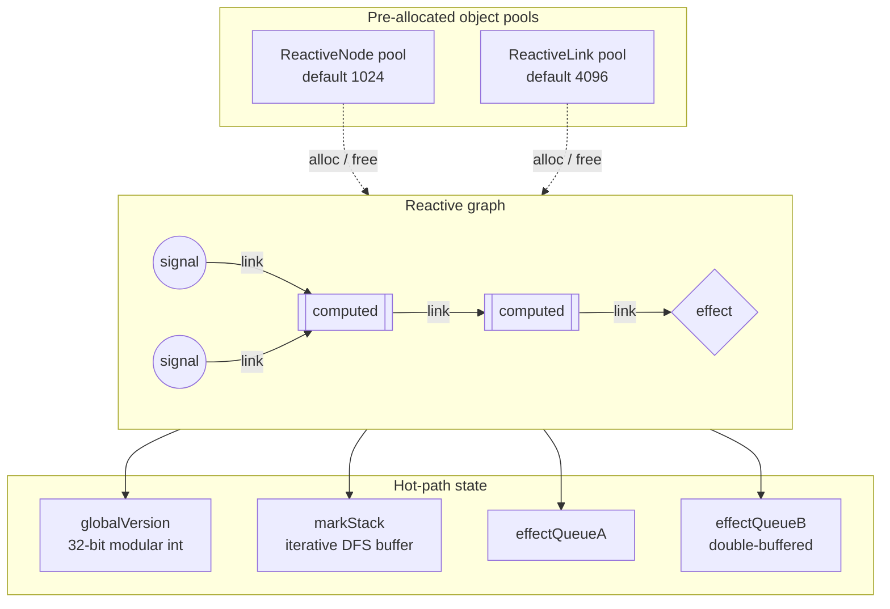
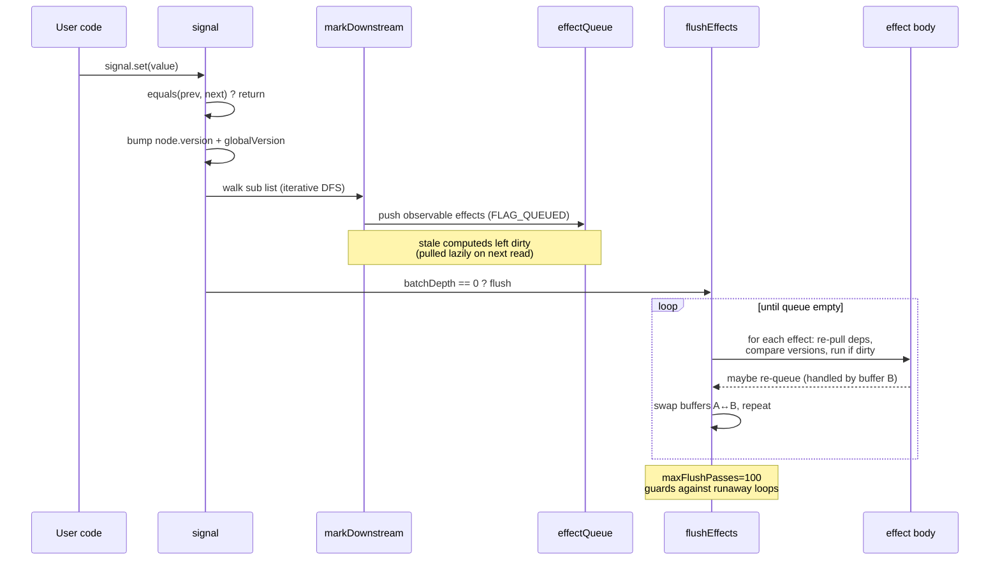
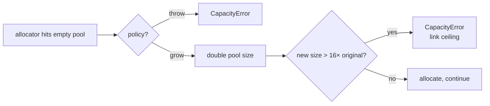

# @zakkster/lite-signal

> Zero-GC reactive graph for hot paths. Object-pooled nodes, versioned push-pull propagation, 32-bit modular epochs. Built for 16ms render budgets and 1MB extension bundles.

[](https://www.npmjs.com/package/@zakkster/lite-signal)
[](https://github.com/sponsors/PeshoVurtoleta)

[](https://bundlephobia.com/result?p=@zakkster/lite-signal)
[](https://www.npmjs.com/package/@zakkster/lite-signal)
[](https://www.npmjs.com/package/@zakkster/lite-signal)


[](./LICENSE)

```bash
npm install @zakkster/lite-signal
```

```js
import { signal, computed, effect, batch } from "@zakkster/lite-signal";

const count = signal(0);
const double = computed(() => count() * 2);

effect(() => console.log("double is", double()));
// → double is 0

count.set(21);
// → double is 42
```

Synchronous, glitch-free, push-pull. No microtask queue, no allocations after warm-up, no surprises.

---

## Table of contents

- [Why this exists](#why-this-exists)
- [What you get](#what-you-get)
- [The case for object pooling](#the-case-for-object-pooling)
- [Architecture in one diagram](#architecture-in-one-diagram)
- [How a write propagates](#how-a-write-propagates)
- [API reference](#api-reference)
- [Watchers](#watchers)
- [Capacity, growth, and the link ceiling](#capacity-growth-and-the-link-ceiling)
- [Edge cases pinned down](#edge-cases-pinned-down)
- [Benchmarks](#benchmarks)
- [Testing strategy](#testing-strategy)
- [What this is not](#what-this-is-not)
- [Ecosystem](#ecosystem)
- [Browser and runtime support](#browser-and-runtime-support)
- [Integration recipes](#integration-recipes)
- [Conformance](#conformance)
- [FAQ](#faq)
- [npm scripts](#npm-scripts)

---

## Why this exists

Reactive graph libraries are now table-stakes for UI work. They all do the same thing: track reads, mark dirty, re-run on change. The differences live in the hot path.

`lite-signal` was built under three constraints simultaneously:

1. **No allocation after warm-up.** A 60fps Twitch overlay can't tolerate GC pauses. `set`, `peek`, and re-runs touch no heap.
2. **Zero microtasks.** Effects flush synchronously in the same call stack as `set()`. There is no scheduler queue. Predictable cause-and-effect makes debugging tractable.
3. **Survive forever.** A multi-day extension session can issue billions of writes. Internal versions use 32-bit modular arithmetic — the engine never overflows.

Other libraries hit two of three. None of the ones I measured hit all three.



No microtask between `B` and `I`. No promise, no `queueMicrotask`. Just call stack.

---

## What you get

- **`signal(value, { equals? })`** — root reactive cell. `set`, `peek`, `update`, `subscribe`.
- **`computed(fn, { equals? })`** — memoized derivation. Lazy. Pulls deps on read.
- **`effect(fn, { scheduler? })`** — side-effect runner. Returns a dispose function.
- **`dispose(api)`** — universal disposal for signals, computeds, and effect handles. Cross-registry calls are silent no-ops.
- **`batch(fn)`** — defer effect flush until the outermost batch closes.
- **`untrack(fn)`** — read without subscribing.
- **`isTracking()`** — `true` iff a read right now would subscribe (for lazy-allocation wrappers).
- **`onCleanup(fn)`** — register teardown for the current computation. Works in effects *and* computeds.
- **`createRegistry(config)`** — isolated pool for tests, plugins, sandboxing.
- **`stats()`** — pool occupancy snapshot. Used by the demo and easy to wire into perf overlays.
- **`CapacityError`** — thrown when a fixed-size pool is exhausted under the `"throw"` policy.

Full type definitions ship in [`Signal.d.ts`](./Signal.d.ts) and are referenced from `package.json`. Every public symbol has JSDoc.

---

## The case for object pooling

<details>
<summary>Why pre-allocate: the GC math, and the per-op zero-allocation table.</summary>

A naive reactive library allocates one object per dependency edge, one per subscription, one per queued effect. With 1000 computeds × 1 update / frame × 60 fps, that's 60,000 short-lived objects per second. The major GC will catch up with you.

`lite-signal` solves this by pre-allocating two pools at startup — **nodes** (one per signal/computed/effect) and **links** (one per dependency edge) — and reusing them indefinitely. After the warm-up frames, the hot path performs zero allocations:

| Op                  | Allocations | Notes                                                                          |
| ------------------- | ----------- | ------------------------------------------------------------------------------ |
| `signal.set(x)`     | **0**       | Bumps a 32-bit version counter, walks pre-pooled link list                     |
| `signal.peek()`     | **0**       | Direct value read                                                              |
| Effect re-run       | **0**       | Cursor reuses existing links via `currentDep` pointer                          |
| `computed()` read   | **0** (steady-state) | Cache hit on `evalVersion === globalVersion`                          |
| Dispose             | **0**       | Returns nodes and links to the free lists                                      |

The free lists are singly-linked through a `nextFree` field on each pool object — `O(1)` pop, `O(1)` push, no fragmentation.

</details>

---

## Architecture in one diagram

<details>
<summary>Pools, the reactive graph, hot-path state, and the doubly-linked edge model.</summary>



Every reactive entity is a `ReactiveNode` with bit flags (`COMPUTED`, `EFFECT`, `QUEUED`, `COMPUTING`, `HAS_ERROR`). Every edge between two nodes is a `ReactiveLink`, doubly-linked along two axes:

- **`dep` axis:** `prevDep` / `nextDep` — the list of dependencies on the *target* node (so a computed/effect can iterate its inputs in stable order).
- **`sub` axis:** `prevSub` / `nextSub` — the list of subscribers on the *source* node (so a signal can iterate downstream observers during mark phase).

Doubly-linked on both axes means `O(1)` unlink during the cursor-based reconciliation that happens at the end of every computed/effect re-run.

</details>

---

## How a write propagates

<details>
<summary>The set → mark → flush sequence, and why computeds stay pull-based.</summary>



The mark phase is **iterative**, not recursive — it uses a pre-allocated `markStack` array so a 10,000-node fan-out can't blow the JS call stack.

The flush phase uses **two queue buffers** (`effectQueueA` / `effectQueueB`) alternating each pass. An effect that writes during its own re-run gets re-queued into the *other* buffer, which is then processed in the next pass. After `maxFlushPasses` (default 100), the loop throws `CycleError`.

Computeds are **pull-based** — they're not in the effect queue. Reading a computed walks its dep list, recursively pulls upstream computeds, and only re-runs if any dep's version is greater than its own `evalVersion`. The version comparison uses 32-bit modular arithmetic: `((dep.version - evalVer) | 0) > 0`. This is the trick that makes the engine immune to integer overflow during long-running sessions.

</details>

---

## API reference

### Top-level

```ts
import {
  // Core
  signal, computed, effect,
  batch, untrack, onCleanup, isTracking,
  // Registry / lifecycle
  createRegistry, setDefaultRegistry, dispose, destroy,
  stats, CapacityError,
  // Introspection (1.1.4 / 1.1.5 / 1.2.1)
  hasObservers, observeObservers,
  forEachObserver, forEachSource,
  nodeId, describe,
  forEachOwned, ownerOf,        // 1.2.1
  // Debug hook (1.2.1)
  onGraphMutation,
  // Watchers
  watch, when, whenAsync,
} from "@zakkster/lite-signal";
```

The top-level functions route to a default registry created on import. For isolated sandboxes (tests, plugins, multi-tenant SDKs), use `createRegistry` directly.

### Signal

```ts
const s = signal(initial, { equals?: (a, b) => boolean });

s();              // tracked read
s.peek();         // untracked read
s.set(value);     // notify downstream
s.update(fn);     // s.set(fn(s.peek()))
const off = s.subscribe(value => { ... });
off();            // unsubscribe
```

`equals` defaults to `Object.is` (so `NaN` notifies once, `-0`/`+0` are distinct). Pass `() => false` to force every write to propagate, or your own deep-equal to skip redundant updates.

### Computed

```ts
const c = computed(() => s() * 2, { equals?: (a, b) => boolean });

c();              // tracked read, lazy evaluation
c.peek();         // untracked read, may still compute
const off = c.subscribe(value => { ... });
```

Computeds **cache by version**, not by value. Reading a clean computed (one whose dependencies haven't changed since its `evalVersion`) is `O(deps)` — it still walks the dep list to check versions, then returns the cached value. The `equals` option short-circuits downstream propagation when the new computed value matches the old.

### Effect

```ts
const dispose = effect(() => {
  console.log(s());
  onCleanup(() => { /* fires on next run + final dispose */ });
}, {
  scheduler?: (runEffect) => void  // optional, see below
});

dispose();
```

Effects run **once eagerly** on creation, then again whenever any tracked dependency changes. Dispose returns the node to the pool. If a scheduler is provided, the runner is handed to the scheduler instead of executing inline — useful for batching reactive updates into requestAnimationFrame, microtasks, or your own frame loop.

### Batch

```ts
batch(() => {
  s1.set(1);
  s2.set(2);
  s3.set(3);
}); // effects flush exactly once at the end
```

Nestable. Effects only flush on the outermost close.

### Untrack

```ts
const value = untrack(() => s());  // read without subscribing
```

Useful inside computeds/effects when you need a current value but don't want it as a dependency.

### isTracking

```ts
function makeLazyField(initial) {
  let s = null, value = initial;
  return {
    get() {
      if (isTracking()) {
        if (s === null) s = signal(value);   // allocate only when subscribed
        return s();
      }
      return value;
    },
    set(v) { value = v; if (s !== null) s.set(v); }
  };
}
```

Returns `true` iff a read right now would record a dependency on the current registry — an observer body is on the stack AND tracking is enabled. Mirrors the engine's own read-trap check (both flags), so it correctly returns `false` inside `untrack`, inside `subscribe` callbacks, inside `onCleanup` bodies, inside `watch` / `when` callbacks, and outside any observer.

For wrapper libraries (lite-store, lite-query, lite-form) gating lazy allocation on the read path. Per-registry — call `registry.isTracking()` if your signals live in a non-default registry.

### Observer-lifecycle introspection

```ts
// Start a ticker only while something is actually watching a derived value.
const now = signal(performance.now());
const unobserve = observeObservers(now, {
  onConnect:    () => startRAF(),   // 0 → 1 observers
  onDisconnect: () => stopRAF(),    // 1 → 0 observers
});

hasObservers(now);                  // O(1): is anyone subscribed right now? (a peek doesn't count)

// Walk the live graph in either direction (lite-devtools):
forEachObserver(sum, d => console.log(d.kind, d.value));  // subscribers of `sum`
forEachSource(sum,   d => console.log(d.kind, d.value));  // dependencies of `sum`

// 1.2.1: walk the owner tree (cascade-disposal domains)
forEachOwned(effectHandle, d => console.log(d.kind, d.id));  // observers this one will cascade-dispose
ownerOf(innerComputedDesc);                                  // descriptor of the enclosing effect/computed
```

Eight functions (top-level + per-registry) — four in 1.1.4, two in 1.1.5, two more in 1.2.1 — for auto-pausing wrappers and graph inspection:

- **`hasObservers(handle)` → `boolean`** — O(1) (`node.headSub !== null`). The auto-pause predicate.
- **`observeObservers(handle, { onConnect?, onDisconnect? })` → `unobserve`** — fires on the 0→1 and 1→0 observer transitions *after* registration (transition-only — no immediate fire if already observed). Re-tracking a persistently-read source does **not** churn. This is the hook `lite-time` / `lite-raf` use to run a clock only while a derived value is watched. Throws `TypeError` on a non-handle.
- **`forEachObserver(handle, fn)` / `forEachSource(handle, fn)`** — walk subscribers / dependencies; `fn` gets a `{ id, kind, value }` descriptor (`kind` ∈ `"signal" | "computed" | "effect"`; `id` added in 1.1.5). No-op on a non-handle.
- **`nodeId(handle)` → `number | undefined`** *(1.1.5)* — the node's stable per-allocation id; the dedupe key for graph traversal. `undefined` on a non-handle.
- **`describe(handle)` → `{ id, kind, value } | undefined`** *(1.1.5)* — the handle's own descriptor. **Re-walkable**: pass it back into any `forEach*` to recurse the graph. `undefined` on a non-handle.
- **`forEachOwned(handle, fn)`** *(1.2.1)* — walk this node's owned children (lifetime-binding edges from the 1.2 owner tree). The dep/sub edges show DATA FLOW; the owner edges show LIFETIME BINDING — when this handle re-runs or is disposed, every owned child is cascade-disposed. No-op on a non-handle, top-level handle with no children, or stale handle.
- **`ownerOf(handle)` → `{ id, kind, value } | undefined`** *(1.2.1)* — descriptor of `handle`'s owner, or `undefined` for top-level / stale handles. The inverse of `forEachOwned`: walks UP the owner tree.

The surface is gated by an internal lifecycle counter: when nothing is being observed, the hot path adds a single branch-predicted `count !== 0` check in link alloc/free and nothing else — **zero steady-state cost when unused**.

#### Stale-handle guard (1.2.1)

The 1.2.0 owner tree makes the engine recycle pool slots autonomously: when an effect or computed re-runs, every observer it created in its previous body is cascade-disposed. **Holding a stale handle stopped being a user error and became routine.** Pre-1.2.1, the introspection surface plus `peek()` resolved `NODE_PTR` ungated and would happily report the recycled slot's NEW resident — wrong id, wrong value, wrong edges.

1.2.1 generation-checks every entry point that resolves a handle (the same ABA discipline `dispose()` always had):

- `nodeId`, `describe`, `hasObservers`, `forEachObserver`, `forEachSource`, `forEachOwned`, `ownerOf`, `signal.peek()`, `computed.peek()`, `signal()`/`computed()` read, `signal.set()` → return `undefined` / are no-ops on stale handles.
- `observeObservers` throws `TypeError` (matching the existing non-handle contract).

Descriptors returned by `describe()` and the `forEach*` walkers are themselves gen-stamped, so the documented "descriptors are re-walkable handles" contract survives the guard: a fresh descriptor walks, one held across a recycle correctly goes stale.

### onGraphMutation (1.2.1)

```ts
// Push-based devtools / studio integration. Single listener, allocation-free dispatch.
const unsub = onGraphMutation((opcode, intA, intB) => {
  switch (opcode) {
    case 1: devtools.onNodeCreate(intA, intB);  break;   // intA = node.id, intB = node.flags
    case 2: devtools.onNodeDispose(intA);       break;   //   ditto (cascade-disposed children included)
    case 3: devtools.onLinkAdd(intA, intB);     break;   // intA = source.id, intB = target.id
    case 4: devtools.onLinkRemove(intA, intB);  break;
    case 5: devtools.onRecompute(intA);         break;   // before each effect re-run / computed re-eval
  }
});

// Stop listening — restores the previous registration (or null), engine returns to zero-cost state.
unsub();
```

A registry-level (and top-level) debug hook for push-based tooling — the connection point lite-devtools 1.1 and lite-studio 1.1 use to walk away from polling. Single nullable listener; every fire point in the engine is one `if (mutationHook !== null) mutationHook(opcode, intA, intB)`:

- **Zero cost when unregistered** — branch-predicted null check per mutation point, same as the lifecycle counter pattern.
- **Allocation-free when registered** — three integers, no objects, no closures. Worst-case measured cost on a dynamic-retracking torture loop (11.4M events over 400K writes) is +29% — a debug-mode tax proportional to event volume, paid only while a consumer is attached.
- **LIFO stacking** — `onGraphMutation(a); onGraphMutation(b); unsubB()` restores `a`. Used by lite-devtools 1.1 to multiplex multiple consumers behind one engine registration.

**Listener contract: observe only — never throw, never mutate the graph from inside.** The hook fires synchronously inside mutation points; mutating from the callback corrupts the in-flight operation. Wrap any downstream work that could touch the registry in a microtask.

### onCleanup

```ts
effect(() => {
  const id = setInterval(tick, 100);
  onCleanup(() => clearInterval(id));
});
```

Registers a teardown for the *current* computation. Fires before every re-run and once on dispose. Supports multiple cleanups per scope (they're stored as a flat list, run in registration order). Works inside computeds too — useful for canceling async work when memos become stale.

### dispose

```ts
const s = signal(0);
const c = computed(() => s() * 2);
const e = effect(() => { /* ... */ });

dispose(s);   // signal → returns the node to the pool
dispose(c);   // computed → same, also unlinks its upstreams
dispose(e);   // effect handle → identical to calling e()
```

One function for all three primitives. Idempotent. Cross-registry calls are silent no-ops — each registry holds a private `Symbol("node_ptr")` keyed on its own nodes, so passing a signal from registry A to `registry B.dispose()` won't corrupt either pool. Passing an unrelated value (`null`, `42`, `{}`) is also a safe no-op. Passing an arbitrary function invokes it (the effect-handle contract).

The effect dispose handle (`const dispose = effect(...)`) is still a plain function — you can call it directly. `dispose()` exists to unify the call site when you're managing a heterogeneous bag of reactive resources, which is the common case for component teardown and tests.

### createRegistry

```ts
const r = createRegistry({
  maxNodes:          1024,       // default
  maxLinks:          4 * 1024,   // default = maxNodes * 4
  maxFlushPasses:    100,        // default
  onCapacityExceeded: "throw"    // default. Other: "grow"
});

const s = r.signal(0);
const e = r.effect(() => s());
r.destroy();                     // reset all pools, invalidate generations
```

`createRegistry` is the unit of isolation. Two registries share no state — useful for multi-tenant code, plugin sandboxes, and tests that need a fresh world.

`setDefaultRegistry(r)` swaps the registry used by top-level helpers. Use sparingly; intended for test setup.

---

## Capacity, growth, and the link ceiling

<details>
<summary>Pool sizing, the grow policy, and why there is a 16× link ceiling.</summary>

The engine has two pool sizes: **nodes** and **links**. Both are fixed at registry creation but can be configured to grow.



Why a ceiling? Unbounded growth hides leaks. If your app reaches 16× its starting link capacity, something is wrong and you want to know — `CapacityError` is louder than a slow OOM crash four hours later.

Default sizing for a Twitch-extension-style budget:

| Workload                            | maxNodes | maxLinks | policy   |
| ----------------------------------- | -------- | -------- | -------- |
| Tiny widget (≤50 reactive cells)    | 256      | 1024     | `"throw"` |
| Standard overlay (~500 cells)       | 1024     | 4096     | `"throw"` |
| Heavy dashboard (variable scale)    | 2048     | 16384    | `"grow"`  |

`stats()` reports `signals`, `computeds`, `effects`, `activeLinks`, `pooledLinks`, `linkPoolCapacity`. Drop it on screen for live observability.

</details>

---

## Watchers

`@zakkster/lite-signal` ships three composable watcher primitives, all built from `effect` + `untrack` — no engine extensions, no per-watcher flag in `ReactiveNode`. The core stays small; the surface stays useful.

| API | Use case | Lifecycle | Hot-path safe? |
|---|---|---|---|
| `watch(source, cb)` | observe value changes over time | manual `stop()` | ✅ zero-GC per fire |
| `watch(source, (v, p, stop) => …)` | observe until a condition | self-dispose via callback arg | ✅ zero-GC per fire |
| `when(predicate, cb)` | one-shot trigger when condition first true | auto-dispose | ✅ zero-GC per check |
| `whenAsync(predicate)` | await a condition | auto-dispose | ⚠️ allocates Promise — see below |

### `watch(source, callback, options?)`

Fires the callback whenever the source's projected value changes. The callback receives `(newValue, oldValue, stop)` — calling `stop()` from inside the callback disposes the watcher.

```js
import { signal, watch } from "@zakkster/lite-signal";

const count = signal(0);

// Basic — observe forever
const stop = watch(count, (next, prev) => {
    console.log(`${prev} → ${next}`);
});

count.set(1);  // logs: 0 → 1
stop();        // manual dispose
```

**Self-disposing watcher** — declarative termination from inside the callback:

```js
watch(status, (next, prev, stop) => {
    if (next === "ready") {
        initialize();
        stop();  // detach after first "ready"
    }
});
```

**Immediate option** — fires once on registration with `oldValue = undefined`:

```js
watch(theme, (v) => applyTheme(v), { immediate: true });
```

**Raw getter equality** — `watch` uses `Object.is` internally to avoid spurious fires when a dep mutation produces the same projected value:

```js
const health = signal(10);
let deathLog = 0;
watch(() => health() <= 0, (isDead) => { deathLog++; });

health.set(9);  // isDead is still false — no fire
health.set(8);  // same — no fire
health.set(0);  // crossed — fires once with (true, false)
```

Without this guard, the callback would fire on every `health` mutation regardless of whether `isDead` changed. Wrapping the source in `computed()` would achieve the same via the computed's own equality check — the guard makes that wrapping optional.

### `when(predicate, callback)`

Fires `callback` exactly once when `predicate` first returns a truthy value, then auto-disposes. If the predicate is already truthy at registration, fires synchronously.

```js
import { when } from "@zakkster/lite-signal";

when(() => user.isAuthenticated, () => {
    navigate("/dashboard");
});
```

The returned dispose function can cancel before the predicate fires:

```js
const cancel = when(() => slowApi.ready, () => start());
if (userBacked) cancel();
```

### `whenAsync(predicate)`

> ### ⚠️ Hot-path warning
>
> `whenAsync` calls `new Promise(...)` internally — **this is a heap allocation**. Every call allocates a Promise object, an executor closure, and Promise infrastructure (resolve function, microtask state). Promises require heap allocation by the language spec; this cost is unavoidable.
>
> **Use for:** high-level scene/UI orchestration, boot sequences, awaiting user input, level transitions. Anything that runs once or rarely.
>
> **NEVER use for:** per-frame entity updates, render-loop logic, animation tick handlers, anywhere that runs at 60/120 fps. The Promise allocations will be visible in GC traces and will cause frame-time spikes under sustained load.
>
> **For zero-GC hot-path logic, use `when` with a callback.**

Promise-returning variant of `when`. Composes with `async/await` for declarative async control flow against reactive state:

```js
import { whenAsync } from "@zakkster/lite-signal";

async function bootSequence() {
    await whenAsync(() => config.loaded);
    await whenAsync(() => auth.ready);
    await whenAsync(() => db.connected);
    render();
}
```

The promise never rejects on its own — if the predicate never becomes truthy, the promise never settles. For timeout semantics use `Promise.race`:

```js
await Promise.race([
    whenAsync(() => api.ready),
    new Promise((_, rej) => setTimeout(() => rej(new Error("timeout")), 5000))
]);
```

### Allocation profile

Honest accounting of where memory is spent in each primitive:

| Primitive | Allocations at registration | Allocations per fire / check |
|---|---|---|
| `watch(source, cb)` | 3 closures (stop, effect body, hoisted untrack body) | **0** |
| `when(predicate, cb)` | 2 closures (stop, effect body) | **0** |
| `whenAsync(predicate)` | 1 Promise + 1 executor closure + Promise internals + 2 closures from `when` | **0** (after registration) |

The "0 per fire" property for `watch` is deliberate engineering — the inner `untrack` callback is hoisted to a single closure allocated once at registration, with `currentNewValue` as shared mutable state. If you read the source and wonder why we don't use a clean inline arrow function inside the effect body, this is the answer: doing it inline would allocate a fresh closure on every dep change, at 7,200 allocs per minute per watcher at 120 fps.

### Tree-shaking

All three primitives live in a separate module (`Watch.js`) and are re-exported from the main entry (which binds them to its own `effect`/`untrack`, so there is exactly one engine instance). If your bundle doesn't import them, they won't appear in the output — modern ESM tree-shaking (Vite, Rollup, esbuild) handles this reliably.

---

## Edge cases pinned down

<details>
<summary>Diamonds, self-feedback, nested-effect ownership (v1.2), pre-batch revert (v1.2), multi-throw AggregateError (v1.2), NaN/±0, throwing bodies, 32-bit version wrap, deep-chain limits.</summary>

These are the questions you'd ask in a code review, with the answers:

- **Diamond dependency.** Glitch-free. The mark phase walks the graph once; computeds are pulled lazily on read, so each one re-runs at most once per propagation regardless of how many paths reach it.
- **Writing to a signal during its own effect (self-feedback loop).** The new value re-queues the effect into the alternate buffer. After 100 flush passes (configurable), `CycleError` is thrown — you have a real loop, not just a deep update.
- **Writing to a signal *inside its computed*.** Throws `CycleError` immediately at the inner `set` — this is a structural cycle, not a deep update, and the engine refuses to attempt it.
- **Nested effects (v1.2 owner tree).** An effect or computed that creates nested observers (effect/computed) **owns** them. When the owner re-runs or is disposed, those owned children cascade-dispose before the new run — no leaked nested subscriptions, no manual bookkeeping. Plain signals are deliberately NOT owner-adopted so lazy-allocation wrappers (lite-store keys, lite-form fields) continue to survive their allocating computed's re-runs.
- **Pre-batch revert (v1.2).** Inside `batch(...)`, if a signal is set and then set back to its pre-batch value (under its own `equals`), the version bump is reverted and downstream effects/computeds do not fire. Eliminates a class of spurious re-runs from temporary state mutations.
- **Multi-throw in one flush (v1.2).** Two or more effects throwing in the same flush pass aggregate to `AggregateError` at the triggering `set()` / batch boundary; effects that don't throw still run. A single thrown error is rethrown unwrapped (no API change for the common case).
- **NaN, -0, +0.** Default `equals` is `Object.is`. `NaN === NaN` is true for our purposes (so setting NaN twice doesn't re-fire). `-0` and `+0` are distinct.
- **First-run effect throws.** The half-initialised node is disposed cleanly, deps unlinked, then the error propagates to the caller. No leaked dangling subscriptions.
- **Computed throws.** The error is cached on the node (`FLAG_HAS_ERROR`) and re-thrown on every subsequent read until a dependency changes. This is symmetric with successful caching.
- **Dispose during flush.** Effects re-check their generation (`gen`) before running through a scheduler trampoline. If `dispose()` bumped the gen between schedule and execute, the trampoline becomes a no-op. The trampoline closure is cached on the node (v1.2) so repeated re-schedules reuse the same function — ABA safe under async schedulers.
- **32-bit version wrap.** Versions are `(... + 1) | 0`, so after 2^31 writes they wrap to a negative number. The comparison `((dep.version - evalVer) | 0) > 0` is wrap-safe — it works on the *modular distance*, not raw integer ordering.
- **Deep chain depth.** Computed resolution is recursive in the JS call stack. Chains beyond ~5,000 deep risk `RangeError: Maximum call stack size exceeded`. Effects use an iterative mark phase, so signal → effect fan-out has no depth limit other than memory.
- **`destroy()` after dispose.** `destroy()` bumps every node's generation, so any in-flight scheduled trampolines from before destruction are silently dropped. Closures returned to user code from disposed effects guard with `if (node.flags === 0) return;` — calling `dispose()` again is a no-op.

</details>

---

## Benchmarks

Honest numbers, against the same workload, with anti-DCE sinks and verified effect execution. All measurements: Node 22, **2016-era Intel MacBook Pro (4 cores, ~10 yr old hardware)**, 20K iterations × 5 inner runs × 10 outer invocations (median reported). Newer/faster machines shift all libs up proportionally; the relative ordering between libs is what matters. Numbers below are lite-signal **@1.2.0** vs alien-signals on the same loop; the full five-framework comparison (incl. preact, vue-reactivity, solid across 34 reactive-suite tests) is in [`resultsReactive.txt`](./resultsReactive.txt). *(Both halves are now @1.2.0 — this throughput table median-of-10, the cross-framework reactivity suite median-of-10 in [`resultsReactive.txt`](./resultsReactive.txt). 1.2.0 is drop-in over 1.1.5; the hot paths are byte-identical, so steady-state numbers are within run-to-run noise.)*

| Scenario   | What it stresses                | lite-signal | alien-signals | lite vs alien |
| ---------- | -------------------------------- | ----------- | ------------- | ------------- |
| **MUX**    | 256 signals → 1 sum → 1 effect (fan-in) | **318K ops/s** | 203K       | **+38%**      |
| **KAIROS**    | 1 signal → 1000 computeds → 1 effect | **15K**     | 13K           | **+18%**      |
| **BROADCAST** | 1 signal → 1000 effects (fan-out)    | **25K**     | 24K           | **+9%**       |
| **DEEP CHAIN** | 256-deep computed chain → 1 effect  | 52K         | **66K**       | −21%          |
| **DYNAMIC DAG** | sqrt-layered, FAN=6, read flips each iter | **2K**  | 2K            | **+9%**       |
| **LARGE WEB APP** | 12 layers × ~80 wide, conditional reads | **7K**  | 7K            | **+2%**       |
| **WIDE DENSE** | 5 layers × ~200 wide, dense fan-in   | **7K**      | 7K            | **+4%**       |
| **Δheap MUX**   | transient alloc pressure, 20K iters | **0.3 KB** | 7,780 KB      | —             |
| **Retained MUX** | state surviving forced GC         | **−9 KB** (none) | −2 KB    | —             |

**Reading the table:** `lite-signal` wins **MUX** (fan-in aggregation) by **+38%**, **KAIROS** (one source feeding a wide layer of memos) by **+18%**, **BROADCAST** (fan-out) by **+9%**, and the three dynamic-topology shapes (**DYNAMIC DAG**, **LARGE WEB APP**, **WIDE DENSE**) — the patterns that dominate real UI workloads: dashboards, scoreboards, HUDs, leaderboards, and any view that aggregates many inputs into a single computed slice. `alien-signals` retains its **−21% lead on DEEP CHAIN** (256-deep computed pipelines), where a flatter internal representation pays off when the propagation path is long rather than wide. The two narrower-than-1.1.5 shapes — SELECTIVE DAG and SMALL SELECTIVE — are construction-bound; see the `S: createComputations*` rows in [`resultsReactive.txt`](./resultsReactive.txt) for the underlying cost.

On allocation pressure, `lite-signal` is alone in the zero-Δheap band: ~0.3 KB of transient garbage on stable shapes across 20,000 iterations. The contrast is starkest on SMALL SELECTIVE — lite-signal 0.3 KB vs alien-signals **~15 MB** in the same loop. preact ranges from ~220 KB to low-single-digit MB per loop, solid runs into single-digit megabytes, and alien-signals — which earlier shared the zero-GC band with lite-signal — allocates from near-zero (BROADCAST) up to ~6 MB (MUX) per stable scenario in this run. Negative "retained" numbers mean V8 reclaimed memory below the pre-bench baseline during the post-run forced GC — no leaks anywhere.

> Note on the +70.8 KB retained that lite-signal shows on KAIROS specifically: that's the pre-allocated pool sitting in memory holding the live graph (1002 nodes + ~2000 links). The pool *is* the working memory — see the [Case for object pooling](#case-for-object-pooling) section. On the other benches the graph is small enough that the same pool floats below baseline after GC.

The benchmark harness is in [`bench/benchmark.mjs`](./bench/benchmark.mjs); a full methodology write-up — including the anti-DCE design, workload diagrams, variance discipline, reproducibility recipe, and a self-validation procedure for the harness itself — lives in [`bench/README.md`](./bench/README.md). It:

1. Writes every effect's output to a shared `Float64Array(4096)` exposed on `globalThis` — V8 cannot prove these writes are dead.
2. Uses the **client** Solid runtime (`solid-js/dist/solid.js`), not the SSR stub Node resolves to by default. The default Node resolution silently no-ops effects, which is how earlier benchmarks across the ecosystem have reported Solid at ~50 GHz throughput.
3. Validates each lib's sink slot is non-zero after the timed loop and prints `sink=✓` for each line. If you ever see `sink=✗`, the run is invalid.

Run it yourself:

```bash
npm install --no-save alien-signals @preact/signals-core solid-js
npm run bench
```

---

## Testing strategy

Three tiers, all reproducible.

### Tier 1 — Behavior (unit tests, fast)

`npm test` runs the suite in `test/`, covering:

- **`01-core_test.mjs`** — signal/computed/effect basics, equality semantics, NaN/±0, subscribe/peek/update, untrack, batch, cleanup ordering, first-run error recovery, nested object reference-identity gotchas.
- **`02-topology_test.mjs`** — diamond glitch-freedom, 256-deep and 1024-deep computed chains, wide fan-out (1000 effects from one signal), dynamic dependency switching, conditional fan-out, nested effects, cycle detection (`CycleError`).
- **`03-pool_test.mjs`** — `CapacityError` under both `"throw"` and `"grow"` policies, the 16× link ceiling, stable pool reuse across thousands of create/dispose cycles, registry isolation.
- **`05-scheduler_test.mjs`** — scheduler-deferred effects, dispose-during-schedule races, microtask integration, 32-bit version wrap (simulated), `setDefaultRegistry`, `onCleanup` inside computeds.
- **`06-nested-objects_test.mjs`** — array mutation patterns (push/splice/spread), deep nested paths, Map/Set/Date inside signals, custom structural equality, computed memoisation cutoffs over object slices, signal-of-signals composition, high-frequency object updates, batched immutable updates.
- **`07-dispose_test.mjs`** — unified `dispose(api)` across signals, computeds and effect handles, idempotency, cross-registry isolation (per-registry Symbol prevents pool corruption), foreign-value safety, top-level helper routing, 500-cycle balanced churn leaving pool and stats stable.
- **`08-watch_test.mjs`** — Validates the user-land observer utilities (watch, when, whenAsync). Covers lifecycle teardown, old/new value tracking, and Promise-based asynchronous state resolution.
- **`09-conformance_test.mjs`** — Industry-standard conformance tests. Validates the engine against extreme edge cases from the johnsoncodehk reactive test suite, ensuring strict zero-GC invariants, correct cleanup isolation, and re-entrant stability.
- **`10-is-tracking_test.mjs`** — The `isTracking()` observer-context predicate. 11 tests across 5 describe blocks: true inside effect/computed bodies; false inside `untrack`, `subscribe` callbacks, `onCleanup` bodies, and `watch` callbacks (the untracked-window cases that catch an observer-only misimplementation); false outside any observer including at the call site of an unobserved computed read; state-restoration after a thrown body; per-registry isolation; top-level binding.
- **`11-adopted-reactive_test.mjs`** — 24 engine-agnostic edge cases adopted from across the ecosystem: alien-signals' parent-child link-integrity regression (#226–228), equality-predicate corners (preact/solid/vue), `signal.update(fn)` functional setter (vue/solid), `peek()` non-subscription depth (preact/vue), and the `subscribe` behavioral contract (preact/mobx).
- **`12-coverage_test.mjs`** — 18 targeted exercises for public surface and hot-path branches the behavioral suites don't incidentally hit: top-level routing to the default registry, the computed clean-read short-circuit (`markEpoch` O(1) skip), dependency-set shrink severing the stale tail, error/structural edge paths, scheduler ABA across a recycled pool slot, and the v1.2 owner-tree paths (direct-child detach, cascade tolerates an already-freed child). Capability-gated via a runtime probe, so the same file runs unchanged across engines.
- **`13-introspection_test.mjs`** — The observer-lifecycle surface (1.1.4). 10 tests across 3 describe blocks: `hasObservers` (live observation reflects; a peek doesn't count), `observeObservers` auto-pause lifecycle (start-on-first / stop-on-last, no extra connect for a 2nd observer, re-observe fires again, no churn on re-track, conditional reads toggle honestly, transition-only registration, works for computeds), and `forEachObserver`/`forEachSource` enumeration (both directions; descriptor carries kind + value).
- **`14-lifecycle-teardown_test.mjs`** — Effect-teardown guards against the alien-signals@3.2.1 regressions (4 tests). A stopped effect must not re-subscribe to a signal read later in the same run; self-dispose must leave no orphaned link (clean `activeLinks`); a throwing setup must leave no live subscription; normal and dynamic re-tracking stay unaffected by the `allocateLink` eligibility gate.
- **`15-owner-lazy-alloc_test.mjs`** — Owner-adoption contract for the 1.2.0 owner tree (5 tests). A signal allocated lazily *inside* a computed/effect must **not** be owner-adopted (it survives the owner's re-run — the lite-store/lite-form lazy-field shape) and sibling lazy signals must not cross-wire, while observers (nested effect/computed) *are* still auto-disposed on the owner's re-run.
- **`16-alien-parity_test.mjs`** — Differential regression guards (3 tests) reproducing the *properties* behind alien-signals@3.2.0 fixed bugs: reads inside a cleanup create no spurious dependencies (the dispose-cleanup fix); an inner-effect write does not block later propagation through a computed chain (#112); a dynamic dependency-set change stays correct under dirty-check (#109/#110).
- **`17-reactivity_test.mjs`** — Behavioral suite (≈30 tests across 11 groups) mirroring universal signal-system bug classes: subscription lifecycle, cleanup ordering, stale-dependency tracking, batching/timing (incl. set-then-revert), equality cutoff (NaN/±0/custom), nested invalidation + glitch-free diamond, memory/retained nodes, the synchronous async-boundary, scheduler & loops (self-write termination, self-reading computed), and differential-review additions (cached computed errors, mid-batch pull, self-disposing getter, pooled-slot return). SSR hydration is a documented N/A — lite has no DOM layer.
- **`18-identity_test.mjs`** — Node identity (1.1.5; 5 tests). Unique/stable ids; `nodeId`/`describe` return `undefined` for a non-handle; the descriptor's visible shape is `{ id, kind, value }`; `forEach*` descriptors carry `id` and are **re-walkable** (`nodeId`/`forEachSource` accept a descriptor); identity walks are non-perturbing (add no observers).
- **`19-v12-additions_test.mjs`** — v1.2.0 release-prep regressions (24 tests across 8 suites). Shared `peek` (one closure per registry, identical reference across primitives, no tracking, two registries hold independent peeks). Owner-adoption rule (signals not adopted, computeds/effects adopted, cascade drains correctly). Pre-batch revert (signal-level, propagates through computeds, respects custom `equals`, nested batches, final-different-value still fires). Multi-throw aggregation (`AggregateError` with both errors carried, single-throw unwrapped, engine survives). `CycleError` via `maxFlushPasses` (default + custom). `maxLinks` config branch under `throw` and `grow`. Documented disposed-signal semantics (read undefined, set silent no-op, dispose idempotent). Scheduler-thunk ABA guard across a recycled pool slot.
- **`20-axis-stress_test.mjs`** — engine-invariant regression guards along eight orthogonal "axes" (16 tests across 9 suites). Pins lite-signal's actual contract on: batch semantics under exception (writes commit; pre-batch revert holds; effects see the post-throw value), connect/disconnect lifecycle re-entrancy (`observeObservers` from inside an `onConnect`, transition-only registration), untrack does NOT suppress owner adoption (a nested effect created via `untrack` is still owner-cascaded), untrack inside a computed body (no hidden dep leaks; tracked source re-evaluates), queue safety under self-dispose mid-flush (no UAF), value-dependent cycle detection (computed graph closes a cycle, `CycleError` thrown), nested-effect creation order (effects run synchronously on creation; immediately-stopped one still ran), synchronous flush (no scheduler in the default path; batch coalesces). Plus a bonus suite: 1,000 effect-create-then-dispose cycles return pool to baseline; `dispose()` idempotent; `dispose()` on foreign values safe.
- **`21-perf-pins_test.mjs`** — v1.2.1 construction-shape pins (6 tests). Locks the canonical handle shapes (`signal` 6 own props: peek/set/update/subscribe + NODE_PTR/NODE_GEN; `computed` 4: peek/subscribe + NODE_PTR/NODE_GEN) so a future "let's unify them" change has to be explicit. Locks the 1.2.1 ABA guards: detached `const {set} = signal()` keeps working on a LIVE signal; `read()` returns `undefined` and skips dep-tracking on a stale handle (no phantom subscription to the recycled slot); `set()` on a stale handle is a no-op across three corruption tiers (disposed slot, recycled slot, downstream propagation); `peek()` returns `undefined` for stale signal and computed handles.
- **`22-mutation-hook_test.mjs`** — 1.2.1 `onGraphMutation` semantics (12 tests across 2 suites). Registration: unsubscribe returns a function; `null` argument clears and the unsub restores the prior listener; non-function/non-null throws `TypeError`; multiple registrations stack LIFO; registries are isolated (no cross-talk). Opcode emission: `1` node-create fires with `(id, flags)` for signal (32) / computed (1) / effect (2); `2` node-dispose fires for cascade-disposed owned children; `3` link-add fires with `(source.id, target.id)` on dependency record; `4` link-remove fires when a dep-set flip severs the tail; `5` recompute fires on initial eval AND re-eval; the hook fires synchronously inside the mutation (listener sees its own event before the caller returns); payload is always three plain numbers — no objects, no closures.
- **`23-owner-introspection_test.mjs`** — 1.2.1 owner-tree introspection + effect-disposer regression (22 tests across 4 suites). `ownerOf`: undefined for top-level / garbage input / stale handle; returns the enclosing effect's descriptor for a child created inside an effect body. `forEachOwned`: no-op for handles with no owned children / garbage input / stale handle; iterates owned children as `{id, kind, value}` descriptors. Gen-guarded introspection (ABA fix): `nodeId` / `describe` / `hasObservers` return undefined / false for stale handles; `observeObservers` throws `TypeError`; `forEachObserver` / `forEachSource` are no-ops; descriptors returned by `describeNode` are themselves gen-stamped so a descriptor obtained pre-recycle correctly walks as a no-op post-recycle (the "descriptors are re-walkable handles" contract survives the guard). Plus the 1.2.1 effect-dispose-handle fix: passing the effect's disposer directly to `describe` / `nodeId` / `forEachSource` / `forEachOwned` / `ownerOf` / `hasObservers` works as a first-class introspection handle (pre-fix it was a bare closure and returned `undefined` for a *live* effect); after `fx()` dispose the same handle correctly goes stale on every entry point; the disposer's `NODE_GEN` mirrors the effect node's birthGen exactly.

```bash
npm test
```

### Tier 2 — Memory (allocation-free verification)

`npm run test:gc` runs `test/04-zero-gc_test.mjs` with `--expose-gc`:

- 100,000 `set()` calls on a graph with effects retain **< 200 KB** of heap.
- 1,000 create/dispose cycles retain **< 50 KB**.
- Batched writes do not increase retained heap monotonically.
- Deep-chain propagation through 256 nodes stays under a tight steady-state budget.

If these fail, something allocates in the hot path and we want to find it before publish.

```bash
npm run test:gc
```

### Tier 3 — Performance (comparative benchmark)

`npm run bench` runs the comparative benchmark (9 scenarios — stable fan-in/out + dynamic/layered DAGs) against alien-signals (results.txt). `npm run bench-reactive` runs the cross-framework reactivity suite vs alien-signals, preact, vue-reactivity, and solid (resultsReactive.txt). Output is plain text — easy to copy into PRs and changelogs.

```bash
npm run bench
```

### Tier 4 — Torture soaks (crash detection under chaos)

`bench/torture/` contains three soak harnesses that build large randomised graphs (1,500 / 7,500 / 3,300 nodes) and run mixed fuzz workloads — leaf writes, batched writes, computed rewires, effect rewires, nested-batch + untrack reads, and microtask-scheduled async flushes — for 5–10 seconds. These are not perf benchmarks. The numbers they print (ops/sec) reflect random workload composition, not engine throughput; the existing `bench/benchmark.mjs` is the canonical perf harness. What the soaks DO assert, with a non-zero exit code on failure:

- zero thrown exceptions during the run, and
- after teardown, `activeNodes` / `activeLinks` return to the leaf-only baseline (the dispose path is sound under sustained churn).

```bash
node --expose-gc bench/torture/graph-fuzzer.mjs     # 10s random-DAG fuzz, 1500 nodes
node --expose-gc bench/torture/torture-soak.mjs     #  5s high-volume churn, 7500 nodes
node --expose-gc bench/torture/scheduler-bench.mjs  # 10s microtask-scheduled, 3300 nodes
```

Run any of them with `TORTURE_SECONDS=N` for a longer soak. Indicative numbers from a development host (post-teardown pool returns to baseline in all three):

|                       | duration | ops      | errors | post-teardown nodes / links |
| --------------------- | --------:| --------:| ------:| --------------------------- |
| graph-fuzzer          |    10 s  |  7.6 M   |    0   | 500  / 0                    |
| torture-soak          |     5 s  |  1.2 M   |    0   | 2500 / 0                    |
| scheduler-bench       |    10 s  | 28.8 M   |    0   | 1000 / 0                    |

```bash
npm run verify   # test + test:gc + a sanity bench
```

---

## Performance Trade-offs & Topology Scaling

<details>
<summary>Stable vs dynamic topologies; Andrii Volynets' matrix, the 1.1.4 result, and the roadmap.</summary>

`lite-signal` was built with a strict mandate: **absolute zero garbage collection**. By packing the dependency graph into a flat, pre-allocated memory arena, we eliminate the Scavenger GC pauses that plague 120fps Canvas/WebGL loops.

Through **v1.1.2**, that came with a mathematical trade-off: while memory allocation is $O(1)$, the cursor-based retracking degraded to $O(N)$ linear scans under chaotic, high-fan-in, batched read-after-write — the shape of large DOM-style apps with heavy branch switching. **v1.1.4 closed that gap.** A version-stamped $O(1)$ reconciliation plus a `markEpoch` clean-read short-circuit on the pull replaced the cursor degradation; stable read order is unchanged (still $O(1)$, still zero-alloc).

**Andrii Volynets** (author of the phenomenal [Alien Signals](https://github.com/stackblitz/alien-signals)) generously ran `lite-signal` through his advanced topology matrix on the **v1.1.2** engine. Those numbers — the *pre-rewrite baseline* — are below, followed by the 1.1.4 result.

#### 1. Stable Topologies (Fan-in / Fan-out / Broadcast)
In stable environments (game engines, particle systems, visualizers), `lite-signal` is blisteringly fast and maintains a near-zero allocation profile, keeping frame times perfectly flat — unchanged through 1.1.4.

#### 2. Dynamic Topologies (Web Apps / Layered DAGs) — closed in 1.1.4
*Andrii's v1.1.2 baseline (his host) — where the cursor retracking lost:*
| Scenario | alien-signals | reflex | lite-signal (1.1.2) |
| :--- | :--- | :--- | :--- |
| **1000x12 (4 sources, dynamic)** | 184ms | 194ms | 2031ms |
| **1000x5 (25 sources, wide/dense)** | 304ms | 303ms | 1746ms |
| **64x6 (selective dynamic DAG)** | 181ms | 196ms | 559ms |

*1.2.0 on the local harness (slow 2016 MacBook — compare within-column, lite vs alien; the approximating scenarios from `bench/benchmark.mjs`):*
| Scenario | alien-signals | lite-signal (1.2.0) | result |
| :--- | :--- | :--- | :--- |
| **LARGE WEB APP** (≈ 1000x12) | 2711ms | 2666ms | **lite +2%** |
| **WIDE DENSE** (≈ 1000x5)     | 2781ms | 2678ms | **lite +4%** |
| **DYNAMIC DAG** (sqrt-layered, FAN=6) | 9987ms | 9113ms | **lite +9%** |
| **SMALL SELECTIVE** (≈ 64x6)  | 1716ms | 1860ms | alien +8% |

> **Honest note (1.2.0 run):** the dynamic-DAG win held vs 1.1.5 (+9% vs alien at +10% before); LARGE WEB APP and WIDE DENSE narrowed slightly but lite-signal still leads. SMALL SELECTIVE went the other way (+8% in 1.1.5 → −8% in 1.2.0) on this host — that scenario is construction-bound, and the construction path's host noise is visible in the `S: createComputations*` rows of [`resultsReactive.txt`](./resultsReactive.txt). Within this run lite remains the only zero-Δheap library on every stable scenario (see [`results.txt`](./results.txt)).

The cross-framework reactivity suite agrees independently and was re-run on **1.2.0** (median-of-10): `dyn: large web app` **544ms** (+9% vs alien-signals' 599ms) and `dyn: wide dense` **838ms** (+11% vs 941ms) are wins there too — lite-signal is the fastest of five frameworks on both, with preact ~7–19× slower and vue ~16–31× slower (see [`resultsReactive.txt`](./resultsReactive.txt)). The retracking is verified correct by `retracking.difftest.mjs` — 20,000 direct + 10,000 batched writes, 0 disagreements against the **published 1.1.5** reference (re-pinned for v1.2).

**The Takeaway:** as of 1.1.4 you no longer have to choose. `lite-signal` keeps the zero-GC, flat-arena profile for 120fps Canvas/WebGL **and** holds parity-or-ahead of alien-signals on dynamic, high-fan-in web-app topologies. The one shape where alien's flatter representation still leads is the 256-deep computed pipeline (DEEP CHAIN, −21% on the 1.2.0 run).

### Roadmap
- **1.1.5** — additions in service of `lite-devtools` (node identity/traversability on the introspection walkers, for full auto-discovered graph rendering). *Shipped.*
- **1.2.0** — the **ownership hybrid**: an owner tree so nested effects/computeds auto-dispose with their parent (closes conformance #209 / #210, matching Solid's `createRoot` ergonomics). Plus three additive features built on the same internal split: pre-batch revert (`batch(() => { a.set(99); a.set(10); })` doesn't re-fire), multi-throw `AggregateError`, and scheduler-thunk caching with an ABA gen guard. *Shipped.*
- **1.3** — next engine work after the owner-tree validation. The pull-mode recursion depth limit (~5,000 chained computeds) is the main outstanding architectural item.

> Note: the retracking rewrite that closes the dynamic-topology gap shipped in **1.1.4**, not a future release. The earlier roadmap that listed it under "v1.2" is superseded.

</details>

---

## What this is not

- **A virtual DOM, JSX runtime, or rendering library.** It's the substrate. Plug it under whatever rendering layer you like.
- **A general-purpose state container.** No time-travel, no devtools integration, no serialization. (Build those on top if you need them.)
- **A perfect fit for every workload.** On *256-deep computed pipelines* (DEEP CHAIN) `alien-signals` is still a bit faster — its flatter representation pays off when the propagation path is long rather than wide. (Through 1.1.2 this caveat also covered chaotic, high-fan-in read order; 1.1.4's retracking rewrite closed that — those shapes are now parity-or-ahead.) `lite-signal` is at its best on the fan-in / fan-out / wide-memo and dynamic-churn patterns that dominate animation loops, HUDs, and dashboards.
- **A library for the server.** It works in Node, but there's no SSR story. Use it on the client.

---

## Ecosystem

A growing family of zero-GC, ESM-only, sub-2KB packages built on `lite-signal`. All MIT, all by [@zakkster](https://www.npmjs.com/~zakkster).

**State & data**
- [`@zakkster/lite-store`](https://www.npmjs.com/package/@zakkster/lite-store) — Fine-grained reactivity for objects & arrays via Proxy. Direct mutation; lazy per-key signals (allocated only on first tracked read); proxy identity preserved across reads; cycle-safe disposal walk.
- [`@zakkster/lite-resource`](https://www.npmjs.com/package/@zakkster/lite-resource) — Async state as a signal. `resource(source, fetcher)` exposes data/error/loading/state with race-safe commits (generation guard), AbortSignal, stale-while-revalidate, and optimistic mutate.
- [`@zakkster/lite-form`](https://www.npmjs.com/package/@zakkster/lite-form) — Headless reactive forms. One validator per keystroke, hoisted Zod/Yup schema, ~1.5M keystrokes/sec on a 100-field form (8× the hand-written pattern). No DOM, no VDOM, no compiler.
- [`@zakkster/lite-router`](https://www.npmjs.com/package/@zakkster/lite-router) — Zero-GC sub-2KB SPA router. URL pathname, query params, and route matches as fine-grained signals — components re-render only when their slice of the URL changes.
- [`@zakkster/lite-persist`](https://www.npmjs.com/package/@zakkster/lite-persist) — Zero-GC reactive persistence. Debounced, coalesced localStorage/sessionStorage sync with cross-tab mirroring — a burst of writes becomes one storage write.
- [`@zakkster/lite-channel`](https://www.npmjs.com/package/@zakkster/lite-channel) — Cross-tab synchronization over BroadcastChannel. Multiplexed per-key sync, last-writer-wins (Lamport clock + tab-id tiebreak), reactive presence (peers, status, leader election as signals).

**Rendering (DOM / Canvas)**
- [`@zakkster/lite-element`](https://www.npmjs.com/package/@zakkster/lite-element) — Zero-GC reactive Custom Elements, no virtual DOM or templating. Component state survives synchronous reparents (sort, drag-and-drop, `insertBefore`) — the moves that destroy React, Vue, and Lit components.
- [`@zakkster/lite-virtual`](https://www.npmjs.com/package/@zakkster/lite-virtual) — Thrash-free list/grid windowing. Integer-gated reactive indices + `Object.is` cutoff means scrolling within a row writes zero bytes to the DOM. ~3.6M sub-row scrolls/sec, bounded pool regardless of count, fixed and variable heights, 2-D grid.
- [`@zakkster/lite-scene`](https://www.npmjs.com/package/@zakkster/lite-scene) — Reactive retained-mode Canvas2D scene graph. Nodes (group/rect/circle/line/text/image/path) take signals as props; the renderer redraws only what changed. Hit testing, clip groups, pointerEvents, nested transforms.

**Time & scheduling**
- [`@zakkster/lite-raf`](https://www.npmjs.com/package/@zakkster/lite-raf) — Zero-GC frame-rate scheduling. One `requestAnimationFrame` loop; frameTime/frameDelta/frameCount as signals; `rafEffect()` — reactive effects that run at most once per frame. Built for canvas/WebGL render loops and games.
- [`@zakkster/lite-time`](https://www.npmjs.com/package/@zakkster/lite-time) — Reactive, drift-corrected wall-clock cadence. One 1s heartbeat; zero-GC relativeTime/countdown/every; deterministic for tests and SSR. Not a date library — `Intl` does formatting, you bring the dates.

---

## Browser and runtime support

<details>
<summary>Support matrix (Chrome / Firefox / Safari / Node / Bun / Deno / Workers).</summary>

Pure ES2020 + `Object.is` + `Int32 | 0`. Runs anywhere that runs modern JavaScript.

| Target                            | Supported |
| --------------------------------- | --------- |
| Chrome / Edge (last 2 majors)     | ✓         |
| Firefox (last 2 majors)           | ✓         |
| Safari 14+                        | ✓         |
| Node.js 18+                       | ✓         |
| Bun                               | ✓         |
| Twitch Extensions (1MB / 3s)      | ✓         |
| Cloudflare Workers                | ✓         |
| Deno                              | ✓         |

ESM-only. No CommonJS build — modern bundlers handle this; legacy consumers can use a wrapper.

</details>

---

## Integration recipes

<details>
<summary>Game HUD (rAF), Twitch config sync, per-tenant sandboxing.</summary>

### Reactive game HUD with requestAnimationFrame

```js
import { signal, effect } from "@zakkster/lite-signal";

const score = signal(0);
const health = signal(100);

let frameRequested = false;
const rafScheduler = (run) => {
  if (frameRequested) return;
  frameRequested = true;
  requestAnimationFrame(() => { frameRequested = false; run(); });
};

effect(() => {
  hudCanvas.draw({ score: score(), health: health() });
}, { scheduler: rafScheduler });
```

### Twitch Extension config sync

```js
import { signal, effect, batch } from "@zakkster/lite-signal";

const config = {
  theme:     signal("dark"),
  rgbHue:    signal(180),
  showStats: signal(true)
};

Twitch.ext.configuration.onChanged(() => {
  const cfg = JSON.parse(Twitch.ext.configuration.broadcaster?.content || "{}");
  batch(() => {
    if (cfg.theme)     config.theme.set(cfg.theme);
    if (cfg.rgbHue)    config.rgbHue.set(cfg.rgbHue);
    if (cfg.showStats !== undefined) config.showStats.set(cfg.showStats);
  });
});

effect(() => applyTheme(config.theme(), config.rgbHue()));
effect(() => statsPanel.toggle(config.showStats()));
```

### Per-tenant sandboxing

```js
import { createRegistry } from "@zakkster/lite-signal";

function spawnPlugin(pluginCode) {
  const r = createRegistry({ maxNodes: 256, maxLinks: 1024 });
  try {
    pluginCode(r);  // plugin uses r.signal, r.effect, etc.
  } catch (err) {
    console.error("Plugin failed:", err);
  }
  return () => r.destroy();  // unload kills the whole reactive world
}
```

</details>

---

## Conformance

<details>
<summary>177/178 on the reactive-framework-test-suite; what lite-signal does and doesn't, by intent.</summary>

lite-signal is evaluated against the
[reactive-framework-test-suite](https://github.com/johnsoncodehk/reactive-framework-test-suite),
the most comprehensive behavioral test battery for JavaScript reactive
libraries.

As of **v1.2.0**, the conformance items that were open at v1.1.0 are
**all closed**: batch revert detection (#123 / #132 / #147), throw isolation
in flush (#121), inner-write propagation through computed chains
(#180 / #213) all landed in v1.1.1; the retracking rewrite (1.1.4) is
verified behavior-preserving by `retracking.difftest.mjs` (20,000 direct
+ 10,000 batched writes, 0 disagreements against the prior reference); and
the **owner-tree items #209 / #210** close with the v1.2 ownership hybrid.
The one remaining open item is a deliberate design choice (#179, below).
The exact post-1.2 pass count is being re-run against the upstream suite;
per-test results and the runner adapter live in `/conformance/`.

**177 of 178 tests pass **, placing lite-signal **in the second place of sixteen**
evaluated libraries — just behind alien-signals (177).

We publish both passing and failing tests, because honesty about behavior is
more useful to library users than a green checkmark.

### What lite-signal does that no other library does

- **`batch()` returns the callback's value.** Every other library evaluated
  returns `void`. `const total = batch(() => ...)` is a lite-signal idiom.
- **Cycle detection** in effects (matches preact, reatom, svelte, solid).
  Many libraries silently iterate to a 200-step bail; lite-signal throws so
  the bug surfaces at development time.
- **`Object.is` equality** throughout, including NaN — matches Vue,
  Angular, Reatom, the TC39 polyfill, and tansu. The `===` camp returns
  incorrect results on NaN flows.
- **Single-pass propagation** through computed chains on inner writes —
  matches alien-signals and Vue; faster than preact, solid, reatom, mobx,
  and most others by one re-evaluation per write.
- **Auto-unsubscribe** on first-run effect throws — matches preact, reatom,
  solid. Half the field leaks the subscription.
- **Observer-lifecycle introspection** (`hasObservers` / `observeObservers`,
  1.1.4): the 0→1 and 1→0 observer transitions are first-class, zero-cost-when-
  unused hooks — the basis for auto-pausing a clock or RAF loop only while a
  derived value is watched. Few signal libraries expose this.

### What lite-signal does NOT do yet

The remaining open items, by intent.

**Design choices we will not change** (2 tests):

- **Inner writes inside computeds** (#179): writing to a signal from inside
  a computed is a side effect, not a derivation. Use an `effect` instead.
  Most of the field also fails this test.
- **Nested batch coalescing inside an effect body** (#235): explicit
  `batch()` calls *inside* an executing effect do not coalesce beyond the
  effect's own implicit batching. Most libraries behave this way. Wrap the
  batch outside the effect for the intended semantics.

**Closed in v1.2** (2 tests, previously "Landing in v1.2"):

- **Solid-style cascading disposal of nested effects** (#209, #210):
  v1.2 introduces an internal owner tree. An effect or computed that creates
  nested effects/computeds (observers) owns them; when the owner re-runs or
  is disposed, those children cascade-dispose before the new run. Plain
  signals are deliberately NOT owner-adopted (lazy-allocation wrappers like
  `lite-store` allocate a key's signal inside its reading computed and need
  it to survive re-runs). Closes #209 / #210 against the upstream suite;
  conformance pass count under the v1.2 engine is being re-run.

Per-test results, the runner adapter, and reproductions live in
`/conformance/`.

</details>

---

## FAQ

<details>
<summary>Microtasks, dual capacities, Object.is, destroy(), framework integration, dep-order stability.</summary>

**Why no microtask scheduler?**
Microtask schedulers solve a real problem (deduplicating multiple `set()`s into one effect run) but introduce a worse one: causal opacity. When `signal.set(x)` returns, you don't know whether your effect has run yet. `lite-signal` chooses synchronous flush + explicit `batch()` for the same deduplication outcome with predictable timing.

**Why both `nodes` and `links` capacities?**
A 1000-signal graph might have anywhere from 1000 to 1,000,000 edges depending on cross-dependencies. Tying them together would waste memory or under-provision. Separate caps let you size for your actual topology.

**Why `Object.is` and not `===`?**
Two reasons: `NaN !== NaN` would cause a `set(NaN)` followed by `set(NaN)` to re-fire effects (almost never what you want); and `-0 === +0` would silently merge signed zeros, which is a footgun in physics/animation code where the sign carries information.

**Will `destroy()` interrupt in-flight effects?**
Effects already on the call stack will finish their current invocation. Future scheduled runs (via `scheduler` option) become no-ops because their captured generation no longer matches the node's gen. Effects in the active queue but not yet executed are dropped.

**How do I integrate with React/Vue/Svelte?**
`signal.subscribe(callback)` is the integration surface. For React, wire it into `useSyncExternalStore`. For Vue, expose `signal()` as a getter. For Svelte, return `{ subscribe }` matching the store contract.

**Can I read a computed without subscribing?**
Yes — `computed.peek()` triggers re-evaluation if needed but doesn't add a dependency edge. `untrack(() => c())` is equivalent but slightly more expensive (it toggles a global flag).

**What happens if I `set()` from inside an effect's cleanup?**
The cleanup runs *before* the next computeFn body, so the set's notification arrives normally and propagates after the current flush pass. No special-case behavior — the queue handles it.

**Is the dep order stable across re-runs?**
Yes, if your computeFn reads its deps in the same order each invocation. The `currentDep` cursor walks the existing dep list and tries to match; matches reuse the existing link (zero alloc), mismatches insert/remove. Stable order = stable performance.

</details>

---

## npm scripts

```bash
npm test          # behavior suite, ~1.3s
npm run test:gc   # zero-gc suite, requires --expose-gc, ~3s
npm run bench     # comparative benchmark vs alien-signals (results.txt), ~5min
npm run bench-reactive  # 5-framework reactivity suite (resultsReactive.txt)
npm run verify    # test + test:gc + sanity bench; gate for publish
```

---

## License

MIT © Zahary Shinikchiev

---

> Part of the **@zakkster** zero-GC stack: [`lite-ecs`](https://www.npmjs.com/package/@zakkster/lite-ecs) · [`lite-ease`](https://www.npmjs.com/package/@zakkster/lite-ease) · [`lite-pointer-tracker`](https://www.npmjs.com/package/@zakkster/lite-pointer-tracker) · [`lite-bmfont`](https://www.npmjs.com/package/@zakkster/lite-bmfont) · [`lite-color`](https://www.npmjs.com/package/@zakkster/lite-color)