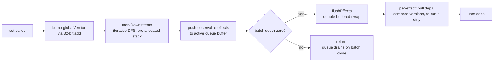
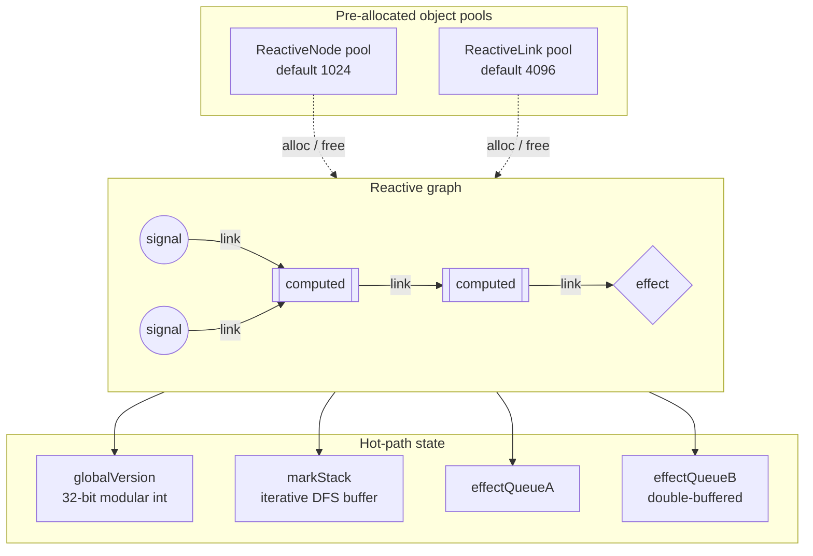
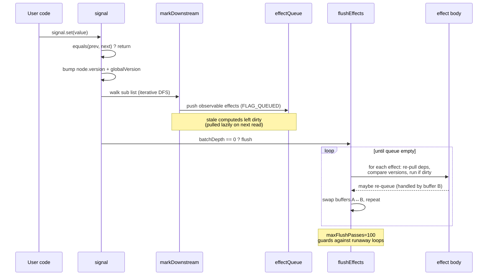
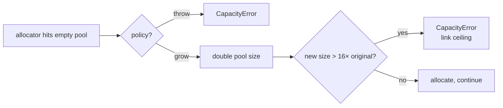

# @zakkster/lite-signal

> Zero-GC reactive graph for hot paths. Object-pooled nodes, versioned push-pull propagation, 32-bit modular epochs. Built for 16ms render budgets and 1MB extension bundles.

[](https://www.npmjs.com/package/@zakkster/lite-signal)
[](https://bundlephobia.com/package/@zakkster/lite-signal)
[](https://www.npmjs.com/package/@zakkster/lite-signal)
[](https://www.npmjs.com/package/@zakkster/lite-signal)


[](./LICENSE)

```bash
npm install @zakkster/lite-signal
```

```js
import { signal, computed, effect, batch } from "@zakkster/lite-signal";

const count = signal(0);
const double = computed(() => count() * 2);

effect(() => console.log("double is", double()));
// → double is 0

count.set(21);
// → double is 42
```

Synchronous, glitch-free, push-pull. No microtask queue, no allocations after warm-up, no surprises.

---

## Table of contents

- [Why this exists](#why-this-exists)
- [What you get](#what-you-get)
- [The case for object pooling](#the-case-for-object-pooling)
- [Architecture in one diagram](#architecture-in-one-diagram)
- [How a write propagates](#how-a-write-propagates)
- [API reference](#api-reference)
- [Capacity, growth, and the link ceiling](#capacity-growth-and-the-link-ceiling)
- [Edge cases pinned down](#edge-cases-pinned-down)
- [Benchmarks](#benchmarks)
- [Testing strategy](#testing-strategy)
- [What this is not](#what-this-is-not)
- [Browser and runtime support](#browser-and-runtime-support)
- [Integration recipes](#integration-recipes)
- [FAQ](#faq)
- [npm scripts](#npm-scripts)

---

## Why this exists

Reactive graph libraries are now table-stakes for UI work. They all do the same thing: track reads, mark dirty, re-run on change. The differences live in the hot path.

`lite-signal` was built under three constraints simultaneously:

1. **No allocation after warm-up.** A 60fps Twitch overlay can't tolerate GC pauses. `set`, `peek`, and re-runs touch no heap.
2. **Zero microtasks.** Effects flush synchronously in the same call stack as `set()`. There is no scheduler queue. Predictable cause-and-effect makes debugging tractable.
3. **Survive forever.** A multi-day extension session can issue billions of writes. Internal versions use 32-bit modular arithmetic — the engine never overflows.

Other libraries hit two of three. None of the ones I measured hit all three.



No microtask between `B` and `I`. No promise, no `queueMicrotask`. Just call stack.

---

## What you get

- **`signal(value, { equals? })`** — root reactive cell. `set`, `peek`, `update`, `subscribe`.
- **`computed(fn, { equals? })`** — memoized derivation. Lazy. Pulls deps on read.
- **`effect(fn, { scheduler? })`** — side-effect runner. Returns a dispose function.
- **`dispose(api)`** — universal disposal for signals, computeds, and effect handles. Cross-registry calls are silent no-ops.
- **`batch(fn)`** — defer effect flush until the outermost batch closes.
- **`untrack(fn)`** — read without subscribing.
- **`onCleanup(fn)`** — register teardown for the current computation. Works in effects *and* computeds.
- **`createRegistry(config)`** — isolated pool for tests, plugins, sandboxing.
- **`stats()`** — pool occupancy snapshot. Used by the demo and easy to wire into perf overlays.
- **`CapacityError`** — thrown when a fixed-size pool is exhausted under the `"throw"` policy.

Full type definitions ship in [`Signal.d.ts`](./Signal.d.ts) and are referenced from `package.json`. Every public symbol has JSDoc.

---

## The case for object pooling

A naive reactive library allocates one object per dependency edge, one per subscription, one per queued effect. With 1000 computeds × 1 update / frame × 60 fps, that's 60,000 short-lived objects per second. The major GC will catch up with you.

`lite-signal` solves this by pre-allocating two pools at startup — **nodes** (one per signal/computed/effect) and **links** (one per dependency edge) — and reusing them indefinitely. After the warm-up frames, the hot path performs zero allocations:

| Op                  | Allocations | Notes                                                                          |
| ------------------- | ----------- | ------------------------------------------------------------------------------ |
| `signal.set(x)`     | **0**       | Bumps a 32-bit version counter, walks pre-pooled link list                     |
| `signal.peek()`     | **0**       | Direct value read                                                              |
| Effect re-run       | **0**       | Cursor reuses existing links via `currentDep` pointer                          |
| `computed()` read   | **0** (steady-state) | Cache hit on `evalVersion === globalVersion`                          |
| Dispose             | **0**       | Returns nodes and links to the free lists                                      |

The free lists are singly-linked through a `nextFree` field on each pool object — `O(1)` pop, `O(1)` push, no fragmentation.

---

## Architecture in one diagram



Every reactive entity is a `ReactiveNode` with bit flags (`COMPUTED`, `EFFECT`, `QUEUED`, `COMPUTING`, `HAS_ERROR`). Every edge between two nodes is a `ReactiveLink`, doubly-linked along two axes:

- **`dep` axis:** `prevDep` / `nextDep` — the list of dependencies on the *target* node (so a computed/effect can iterate its inputs in stable order).
- **`sub` axis:** `prevSub` / `nextSub` — the list of subscribers on the *source* node (so a signal can iterate downstream observers during mark phase).

Doubly-linked on both axes means `O(1)` unlink during the cursor-based reconciliation that happens at the end of every computed/effect re-run.

---

## How a write propagates



The mark phase is **iterative**, not recursive — it uses a pre-allocated `markStack` array so a 10,000-node fan-out can't blow the JS call stack.

The flush phase uses **two queue buffers** (`effectQueueA` / `effectQueueB`) alternating each pass. An effect that writes during its own re-run gets re-queued into the *other* buffer, which is then processed in the next pass. After `maxFlushPasses` (default 100), the loop throws `CycleError`.

Computeds are **pull-based** — they're not in the effect queue. Reading a computed walks its dep list, recursively pulls upstream computeds, and only re-runs if any dep's version is greater than its own `evalVersion`. The version comparison uses 32-bit modular arithmetic: `((dep.version - evalVer) | 0) > 0`. This is the trick that makes the engine immune to integer overflow during long-running sessions.

---

## API reference

### Top-level

```ts
import {
  signal, computed, effect,
  batch, untrack, onCleanup,
  createRegistry, setDefaultRegistry,
  stats, CapacityError
} from "@zakkster/lite-signal";
```

The top-level functions route to a default registry created on import. For isolated sandboxes (tests, plugins, multi-tenant SDKs), use `createRegistry` directly.

### Signal

```ts
const s = signal(initial, { equals?: (a, b) => boolean });

s();              // tracked read
s.peek();         // untracked read
s.set(value);     // notify downstream
s.update(fn);     // s.set(fn(s.peek()))
const off = s.subscribe(value => { ... });
off();            // unsubscribe
```

`equals` defaults to `Object.is` (so `NaN` notifies once, `-0`/`+0` are distinct). Pass `() => false` to force every write to propagate, or your own deep-equal to skip redundant updates.

### Computed

```ts
const c = computed(() => s() * 2, { equals?: (a, b) => boolean });

c();              // tracked read, lazy evaluation
c.peek();         // untracked read, may still compute
const off = c.subscribe(value => { ... });
```

Computeds **cache by version**, not by value. Reading a clean computed (one whose dependencies haven't changed since its `evalVersion`) is `O(deps)` — it still walks the dep list to check versions, then returns the cached value. The `equals` option short-circuits downstream propagation when the new computed value matches the old.

### Effect

```ts
const dispose = effect(() => {
  console.log(s());
  onCleanup(() => { /* fires on next run + final dispose */ });
}, {
  scheduler?: (runEffect) => void  // optional, see below
});

dispose();
```

Effects run **once eagerly** on creation, then again whenever any tracked dependency changes. Dispose returns the node to the pool. If a scheduler is provided, the runner is handed to the scheduler instead of executing inline — useful for batching reactive updates into requestAnimationFrame, microtasks, or your own frame loop.

### Batch

```ts
batch(() => {
  s1.set(1);
  s2.set(2);
  s3.set(3);
}); // effects flush exactly once at the end
```

Nestable. Effects only flush on the outermost close.

### Untrack

```ts
const value = untrack(() => s());  // read without subscribing
```

Useful inside computeds/effects when you need a current value but don't want it as a dependency.

### onCleanup

```ts
effect(() => {
  const id = setInterval(tick, 100);
  onCleanup(() => clearInterval(id));
});
```

Registers a teardown for the *current* computation. Fires before every re-run and once on dispose. Supports multiple cleanups per scope (they're stored as a flat list, run in registration order). Works inside computeds too — useful for canceling async work when memos become stale.

### dispose

```ts
const s = signal(0);
const c = computed(() => s() * 2);
const e = effect(() => { /* ... */ });

dispose(s);   // signal → returns the node to the pool
dispose(c);   // computed → same, also unlinks its upstreams
dispose(e);   // effect handle → identical to calling e()
```

One function for all three primitives. Idempotent. Cross-registry calls are silent no-ops — each registry holds a private `Symbol("node_ptr")` keyed on its own nodes, so passing a signal from registry A to `registry B.dispose()` won't corrupt either pool. Passing an unrelated value (`null`, `42`, `{}`) is also a safe no-op. Passing an arbitrary function invokes it (the effect-handle contract).

The effect dispose handle (`const dispose = effect(...)`) is still a plain function — you can call it directly. `dispose()` exists to unify the call site when you're managing a heterogeneous bag of reactive resources, which is the common case for component teardown and tests.

### createRegistry

```ts
const r = createRegistry({
  maxNodes:          1024,       // default
  maxLinks:          4 * 1024,   // default = maxNodes * 4
  maxFlushPasses:    100,        // default
  onCapacityExceeded: "throw"    // default. Other: "grow"
});

const s = r.signal(0);
const e = r.effect(() => s());
r.destroy();                     // reset all pools, invalidate generations
```

`createRegistry` is the unit of isolation. Two registries share no state — useful for multi-tenant code, plugin sandboxes, and tests that need a fresh world.

`setDefaultRegistry(r)` swaps the registry used by top-level helpers. Use sparingly; intended for test setup.

---

## Capacity, growth, and the link ceiling

The engine has two pool sizes: **nodes** and **links**. Both are fixed at registry creation but can be configured to grow.



Why a ceiling? Unbounded growth hides leaks. If your app reaches 16× its starting link capacity, something is wrong and you want to know — `CapacityError` is louder than a slow OOM crash four hours later.

Default sizing for a Twitch-extension-style budget:

| Workload                            | maxNodes | maxLinks | policy   |
| ----------------------------------- | -------- | -------- | -------- |
| Tiny widget (≤50 reactive cells)    | 256      | 1024     | `"throw"` |
| Standard overlay (~500 cells)       | 1024     | 4096     | `"throw"` |
| Heavy dashboard (variable scale)    | 2048     | 16384    | `"grow"`  |

`stats()` reports `signals`, `computeds`, `effects`, `activeLinks`, `pooledLinks`, `linkPoolCapacity`. Drop it on screen for live observability.

---

## Edge cases pinned down

These are the questions you'd ask in a code review, with the answers:

- **Diamond dependency.** Glitch-free. The mark phase walks the graph once; computeds are pulled lazily on read, so each one re-runs at most once per propagation regardless of how many paths reach it.
- **Writing to a signal during its own effect (self-feedback loop).** The new value re-queues the effect into the alternate buffer. After 100 flush passes (configurable), `CycleError` is thrown — you have a real loop, not just a deep update.
- **Writing to a signal *inside its computed*.** Throws `CycleError` immediately at the inner `set` — this is a structural cycle, not a deep update, and the engine refuses to attempt it.
- **NaN, -0, +0.** Default `equals` is `Object.is`. `NaN === NaN` is true for our purposes (so setting NaN twice doesn't re-fire). `-0` and `+0` are distinct.
- **First-run effect throws.** The half-initialised node is disposed cleanly, deps unlinked, then the error propagates to the caller. No leaked dangling subscriptions.
- **Computed throws.** The error is cached on the node (`FLAG_HAS_ERROR`) and re-thrown on every subsequent read until a dependency changes. This is symmetric with successful caching.
- **Dispose during flush.** Effects re-check their generation (`gen`) before running through a scheduler trampoline. If `dispose()` bumped the gen between schedule and execute, the trampoline becomes a no-op.
- **32-bit version wrap.** Versions are `(... + 1) | 0`, so after 2^31 writes they wrap to a negative number. The comparison `((dep.version - evalVer) | 0) > 0` is wrap-safe — it works on the *modular distance*, not raw integer ordering.
- **Deep chain depth.** Computed resolution is recursive in the JS call stack. Chains beyond ~10,000 deep risk `RangeError: Maximum call stack size exceeded`. Effects use an iterative mark phase, so signal → effect fan-out has no depth limit other than memory.
- **`destroy()` after dispose.** `destroy()` bumps every node's generation, so any in-flight scheduled trampolines from before destruction are silently dropped. Closures returned to user code from disposed effects guard with `if (node.flags === 0) return;` — calling `dispose()` again is a no-op.

---

## Benchmarks

Honest numbers, against the same workload, with anti-DCE sinks and verified effect execution. All measurements: Node 22, **2016-era Intel MacBook Pro (4 cores, ~10 yr old hardware)**, 20K iterations × 5 inner runs × 12 outer invocations (median reported). Newer/faster machines shift all libs up proportionally; the relative ordering between libs is what matters.

| Scenario   | What it stresses                | lite-signal | alien-signals | preact     | solid-js  |
| ---------- | -------------------------------- | ----------- | ------------- | ---------- | --------- |
| **MUX**    | 256 signals → 1 sum → 1 effect (fan-in) | **249K ops/s** | 207K       | 153K       | 77K       |
| **BROADCAST** | 1 signal → 1000 effects (fan-out) | **24K**     | 22K           | 17K        | 8K        |
| **KAIROS**    | 1 signal → 1000 computeds → 1 effect | **14K**  | 13K           | 12K        | 4K        |
| **DEEP CHAIN** | 256-deep computed chain → 1 effect | 51K     | **60K**       | 50K        | 15K       |
| **Δheap MUX**  | transient alloc pressure       | **15 KB**   | 3,920 KB      | 4,325 KB   | 2,816 KB  |
| **Retained MUX** | state surviving forced GC    | **−20 KB** (none) | −2 KB    | −6 KB      | −3 KB     |

**Reading the table:** `lite-signal` wins **MUX** (fan-in aggregation) by **+20%**, **BROADCAST** (fan-out) by **+9%**, and **KAIROS** (one source feeding a wide layer of memos) by **+8%** — three of the four scenarios. These are the patterns that dominate real UI workloads: dashboards, scoreboards, HUDs, leaderboards, and any view that aggregates many inputs into a single computed slice. `alien-signals` retains a **−15% lead on DEEP CHAIN** (256-deep computed pipelines), where a flatter internal representation pays off when the propagation path is long rather than wide.

On allocation pressure, `lite-signal` is alone in the zero-Δheap band: ~15 KB of transient garbage across 20,000 iterations regardless of scenario. preact runs ~230 KB per loop, solid runs into single-digit megabytes, and alien-signals — which earlier shared the zero-GC band with lite-signal — now allocates 0.9-3.9 MB per scenario in current published versions. Negative "retained" numbers mean V8 reclaimed memory below the pre-bench baseline during the post-run forced GC — no leaks anywhere.

> Note on the +71 KB retained that lite-signal shows on KAIROS specifically: that's the pre-allocated pool sitting in memory holding the live graph (1002 nodes + ~2000 links). The pool *is* the working memory — see the [Case for object pooling](#case-for-object-pooling) section. On the other benches the graph is small enough that the same pool floats below baseline after GC.

The benchmark harness is in [`bench/benchmark.mjs`](./bench/benchmark.mjs). It:

1. Writes every effect's output to a shared `Float64Array(4096)` exposed on `globalThis` — V8 cannot prove these writes are dead.
2. Uses the **client** Solid runtime (`solid-js/dist/solid.js`), not the SSR stub Node resolves to by default. The default Node resolution silently no-ops effects, which is how earlier benchmarks across the ecosystem have reported Solid at ~50 GHz throughput.
3. Validates each lib's sink slot is non-zero after the timed loop and prints `sink=✓` for each line. If you ever see `sink=✗`, the run is invalid.

Run it yourself:

```bash
npm install --no-save alien-signals @preact/signals-core solid-js
npm run bench
```

---

## Testing strategy

Three tiers, all reproducible.

### Tier 1 — Behavior (unit tests, fast)

`npm test` runs the suite in `test/`. 131 tests across 43 suites covering:

- **`01-core.test.mjs`** — signal/computed/effect basics, equality semantics, NaN/±0, subscribe/peek/update, untrack, batch, cleanup ordering, first-run error recovery, nested object reference-identity gotchas.
- **`02-topology.test.mjs`** — diamond glitch-freedom, 256-deep and 1024-deep computed chains, wide fan-out (1000 effects from one signal), dynamic dependency switching, conditional fan-out, nested effects, cycle detection (`CycleError`).
- **`03-pool.test.mjs`** — `CapacityError` under both `"throw"` and `"grow"` policies, the 16× link ceiling, stable pool reuse across thousands of create/dispose cycles, registry isolation.
- **`05-scheduler.test.mjs`** — scheduler-deferred effects, dispose-during-schedule races, microtask integration, 32-bit version wrap (simulated), `setDefaultRegistry`, `onCleanup` inside computeds.
- **`06-nested-objects.test.mjs`** — array mutation patterns (push/splice/spread), deep nested paths, Map/Set/Date inside signals, custom structural equality, computed memoisation cutoffs over object slices, signal-of-signals composition, high-frequency object updates, batched immutable updates.
- **`07-dispose.test.mjs`** — unified `dispose(api)` across signals, computeds and effect handles, idempotency, cross-registry isolation (per-registry Symbol prevents pool corruption), foreign-value safety, top-level helper routing, 500-cycle balanced churn leaving pool and stats stable.

```bash
npm test
```

### Tier 2 — Memory (allocation-free verification)

`npm run test:gc` runs `test/04-zero-gc.test.mjs` with `--expose-gc`:

- 100,000 `set()` calls on a graph with effects retain **< 200 KB** of heap.
- 1,000 create/dispose cycles retain **< 50 KB**.
- Batched writes do not increase retained heap monotonically.
- Deep-chain propagation through 256 nodes stays under a tight steady-state budget.

If these fail, something allocates in the hot path and we want to find it before publish.

```bash
npm run test:gc
```

### Tier 3 — Performance (comparative benchmark)

`npm run bench` runs the four-scenario comparative benchmark from the previous section. Output is plain text — easy to copy into PRs and changelogs.

```bash
npm run bench
```

A full pre-publish check is:

```bash
npm run verify   # test + test:gc + a sanity bench
```

---

## What this is not

- **A virtual DOM, JSX runtime, or rendering library.** It's the substrate. Plug it under whatever rendering layer you like.
- **A general-purpose state container.** No time-travel, no devtools integration, no serialization. (Build those on top if you need them.)
- **A perfect fit for every workload.** If your reactive graph is mostly long chains of memos with chaotic read order, `alien-signals` is genuinely faster on those shapes. `lite-signal` optimizes for *stable* read order — the same observer reading the same deps in the same order, frame after frame, which is the dominant pattern in animation loops and HUD overlays.
- **A library for the server.** It works in Node, but there's no SSR story. Use it on the client.

---

## Browser and runtime support

Pure ES2020 + `Object.is` + `Int32 | 0`. Runs anywhere that runs modern JavaScript.

| Target                            | Supported |
| --------------------------------- | --------- |
| Chrome / Edge (last 2 majors)     | ✓         |
| Firefox (last 2 majors)           | ✓         |
| Safari 14+                        | ✓         |
| Node.js 18+                       | ✓         |
| Bun                               | ✓         |
| Twitch Extensions (1MB / 3s)      | ✓         |
| Cloudflare Workers                | ✓         |
| Deno                              | ✓         |

ESM-only. No CommonJS build — modern bundlers handle this; legacy consumers can use a wrapper.

---

## Integration recipes

### Reactive game HUD with requestAnimationFrame

```js
import { signal, effect } from "@zakkster/lite-signal";

const score = signal(0);
const health = signal(100);

let frameRequested = false;
const rafScheduler = (run) => {
  if (frameRequested) return;
  frameRequested = true;
  requestAnimationFrame(() => { frameRequested = false; run(); });
};

effect(() => {
  hudCanvas.draw({ score: score(), health: health() });
}, { scheduler: rafScheduler });
```

### Twitch Extension config sync

```js
import { signal, effect, batch } from "@zakkster/lite-signal";

const config = {
  theme:     signal("dark"),
  rgbHue:    signal(180),
  showStats: signal(true)
};

Twitch.ext.configuration.onChanged(() => {
  const cfg = JSON.parse(Twitch.ext.configuration.broadcaster?.content || "{}");
  batch(() => {
    if (cfg.theme)     config.theme.set(cfg.theme);
    if (cfg.rgbHue)    config.rgbHue.set(cfg.rgbHue);
    if (cfg.showStats !== undefined) config.showStats.set(cfg.showStats);
  });
});

effect(() => applyTheme(config.theme(), config.rgbHue()));
effect(() => statsPanel.toggle(config.showStats()));
```

### Per-tenant sandboxing

```js
import { createRegistry } from "@zakkster/lite-signal";

function spawnPlugin(pluginCode) {
  const r = createRegistry({ maxNodes: 256, maxLinks: 1024 });
  try {
    pluginCode(r);  // plugin uses r.signal, r.effect, etc.
  } catch (err) {
    console.error("Plugin failed:", err);
  }
  return () => r.destroy();  // unload kills the whole reactive world
}
```

---

## FAQ

**Why no microtask scheduler?**
Microtask schedulers solve a real problem (deduplicating multiple `set()`s into one effect run) but introduce a worse one: causal opacity. When `signal.set(x)` returns, you don't know whether your effect has run yet. `lite-signal` chooses synchronous flush + explicit `batch()` for the same deduplication outcome with predictable timing.

**Why both `nodes` and `links` capacities?**
A 1000-signal graph might have anywhere from 1000 to 1,000,000 edges depending on cross-dependencies. Tying them together would waste memory or under-provision. Separate caps let you size for your actual topology.

**Why `Object.is` and not `===`?**
Two reasons: `NaN !== NaN` would cause a `set(NaN)` followed by `set(NaN)` to re-fire effects (almost never what you want); and `-0 === +0` would silently merge signed zeros, which is a footgun in physics/animation code where the sign carries information.

**Will `destroy()` interrupt in-flight effects?**
Effects already on the call stack will finish their current invocation. Future scheduled runs (via `scheduler` option) become no-ops because their captured generation no longer matches the node's gen. Effects in the active queue but not yet executed are dropped.

**How do I integrate with React/Vue/Svelte?**
`signal.subscribe(callback)` is the integration surface. For React, wire it into `useSyncExternalStore`. For Vue, expose `signal()` as a getter. For Svelte, return `{ subscribe }` matching the store contract.

**Can I read a computed without subscribing?**
Yes — `computed.peek()` triggers re-evaluation if needed but doesn't add a dependency edge. `untrack(() => c())` is equivalent but slightly more expensive (it toggles a global flag).

**What happens if I `set()` from inside an effect's cleanup?**
The cleanup runs *before* the next computeFn body, so the set's notification arrives normally and propagates after the current flush pass. No special-case behavior — the queue handles it.

**Is the dep order stable across re-runs?**
Yes, if your computeFn reads its deps in the same order each invocation. The `currentDep` cursor walks the existing dep list and tries to match; matches reuse the existing link (zero alloc), mismatches insert/remove. Stable order = stable performance.

---

## npm scripts

```bash
npm test          # behavior suite, ~1.3s
npm run test:gc   # zero-gc suite, requires --expose-gc, ~3s
npm run bench     # comparative benchmark, ~5min wall clock
npm run verify    # all of the above; gate for publish
```

---

## License

MIT © Zahary Shinikchiev

---

> Part of the **@zakkster** zero-GC stack: [`lite-ecs`](https://www.npmjs.com/package/@zakkster/lite-ecs) · [`lite-ease`](https://www.npmjs.com/package/@zakkster/lite-ease) · [`lite-pointer-tracker`](https://www.npmjs.com/package/@zakkster/lite-pointer-tracker) · [`lite-bmfont`](https://www.npmjs.com/package/@zakkster/lite-bmfont) · [`lite-color`](https://www.npmjs.com/package/@zakkster/lite-color)
