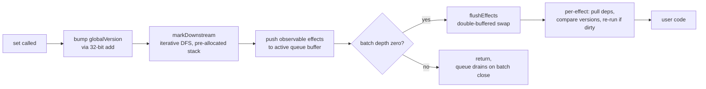
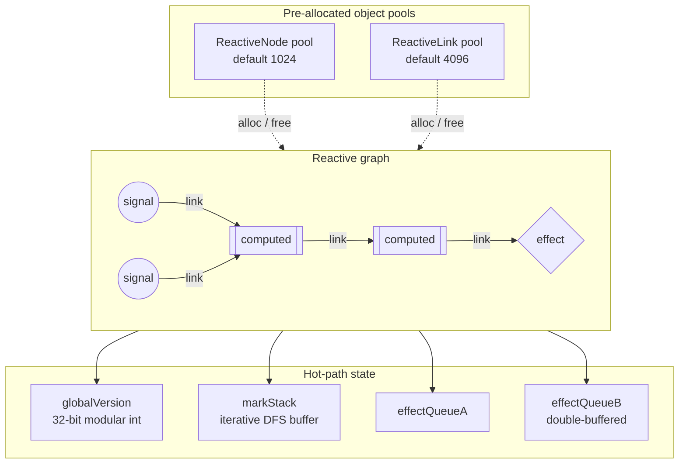
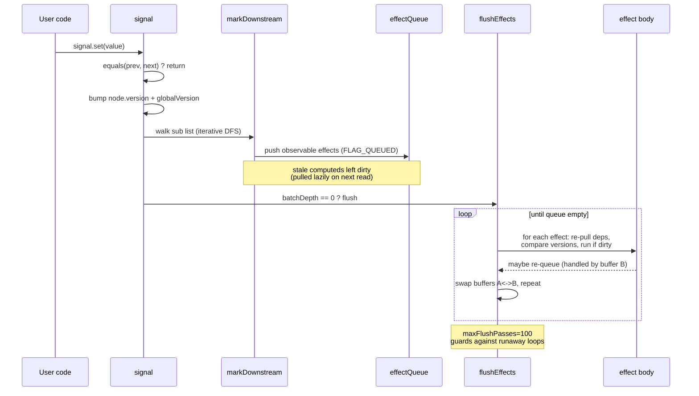
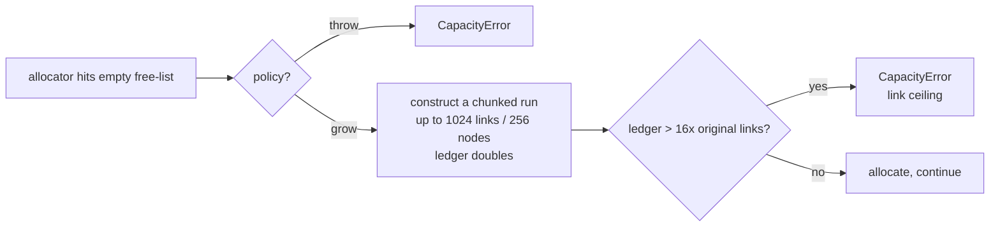

# @zakkster/lite-signal

> Zero-GC reactive graph for hot paths. Object-pooled nodes, versioned push-pull propagation, 32-bit modular epochs. Built for 16ms render budgets and 1MB extension bundles.

[](https://www.npmjs.com/package/@zakkster/lite-signal)
[](https://github.com/sponsors/PeshoVurtoleta)


[](https://bundlephobia.com/result?p=@zakkster/lite-signal)
[](https://www.npmjs.com/package/@zakkster/lite-signal)
[](https://www.npmjs.com/package/@zakkster/lite-signal)
[](https://coveralls.io/github/PeshoVurtoleta/lite-signal?branch=main)


[](./LICENSE)

## 4th of 15 on the community reactivity benchmark -- and the only zero-GC engine in the field

On the independent [js-reactivity-benchmark](https://github.com/volynetstyle/js-reactivity-benchmark) (Andrii Volynets' fork; 15 reactive libraries, 47 tests), `lite-signal` **1.7.0** places **4th overall by geomean (71.5 ms)**, behind only three push-eager engines -- alien-signals (44.2), reflex (51.5), and @reactively (56.8) -- and now clearing 5th-place Preact Signals (85.7) by **20%**, a gap that widened sharply from the ~5% of the 1.3.0 run.

It is the **only object-pooled, zero-GC engine in the entire field**, and it gets that result without giving up glitch-freedom or lazy evaluation. Against the mainstream reactivity libraries it leads decisively:

| vs                     | lite-signal is  |
| ---------------------- | --------------- |
| **SolidJS**            | **4.27x faster** |
| **@solidjs/signals**   | **2.90x faster** |
| **s-js**               | **2.57x faster** |
| **MobX**               | **2.40x faster** |
| **Signia**             | **1.76x faster** |
| **Oby**                | **1.73x faster** |
| **@vue/reactivity**    | **1.62x faster** |
| **Preact Signals**     | **1.20x faster** |
| alien-signals          | 0.62x (the field leader) |

`lite-signal` finishes **top-3 on 21 of the 47 tests** and is the **outright fastest of all 15** on four shapes: `manyEffectsFromOneSource` (1 source -> many effects, fan-out), `manySourcesIntoOneComputedEffect` (many sources -> one computed, fan-in), `updateComputations2to1`, and the `1000x5 - 25 sources` wide-dense DAG. These are the aggregation patterns that dominate live dashboards, scoreboards, and HUDs. The three engines ahead of it are all push-eager designs that allocate on the hot path; `lite-signal` is the only top-4 finisher that allocates **nothing** in steady state.

Raw log: [`bench/AndriiVolynetsReactiveBench1.7.0.log`](./bench/AndriiVolynetsReactiveBench1.7.0.log) -- 15 frameworks x 47 tests, checked in so the geomean above can be recomputed or falsified. (Note: this suite measures reactivity *libraries* -- Vue's reactivity core, MobX, Solid, Preact Signals, etc. -- not full UI frameworks like React or Angular.)

```bash
npm install @zakkster/lite-signal
```

```js
import { signal, computed, effect, batch } from "@zakkster/lite-signal";

const count = signal(0);
const double = computed(() => count() * 2);

effect(() => console.log("double is", double()));
// -> double is 0

count.set(21);
// -> double is 42
```

Synchronous, glitch-free, push-pull. No microtask queue, no allocations after warm-up, no surprises.

---

## Table of contents

- [Why this exists](#why-this-exists)
- [What you get](#what-you-get)
- [The case for object pooling](#the-case-for-object-pooling)
- [Architecture in one diagram](#architecture-in-one-diagram)
- [How a write propagates](#how-a-write-propagates)
- [API reference](#api-reference)
  - [flushStrategy and flush() (1.7.0)](#flushstrategy-and-flush-170)
  - [getOwner / runWithOwner (1.7.0)](#getowner--runwithowner-170)
- [Watchers](#watchers)
- [Capacity, growth, and the link ceiling](#capacity-growth-and-the-link-ceiling)
- [Edge cases pinned down](#edge-cases-pinned-down)
- [Benchmarks](#benchmarks)
- [Testing strategy](#testing-strategy)
- [What this is not](#what-this-is-not)
- [Ecosystem](#ecosystem)
- [Browser and runtime support](#browser-and-runtime-support)
- [Integration recipes](#integration-recipes)
- [Conformance](#conformance)
- [FAQ](#faq)
- [Test harnesses](#test-harnesses)
- [npm scripts](#npm-scripts)

---

## Why this exists

Reactive graph libraries are now table-stakes for UI work. They all do the same thing: track reads, mark dirty, re-run on change. The differences live in the hot path.

`lite-signal` was built under three constraints simultaneously:

1. **No allocation after warm-up.** A 60fps Twitch overlay can't tolerate GC pauses. `set`, `peek`, and re-runs touch no heap.
2. **Zero microtasks.** Effects flush synchronously in the same call stack as `set()`. There is no scheduler queue. Predictable cause-and-effect makes debugging tractable.
3. **Survive forever.** A multi-day extension session can issue billions of writes. Internal versions use 32-bit modular arithmetic -- the engine never overflows.

Other libraries hit two of three. None of the ones I measured hit all three.


```mermaid
flowchart LR
  A[set called] --> B[bump globalVersion<br/>via 32-bit add]
  B --> C[markDownstream<br/>iterative DFS, pre-allocated stack]
  C --> D[push observable effects<br/>to active queue buffer]
  D --> E{batch depth zero?}
  E -- yes --> F[flushEffects<br/>double-buffered swap]
  E -- no --> G[return,<br/>queue drains on batch close]
  F --> H[per-effect: pull deps,<br/>compare versions, re-run if dirty]
  H --> I[user code]
```

No microtask between `B` and `I`. No promise, no `queueMicrotask`. Just call stack.

---

## What you get

- **`signal(value, { equals? })`** -- root reactive cell. `set`, `peek`, `update`, `subscribe`.
- **`computed(fn, { equals? })`** -- memoized derivation. Lazy. Pulls deps on read.
- **`effect(fn, { scheduler? })`** -- side-effect runner. Returns a dispose function.
- **`dispose(api)`** -- universal disposal for signals, computeds, and effect handles. Cross-registry calls are silent no-ops.
- **`batch(fn)`** -- defer effect flush until the outermost batch closes.
- **`flush()`** *(1.7.0)* -- drain the effect queue now. The settle point for the `"sab"` and `"manual"` flush strategies.
- **`untrack(fn)`** -- read without subscribing.
- **`isTracking()`** -- `true` iff a read right now would subscribe (for lazy-allocation wrappers).
- **`onCleanup(fn)`** -- register teardown for the current computation. Works in effects *and* computeds.
- **`createRoot(fn)`** / **`createScope(fn)`** -- detached ownership scopes (escape hatch, and its disposable counterpart).
- **`getOwner()`** / **`runWithOwner(handle, fn)`** *(1.7.0)* -- capture and reinstate the current lifecycle owner across an async gap. Gen-stamped; a stale handle degrades to rooted execution.
- **`createRegistry(config)`** -- isolated pool for tests, plugins, sandboxing. `config.flushStrategy` *(1.7.0)* picks when effects deliver: `"eager"` (default) | `"sab"` | `"manual"`.
- **`stats()`** -- pool occupancy snapshot. Used by the demo and easy to wire into perf overlays.
- **`CapacityError`** -- thrown when a fixed-size pool is exhausted under the `"throw"` policy.

Full type definitions ship in [`Signal.d.ts`](./Signal.d.ts) and are referenced from `package.json`. Every public symbol has JSDoc.

---

## The case for object pooling

<details>
<summary>Why pre-allocate: the GC math, and the per-op zero-allocation table.</summary>

A naive reactive library allocates one object per dependency edge, one per subscription, one per queued effect. With 1000 computeds × 1 update / frame × 60 fps, that's 60,000 short-lived objects per second. The major GC will catch up with you.

`lite-signal` solves this by pre-allocating two pools at startup -- **nodes** (one per signal/computed/effect) and **links** (one per dependency edge) -- and reusing them indefinitely. After the warm-up frames, the hot path performs zero allocations:

| Op                  | Allocations | Notes                                                                          |
| ------------------- | ----------- | ------------------------------------------------------------------------------ |
| `signal.set(x)`     | **0**       | Bumps a 32-bit version counter, walks pre-pooled link list                     |
| `signal.peek()`     | **0**       | Direct value read                                                              |
| Effect re-run       | **0**       | Cursor reuses existing links via `currentDep` pointer                          |
| `computed()` read   | **0** (steady-state) | Cache hit on `evalVersion === globalVersion`                          |
| Dispose             | **0**       | Returns nodes and links to the free lists                                      |

The free lists are singly-linked through a `nextFree` field on each pool object -- `O(1)` pop, `O(1)` push, no fragmentation.

</details>

---

## Architecture in one diagram

<details>
<summary>Pools, the reactive graph, hot-path state, and the doubly-linked edge model.</summary>


```mermaid
flowchart TB
  subgraph Pools[Pre-allocated object pools]
    NP[ReactiveNode pool<br/>default 1024]
    LP[ReactiveLink pool<br/>default 4096]
  end

  subgraph Graph[Reactive graph]
    S1((signal))
    S2((signal))
    C1[[computed]]
    C2[[computed]]
    E1{effect}
    S1 -->|link| C1
    S2 -->|link| C1
    C1 -->|link| C2
    C2 -->|link| E1
  end

  subgraph Hot[Hot-path state]
    GV[globalVersion<br/>32-bit modular int]
    MS[markStack<br/>iterative DFS buffer]
    Q1[effectQueueA]
    Q2[effectQueueB<br/>double-buffered]
  end

  NP -.->|alloc / free| Graph
  LP -.->|alloc / free| Graph
  Graph --> GV
  Graph --> MS
  Graph --> Q1
  Graph --> Q2
```

Every reactive entity is a `ReactiveNode` with bit flags (`COMPUTED`, `EFFECT`, `QUEUED`, `COMPUTING`, `HAS_ERROR`). Every edge between two nodes is a `ReactiveLink`, doubly-linked along two axes:

- **`dep` axis:** `prevDep` / `nextDep` -- the list of dependencies on the *target* node (so a computed/effect can iterate its inputs in stable order).
- **`sub` axis:** `prevSub` / `nextSub` -- the list of subscribers on the *source* node (so a signal can iterate downstream observers during mark phase).

Doubly-linked on both axes means `O(1)` unlink during the cursor-based reconciliation that happens at the end of every computed/effect re-run.

</details>

---

## How a write propagates

<details>
<summary>The set -> mark -> flush sequence, and why computeds stay pull-based.</summary>


```mermaid
sequenceDiagram
  participant U as User code
  participant S as signal
  participant Mark as markDownstream
  participant Q as effectQueue
  participant Flush as flushEffects
  participant Eff as effect body

  U->>S: signal.set(value)
  S->>S: equals(prev, next) ? return
  S->>S: bump node.version + globalVersion
  S->>Mark: walk sub list (iterative DFS)
  Mark->>Q: push observable effects (FLAG_QUEUED)
  Note over Mark,Q: stale computeds left dirty<br/>(pulled lazily on next read)
  S->>Flush: batchDepth == 0 ? flush
  loop until queue empty
    Flush->>Eff: for each effect: re-pull deps,<br/>compare versions, run if dirty
    Eff-->>Flush: maybe re-queue (handled by buffer B)
    Flush->>Flush: swap buffers A<->B, repeat
  end
  Note over Flush: maxFlushPasses=100<br/>guards against runaway loops
```

The mark phase is **iterative**, not recursive -- it uses a pre-allocated `markStack` array so a 10,000-node fan-out can't blow the JS call stack.

The flush phase uses **two queue buffers** (`effectQueueA` / `effectQueueB`) alternating each pass. An effect that writes during its own re-run gets re-queued into the *other* buffer, which is then processed in the next pass. After `maxFlushPasses` (default 100), the loop throws `CycleError`.

Computeds are **pull-based** -- they're not in the effect queue. Reading a computed walks its dep list, recursively pulls upstream computeds, and only re-runs if any dep's version is greater than its own `evalVersion`. The version comparison uses 32-bit modular arithmetic: `((dep.version - evalVer) | 0) > 0`. This is the trick that makes the engine immune to integer overflow during long-running sessions.

</details>

---

## API reference

### Top-level

```ts
import {
  // Core
  signal, computed, effect,
  signalBox, computedBox,       // 1.5.0 -- allocation-light, non-callable
  batch, untrack, onCleanup, isTracking,
  createRoot,                   // 1.5.0 -- detached ownership scope
  createScope,                  // 1.6.0 -- detached, adopting scope (one disposer)
  // Registry / lifecycle
  createRegistry, setDefaultRegistry, dispose, destroy,
  stats, CapacityError,
  // Introspection (1.1.4 / 1.1.5 / 1.2.1)
  hasObservers, observeObservers,
  forEachObserver, forEachSource,
  nodeId, describe,
  forEachOwned, ownerOf,        // 1.2.1
  // Debug hook (1.2.1)
  onGraphMutation,
  // Watchers
  watch, when, whenAsync,
} from "@zakkster/lite-signal";
```

The top-level functions route to a default registry created on import. For isolated sandboxes (tests, plugins, multi-tenant SDKs), use `createRegistry` directly.

### Signal

```ts
const s = signal(initial, { equals?: (a, b) => boolean });

s();              // tracked read
s.peek();         // untracked read
s.set(value);     // notify downstream
s.update(fn);     // s.set(fn(s.peek()))
const off = s.subscribe(value => { ... });
off();            // unsubscribe
```

`equals` defaults to `Object.is` (so `NaN` notifies once, `-0`/`+0` are distinct). Pass `() => false` to force every write to propagate, or your own deep-equal to skip redundant updates.

### Computed

```ts
const c = computed(() => s() * 2, { equals?: (a, b) => boolean });

c();              // tracked read, lazy evaluation
c.peek();         // untracked read, may still compute
const off = c.subscribe(value => { ... });
```

Computeds **cache by version**, not by value. Reading a clean computed (one whose dependencies haven't changed since its `evalVersion`) is `O(deps)` -- it still walks the dep list to check versions, then returns the cached value. The `equals` option short-circuits downstream propagation when the new computed value matches the old.

### SignalBox / ComputedBox (1.5.0)

Non-callable, allocation-light variants of `signal` / `computed`. Instead of a callable function they return a plain object on a shared prototype:

```ts
const s = signalBox(initial, { equals?: (a, b) => boolean });
s.get();          // tracked read   (vs callable s())
s.set(value);     // notify downstream
s.peek();         // untracked read
s.update(fn);     // s.set(fn(currentValue))
const off = s.subscribe(value => { ... });

const c = computedBox(() => s.get() * 2, { equals? });
c.get();          // tracked read, lazy
c.peek();         // untracked read
c.subscribe(value => { ... });   // no set / update -- it's derived
```

Same `ReactiveNode` machinery, same zero-GC read/write path, fully interoperable with callable handles in one graph (a callable `computed` can read `box.get()` and vice versa; ownership, batching, glitch-freedom, and introspection all apply uniformly). The trade is **call ergonomics for cheaper construction**: a box is `Object.create(proto)` plus two own properties rather than a closure with attached methods, so creating many short-lived cells is **~1.9x cheaper** (2.0 ms vs 3.8 ms per 100K on the 1.7.0 `harness:dispose` run) and **~4.2x cheaper to recreate** through the pool (1.9 ms vs 8.0 ms). Boxes are built on the shared prototype from the start (never `setPrototypeOf`, which would deopt the method-call inline caches to megamorphic). Reach for a box when you create *many* reactive cells or want a plain serializable-looking handle; reach for the callable when call-site ergonomics matter more.

### Effect

```ts
const dispose = effect(() => {
  console.log(s());
  onCleanup(() => { /* fires on next run + final dispose */ });
}, {
  scheduler?: (runEffect) => void  // optional, see below
});

dispose();
```

Effects run **once eagerly** on creation, then again whenever any tracked dependency changes. Dispose returns the node to the pool. If a scheduler is provided, the runner is handed to the scheduler instead of executing inline -- useful for batching reactive updates into requestAnimationFrame, microtasks, or your own frame loop.

### Batch

```ts
batch(() => {
  s1.set(1);
  s2.set(2);
  s3.set(3);
}); // effects flush exactly once at the end
```

Nestable. Effects only flush on the outermost close.

### flushStrategy and flush() (1.7.0)

`batch()` answers *"can I coalesce these three writes?"*. `flushStrategy` answers the prior question: **when does a write deliver at all?** It is a per-registry choice, made once at `createRegistry` time:

```ts
const r = createRegistry({ flushStrategy: "manual" });   // "eager" | "sab" | "manual"
```

| strategy | `.set` outside `batch()` | `batch()` exit | `r.flush()` |
| -------- | ------------------------ | -------------- | ----------- |
| **`"eager"`** (default) | delivers | delivers | no-op (nothing queued) |
| **`"sab"`** (stable-after-batch) | queues, does **not** deliver | delivers | delivers |
| **`"manual"`** | queues, does **not** deliver | queues, does **not** deliver | delivers -- the only settle point |

```ts
const r = createRegistry({ flushStrategy: "manual" });
const frame = r.signal(0);
r.effect(() => draw(frame()));

// inside a 16ms budget: write freely, settle exactly once, where you choose
for (const ev of inputQueue) frame.set(ev.t);   // nothing runs yet
r.flush();                                       // one drain, at the frame boundary
```

Three things hold in **every** mode, and they are the reason this is safe to reach for:

- **The write is always eager.** Only effect *delivery* defers. `signal.peek()` and `computed()` are never stale -- pull is independent of flush, so a read after a deferred write returns the new value immediately.
- **Queued effects dedup.** A thousand writes to the same signal before a flush produce **one** effect run, via the same `FLAG_SCHEDULED` bit `batch()` uses.
- **`flush()` is re-entrant-safe.** Calling it from inside an effect body is a no-op (the `isFlushing` guard); an empty queue exits immediately.

`"eager"` is the default and is **byte-identical to 1.6.0** -- the strategy is resolved once at registry init into two closure-captured `const` booleans, which V8 folds at JIT time, so an existing user pays nothing for a lever they don't pull. An invalid token throws at `createRegistry` time, not at first write.

Reach for `"manual"` in hard-real-time loops that need a frame-aligned settle point; reach for `"sab"` when you want Reflex-style semantics (writes accumulate, batch boundaries publish). Stay on `"eager"` otherwise.

### getOwner / runWithOwner (1.7.0)

```ts
const owner = getOwner();                 // inside an effect/computed body
await somethingAsync();
runWithOwner(owner, () => {
  effect(() => { /* adopted by `owner`; dies when `owner` re-runs or disposes */ });
});
```

The capture-and-restore companion to `createRoot`. `getOwner()` returns the current lifecycle owner as an opaque handle (`undefined` outside any observer body); `runWithOwner(handle, fn)` reinstates it so nodes created directly in `fn` are adopted by it. Tracking is nulled for `fn`'s direct body -- the same pairing `createRoot` uses -- so no accidental cross-async dependency edge can form.

**Handles are gen-stamped, which is the whole point.** Holding a raw owner pointer across an `await` is a live footgun: if the owner is disposed and its pool slot is recycled by an unrelated effect, a raw-pointer restore silently adopts your continuation into a *stranger* (whose next re-run then cascade-disposes it), or splices a child into a corpse and sends the next disposal walk into an unterminated recursion. Both hazards are pinned in `test/28-run-with-owner.test.mjs` and reproduced against a patched engine by `harness/owner-hazard-repro.mjs`. On the shipping engine the `NODE_GEN` stamp no longer matches, and `runWithOwner` degrades to **rooted execution** instead. `null`, `undefined`, and non-tracker handles degrade the same way.

### Untrack

```ts
const value = untrack(() => s());  // read without subscribing
```

Useful inside computeds/effects when you need a current value but don't want it as a dependency.

### createRoot (1.5.0)

```ts
const dispose = createRoot(() => {
  // effects/computeds created here are NOT owned by the enclosing scope
  return effect(() => { /* long-lived watcher */ });
});
// ... later, the caller owns the lifecycle:
dispose();
```

Runs `fn` in a **detached ownership scope** and returns whatever `fn` returns. Effects and computeds created directly inside `fn` are not adopted by the enclosing owner, so they survive the enclosing effect's re-runs and disposal -- there is no parent to auto-dispose them, so the caller is responsible (typically `fn` returns a disposer or the created handle). Both ownership *and* tracking are detached for the duration of `fn`'s direct body; inner effect/computed bodies still establish their own scopes as usual. Mirrors Solid's `createRoot` on the lifecycle axis.

The problem it solves: lazily spawning a *long-lived* node from *inside* a consumer effect is otherwise a footgun -- the spawned node is adopted by the consumer, so the consumer's next re-run cascade-disposes it. That is the ownership model working as designed (owned children dispose with their parent); `createRoot` is the sanctioned opt-out. Any consumer that creates a watcher/subscription inside a reactive scope and expects it to outlive that scope wraps the spawn in `createRoot(() => effect(...))` -- `lite-query`'s query-watcher being the first in the ecosystem. (The companion `runWithOwner`, for re-attaching to a captured owner, **shipped in 1.7.0** -- see [above](#getowner--runwithowner-170).)

### createScope (1.6.0)

```ts
const items = signal([/* ... */]);
const itemDisposers = new Map();

// In a reconciler driver: each item gets its own per-item scope.
effect(() => {
  for (const item of items()) {
    if (!itemDisposers.has(item.id)) {
      itemDisposers.set(item.id, createScope((dispose) => {
        // The consumer's mapFn builds an arbitrary reactive subgraph here;
        // every effect and computed it creates is owned by this scope.
        effect(() => { /* render bindings */ });
        return dispose;
      }));
    }
  }
});

// Later, when an item leaves:
itemDisposers.get(removedId)();   // cascade-disposes the entire per-item subgraph
```

Runs `fn(dispose)` in a **detached, adopting scope** and returns whatever `fn` returns. The single `dispose` argument handed to `fn` cascade-disposes every effect and computed created inside `fn` -- one disposer tears down a subtree of *unknown* shape. This is the lifecycle complement to `createRoot`: `createRoot` only *detaches* (the caller must dispose each child by hand, correct for one known long-lived watcher), while `createScope` *adopts*, which is what a per-item scope in a keyed-list or scene reconciler needs where the item's reactive graph is the consumer's `mapFn`, not something the reconciler can enumerate.

Like `createRoot`, both ownership and tracking are detached for the duration of `fn`'s direct body; inner effect/computed bodies still establish their own scopes. Consistent with the 1.2.0 ownership rule, **plain signals created directly in `fn` are not adopted** -- dispose those explicitly or let them fall out of reference; computeds and effects are adopted and cascade. A scope created inside a consumer effect SURVIVES that consumer's re-run -- the reconciler-critical detach property. The disposer is the same gen-guarded, ABA-safe handle `effect()` returns and resolves to its owner effect under `describe` / `nodeId` / `forEachOwned`. Double-dispose is an idempotent no-op.

Implementation note: the scope owner is backed by a never-re-running effect node, so it counts as one effect in `stats()` and the pinned `signals + computeds + effects === activeNodes` invariant is untouched. No new node kind, flag, or `stats()` key.

### isTracking

```ts
function makeLazyField(initial) {
  let s = null, value = initial;
  return {
    get() {
      if (isTracking()) {
        if (s === null) s = signal(value);   // allocate only when subscribed
        return s();
      }
      return value;
    },
    set(v) { value = v; if (s !== null) s.set(v); }
  };
}
```

Returns `true` iff a read right now would record a dependency on the current registry -- an observer body is on the stack AND tracking is enabled. Mirrors the engine's own read-trap check (both flags), so it correctly returns `false` inside `untrack`, inside `subscribe` callbacks, inside `onCleanup` bodies, inside `watch` / `when` callbacks, and outside any observer.

For wrapper libraries (lite-store, lite-query, lite-form) gating lazy allocation on the read path. Per-registry -- call `registry.isTracking()` if your signals live in a non-default registry.

### Observer-lifecycle introspection

```ts
// Start a ticker only while something is actually watching a derived value.
const now = signal(performance.now());
const unobserve = observeObservers(now, {
  onConnect:    () => startRAF(),   // 0 -> 1 observers
  onDisconnect: () => stopRAF(),    // 1 -> 0 observers
});

hasObservers(now);                  // O(1): is anyone subscribed right now? (a peek doesn't count)

// Walk the live graph in either direction (lite-devtools):
forEachObserver(sum, d => console.log(d.kind, d.value));  // subscribers of `sum`
forEachSource(sum,   d => console.log(d.kind, d.value));  // dependencies of `sum`

// 1.2.1: walk the owner tree (cascade-disposal domains)
forEachOwned(effectHandle, d => console.log(d.kind, d.id));  // observers this one will cascade-dispose
ownerOf(innerComputedDesc);                                  // descriptor of the enclosing effect/computed
```

Eight functions (top-level + per-registry) -- four in 1.1.4, two in 1.1.5, two more in 1.2.1 -- for auto-pausing wrappers and graph inspection:

- **`hasObservers(handle)` -> `boolean`** -- O(1) (`node.headSub !== null`). The auto-pause predicate.
- **`observeObservers(handle, { onConnect?, onDisconnect? })` -> `unobserve`** -- fires on the 0->1 and 1->0 observer transitions *after* registration (transition-only -- no immediate fire if already observed). Re-tracking a persistently-read source does **not** churn. This is the hook `lite-time` / `lite-raf` use to run a clock only while a derived value is watched. Throws `TypeError` on a non-handle.
- **`forEachObserver(handle, fn)` / `forEachSource(handle, fn)`** -- walk subscribers / dependencies; `fn` gets a `{ id, kind, value }` descriptor (`kind` in `"signal" | "computed" | "effect"`; `id` added in 1.1.5). No-op on a non-handle.
- **`nodeId(handle)` -> `number | undefined`** *(1.1.5)* -- the node's stable per-allocation id; the dedupe key for graph traversal. `undefined` on a non-handle.
- **`describe(handle)` -> `{ id, kind, value } | undefined`** *(1.1.5)* -- the handle's own descriptor. **Re-walkable**: pass it back into any `forEach*` to recurse the graph. `undefined` on a non-handle.
- **`forEachOwned(handle, fn)`** *(1.2.1)* -- walk this node's owned children (lifetime-binding edges from the 1.2 owner tree). The dep/sub edges show DATA FLOW; the owner edges show LIFETIME BINDING -- when this handle re-runs or is disposed, every owned child is cascade-disposed. No-op on a non-handle, top-level handle with no children, or stale handle.
- **`ownerOf(handle)` -> `{ id, kind, value } | undefined`** *(1.2.1)* -- descriptor of `handle`'s owner, or `undefined` for top-level / stale handles. The inverse of `forEachOwned`: walks UP the owner tree.

The surface is gated by an internal lifecycle counter: when nothing is being observed, the hot path adds a single branch-predicted `count !== 0` check in link alloc/free and nothing else -- **zero steady-state cost when unused**.

#### Stale-handle guard (1.2.1)

The 1.2.0 owner tree makes the engine recycle pool slots autonomously: when an effect or computed re-runs, every observer it created in its previous body is cascade-disposed. **Holding a stale handle stopped being a user error and became routine.** Pre-1.2.1, the introspection surface plus `peek()` resolved `NODE_PTR` ungated and would happily report the recycled slot's NEW resident -- wrong id, wrong value, wrong edges.

1.2.1 generation-checks every entry point that resolves a handle (the same ABA discipline `dispose()` always had):

- `nodeId`, `describe`, `hasObservers`, `forEachObserver`, `forEachSource`, `forEachOwned`, `ownerOf`, `signal.peek()`, `computed.peek()`, `signal()`/`computed()` read, `signal.set()` -> return `undefined` / are no-ops on stale handles.
- `observeObservers` throws `TypeError` (matching the existing non-handle contract).

Descriptors returned by `describe()` and the `forEach*` walkers are themselves gen-stamped, so the documented "descriptors are re-walkable handles" contract survives the guard: a fresh descriptor walks, one held across a recycle correctly goes stale.

### onGraphMutation (1.2.1)

```ts
// Push-based devtools / studio integration. Single listener, allocation-free dispatch.
const unsub = onGraphMutation((opcode, intA, intB) => {
  switch (opcode) {
    case 1: devtools.onNodeCreate(intA, intB);  break;   // intA = node.id, intB = node.flags
    case 2: devtools.onNodeDispose(intA);       break;   //   ditto (cascade-disposed children included)
    case 3: devtools.onLinkAdd(intA, intB);     break;   // intA = source.id, intB = target.id
    case 4: devtools.onLinkRemove(intA, intB);  break;
    case 5: devtools.onRecompute(intA);         break;   // before each effect re-run / computed re-eval
    case 6: devtools.onFlushPass(intA, intB);   break;   // 1.6.0 -- (passCount, effectsToRun) at top of each drain pass
    case 7: devtools.onEffectRunInPass(intA);   break;   // 1.6.0 -- (id, 0) before each effect re-run inside a pass
  }
});

// Stop listening -- restores the previous registration (or null), engine returns to zero-cost state.
unsub();
```

A registry-level (and top-level) debug hook for push-based tooling -- the connection point lite-devtools 1.1 and lite-studio 1.1 use to walk away from polling. Single nullable listener; every fire point in the engine is one `if (mutationHook !== null) mutationHook(opcode, intA, intB)`:

- **Zero cost when unregistered** -- branch-predicted null check per mutation point, same as the lifecycle counter pattern.
- **Allocation-free when registered** -- three integers, no objects, no closures. Worst-case measured cost on a dynamic-retracking torture loop (11.4M events over 400K writes) is +29% -- a debug-mode tax proportional to event volume, paid only while a consumer is attached.
- **LIFO stacking** -- `onGraphMutation(a); onGraphMutation(b); unsubB()` restores `a`. Used by lite-devtools 1.1 to multiplex multiple consumers behind one engine registration.

**Listener contract: observe only -- never throw, never mutate the graph from inside.** The hook fires synchronously inside mutation points; mutating from the callback corrupts the in-flight operation. Wrap any downstream work that could touch the registry in a microtask.

**1.6.0 -- flush-profiling opcodes.** Opcodes `6` (flush pass) and `7` (effect run in pass) extend the surface to cover the flush dimension lite-devtools 1.2 / lite-studio 1.2 read through `watchAllocations`. The matching `stats().flushPasses` counter (the 12th `stats()` key) advances once per drain pass. Both the counter bump and the opcode dispatch sit behind the same `mutationHook !== null` gate, so when no listener is attached they are inert and `flushPasses` is frozen -- the flush loop is byte-identical to 1.5.0.

**Characterization harnesses (`harness/burst-dag.mjs`, `harness/pull-stress.mjs`).** Two standalone harnesses in `harness/` that exercise the 1.6.0 instrumentation against the engine's two main hot paths. `burst-dag.mjs` (`npm run profile:burst`) reproduces Andrii's verbatim strided burst generator (`base = (node*13 + layer*17) % prevW`, `staticFraction = 1`, per-batch pull reads -- his real *layered burst flush warm* shape) and runs it head-to-head against the earlier contiguous-window guess it embeds, using opcodes 5/6/7 plus `stats().flushPasses` to report flush passes, recomputes per node, and per-burst us. The strided topology recomputes ~2x the nodes at ~26% higher us/burst, both single-pass -- so the burst gap is **locality, not redundancy** (ROADMAP S5 closed). It takes the engine path as an argument; the contiguous guess it replaced, with its `burstDagScenario` / `multiPassProbe` exports, is archived in `harness/attic/`. `pull-stress.mjs` (`npm run profile:pull`) is the pull-path companion: binary-searches the exact recursive-pull depth limit (the ~5,000-computed bound named in the roadmap, pinned to a number for the current engine -- **4096** on this one, overflow at 4097), sweeps cold cost per level across depths to flag any superlinear bookkeeping, and confirms cached reads are O(1) regardless of depth (the 1.1.4 `markEpoch` short-circuit holds). Exports `pullStressScenario` for steady-state gates and `probeOverflow` for the bisection alone; supports both `--kind=callable` and `--kind=box`, which surface a real engine difference (box pulls overflow earlier because `box.get()` adds a prototype-method frame per level). `pull-stress` imports only `../Signal.js` + the public `onGraphMutation` hook and `burst-dag` takes an engine path, so both run against any engine build. Neither is part of `npm test` or the published tarball -- they ship in source for reproducibility.

### onCleanup

```ts
effect(() => {
  const id = setInterval(tick, 100);
  onCleanup(() => clearInterval(id));
});
```

Registers a teardown for the *current* computation. Fires before every re-run and once on dispose. Supports multiple cleanups per scope (they're stored as a flat list, run in registration order). Works inside computeds too -- useful for canceling async work when memos become stale.

### dispose

```ts
const s = signal(0);
const c = computed(() => s() * 2);
const e = effect(() => { /* ... */ });

dispose(s);   // signal -> returns the node to the pool
dispose(c);   // computed -> same, also unlinks its upstreams
dispose(e);   // effect handle -> identical to calling e()
```

One function for all three primitives. Idempotent. Cross-registry calls are silent no-ops -- each registry holds a private `Symbol("node_ptr")` keyed on its own nodes, so passing a signal from registry A to `registry B.dispose()` won't corrupt either pool. Passing an unrelated value (`null`, `42`, `{}`) is also a safe no-op. Passing an arbitrary function invokes it (the effect-handle contract).

The effect dispose handle (`const dispose = effect(...)`) is still a plain function -- you can call it directly. `dispose()` exists to unify the call site when you're managing a heterogeneous bag of reactive resources, which is the common case for component teardown and tests.

### createRegistry

```ts
const r = createRegistry({
  maxNodes:           1024,       // default (ledger)
  maxLinks:           4 * 1024,   // default = maxNodes * 4 (ledger)
  prealloc:           "eager",    // default. Other: "lazy"
  maxFlushPasses:     100,        // default
  onCapacityExceeded: "throw",    // default. Other: "grow"
  flushStrategy:      "eager"     // default (1.7.0). Other: "sab", "manual"
});

const s = r.signal(0);
const e = r.effect(() => s());
r.flush();                       // 1.7.0: drain the effect queue now
r.destroy();                     // reset all pools, invalidate generations
```

`createRegistry` is the unit of isolation. Two registries share no state -- useful for multi-tenant code, plugin sandboxes, and tests that need a fresh world.

`setDefaultRegistry(r)` swaps the registry used by top-level helpers. Use sparingly; intended for test setup.

---

## Capacity, growth, and the link ceiling

<details>
<summary>Pool sizing, the grow policy, and why there is a 16× link ceiling.</summary>

The engine has two pools: **nodes** and **links**. Their capacities are set at registry creation. As of **1.3.0** you also choose *when* the pools are populated (`prealloc`) and *what happens* when a capacity is hit (`onCapacityExceeded`).

**`prealloc` (1.3.0)** -- `"eager"` (default) constructs the full `maxNodes` / `maxLinks` pools up front: deterministic latency, zero allocation inside any subsequent hot path (the contract that matters for 16ms render frames and 120fps canvas loops), at the cost of a larger resident heap. `"lazy"` treats the capacities as *ledgers*, constructs nodes/links on first demand, and recycles through the free lists thereafter: smaller heap, faster cold start, lighter GC marking, **identical zero-GC steady state after warm-up**. Choose eager for hard-real-time, lazy for footprint-sensitive or short-lived registries (per-viewer sandboxes, tests).

**`onCapacityExceeded`** -- `"throw"` (default) fails fast with a `CapacityError`. `"grow"` extends the pool on demand. Growth is **chunked and incremental** -- contiguous runs of up to **1024 links / 256 nodes** per free-list miss, not a single doubling burst -- so any one growth pause stays bounded (~chunk x ~0.5us) and freshly constructed slots stay contiguous in memory. The capacity *ledger* still doubles, so `stats()` semantics are unchanged.


```mermaid
flowchart LR
  A[allocator hits empty free-list] --> B{policy?}
  B -- "throw" --> C[CapacityError]
  B -- "grow" --> D[construct a chunked run<br/>up to 1024 links / 256 nodes<br/>ledger doubles]
  D --> E{ledger > 16x original links?}
  E -- yes --> F[CapacityError<br/>link ceiling]
  E -- no --> G[allocate, continue]
```

Why a ceiling? Unbounded growth hides leaks. If your app reaches 16x its starting link capacity, something is wrong and you want to know -- `CapacityError` is louder than a slow OOM crash four hours later.

Default sizing for a Twitch-extension-style budget:

| Workload                            | maxNodes | maxLinks | prealloc | policy   |
| ----------------------------------- | -------- | -------- | -------- | -------- |
| Tiny widget (<=50 reactive cells)    | 256      | 1024     | `"eager"` | `"throw"` |
| Standard overlay (~500 cells)       | 1024     | 4096     | `"eager"` | `"throw"` |
| Heavy dashboard (variable scale)    | 2048     | 16384    | `"eager"` | `"grow"`  |
| Per-viewer sandbox / short-lived    | 512      | 2048     | `"lazy"`  | `"throw"` |

`stats()` reports 12 keys: eight live gauges -- `signals`, `computeds`, `effects`, `activeNodes`, `activeLinks`, `pooledLinks`, `nodePoolCapacity`, `linkPoolCapacity` (the capacity keys are ledgers under `"lazy"`) -- plus three cumulative lifecycle counters added in **1.4.0**: `totalAllocations`, `totalDisposals`, `poolGrowths`, and a fourth counter added in **1.6.0**: `flushPasses` (advances once per effect-flush drain pass, gated behind the mutation-hook check so it stays frozen when no listener is attached -- zero cost in steady state). All four counters are monotonic over the registry's life and reset only by `destroy()`. Sample them over time to chart allocation rate, pool-reuse ratio, graph churn, and flush activity; in a quiescent registry `totalAllocations - totalDisposals === activeNodes`. Drop it on screen for live observability.

</details>

---

## Watchers

`@zakkster/lite-signal` ships three composable watcher primitives, all built from `effect` + `untrack` -- no engine extensions, no per-watcher flag in `ReactiveNode`. The core stays small; the surface stays useful.

| API | Use case | Lifecycle | Hot-path safe? |
|---|---|---|---|
| `watch(source, cb)` | observe value changes over time | manual `stop()` | yes -- zero-GC per fire |
| `watch(source, (v, p, stop) => ...)` | observe until a condition | self-dispose via callback arg | yes -- zero-GC per fire |
| `when(predicate, cb)` | one-shot trigger when condition first true | auto-dispose | yes -- zero-GC per check |
| `whenAsync(predicate)` | await a condition | auto-dispose | ! allocates Promise -- see below |

### `watch(source, callback, options?)`

Fires the callback whenever the source's projected value changes. The callback receives `(newValue, oldValue, stop)` -- calling `stop()` from inside the callback disposes the watcher.

```js
import { signal, watch } from "@zakkster/lite-signal";

const count = signal(0);

// Basic -- observe forever
const stop = watch(count, (next, prev) => {
    console.log(`${prev} -> ${next}`);
});

count.set(1);  // logs: 0 -> 1
stop();        // manual dispose
```

**Self-disposing watcher** -- declarative termination from inside the callback:

```js
watch(status, (next, prev, stop) => {
    if (next === "ready") {
        initialize();
        stop();  // detach after first "ready"
    }
});
```

**Immediate option** -- fires once on registration with `oldValue = undefined`:

```js
watch(theme, (v) => applyTheme(v), { immediate: true });
```

**Raw getter equality** -- `watch` uses `Object.is` internally to avoid spurious fires when a dep mutation produces the same projected value:

```js
const health = signal(10);
let deathLog = 0;
watch(() => health() <= 0, (isDead) => { deathLog++; });

health.set(9);  // isDead is still false -- no fire
health.set(8);  // same -- no fire
health.set(0);  // crossed -- fires once with (true, false)
```

Without this guard, the callback would fire on every `health` mutation regardless of whether `isDead` changed. Wrapping the source in `computed()` would achieve the same via the computed's own equality check -- the guard makes that wrapping optional.

### `when(predicate, callback)`

Fires `callback` exactly once when `predicate` first returns a truthy value, then auto-disposes. If the predicate is already truthy at registration, fires synchronously.

```js
import { when } from "@zakkster/lite-signal";

when(() => user.isAuthenticated, () => {
    navigate("/dashboard");
});
```

The returned dispose function can cancel before the predicate fires:

```js
const cancel = when(() => slowApi.ready, () => start());
if (userBacked) cancel();
```

### `whenAsync(predicate)`

> ### ! Hot-path warning
>
> `whenAsync` calls `new Promise(...)` internally -- **this is a heap allocation**. Every call allocates a Promise object, an executor closure, and Promise infrastructure (resolve function, microtask state). Promises require heap allocation by the language spec; this cost is unavoidable.
>
> **Use for:** high-level scene/UI orchestration, boot sequences, awaiting user input, level transitions. Anything that runs once or rarely.
>
> **NEVER use for:** per-frame entity updates, render-loop logic, animation tick handlers, anywhere that runs at 60/120 fps. The Promise allocations will be visible in GC traces and will cause frame-time spikes under sustained load.
>
> **For zero-GC hot-path logic, use `when` with a callback.**

Promise-returning variant of `when`. Composes with `async/await` for declarative async control flow against reactive state:

```js
import { whenAsync } from "@zakkster/lite-signal";

async function bootSequence() {
    await whenAsync(() => config.loaded);
    await whenAsync(() => auth.ready);
    await whenAsync(() => db.connected);
    render();
}
```

The promise never rejects on its own -- if the predicate never becomes truthy, the promise never settles. For timeout semantics use `Promise.race`:

```js
await Promise.race([
    whenAsync(() => api.ready),
    new Promise((_, rej) => setTimeout(() => rej(new Error("timeout")), 5000))
]);
```

### Allocation profile

Honest accounting of where memory is spent in each primitive:

| Primitive | Allocations at registration | Allocations per fire / check |
|---|---|---|
| `watch(source, cb)` | 3 closures (stop, effect body, hoisted untrack body) | **0** |
| `when(predicate, cb)` | 2 closures (stop, effect body) | **0** |
| `whenAsync(predicate)` | 1 Promise + 1 executor closure + Promise internals + 2 closures from `when` | **0** (after registration) |

The "0 per fire" property for `watch` is deliberate engineering -- the inner `untrack` callback is hoisted to a single closure allocated once at registration, with `currentNewValue` as shared mutable state. If you read the source and wonder why we don't use a clean inline arrow function inside the effect body, this is the answer: doing it inline would allocate a fresh closure on every dep change, at 7,200 allocs per minute per watcher at 120 fps.

### Tree-shaking

All three primitives live in a separate module (`Watch.js`) and are re-exported from the main entry (which binds them to its own `effect`/`untrack`, so there is exactly one engine instance). If your bundle doesn't import them, they won't appear in the output -- modern ESM tree-shaking (Vite, Rollup, esbuild) handles this reliably.

---

## Edge cases pinned down

<details>
<summary>Diamonds, self-feedback, nested-effect ownership (v1.2), pre-batch revert (v1.2), multi-throw AggregateError (v1.2), NaN/+/-0, throwing bodies, 32-bit version wrap, deep-chain limits.</summary>

These are the questions you'd ask in a code review, with the answers:

- **Diamond dependency.** Glitch-free. The mark phase walks the graph once; computeds are pulled lazily on read, so each one re-runs at most once per propagation regardless of how many paths reach it.
- **Writing to a signal during its own effect (self-feedback loop).** The new value re-queues the effect into the alternate buffer. After 100 flush passes (configurable), `CycleError` is thrown -- you have a real loop, not just a deep update.
- **Writing to a signal *inside its computed*.** Throws `CycleError` immediately at the inner `set` -- this is a structural cycle, not a deep update, and the engine refuses to attempt it.
- **Nested effects (v1.2 owner tree).** An effect or computed that creates nested observers (effect/computed) **owns** them. When the owner re-runs or is disposed, those owned children cascade-dispose before the new run -- no leaked nested subscriptions, no manual bookkeeping. Plain signals are deliberately NOT owner-adopted so lazy-allocation wrappers (lite-store keys, lite-form fields) continue to survive their allocating computed's re-runs.
- **Pre-batch revert (v1.2).** Inside `batch(...)`, if a signal is set and then set back to its pre-batch value (under its own `equals`), the version bump is reverted and downstream effects/computeds do not fire. Eliminates a class of spurious re-runs from temporary state mutations.
- **Multi-throw in one flush (v1.2).** Two or more effects throwing in the same flush pass aggregate to `AggregateError` at the triggering `set()` / batch boundary; effects that don't throw still run. A single thrown error is rethrown unwrapped (no API change for the common case).
- **NaN, -0, +0.** Default `equals` is `Object.is`. `NaN === NaN` is true for our purposes (so setting NaN twice doesn't re-fire). `-0` and `+0` are distinct.
- **First-run effect throws.** The half-initialised node is disposed cleanly, deps unlinked, then the error propagates to the caller. No leaked dangling subscriptions.
- **Computed throws.** The error is cached on the node (`FLAG_HAS_ERROR`) and re-thrown on every subsequent read until a dependency changes. This is symmetric with successful caching.
- **Dispose during flush.** Effects re-check their generation (`gen`) before running through a scheduler trampoline. If `dispose()` bumped the gen between schedule and execute, the trampoline becomes a no-op. The trampoline closure is cached on the node (v1.2) so repeated re-schedules reuse the same function -- ABA safe under async schedulers.
- **32-bit version wrap.** Versions are `(... + 1) | 0`, so after 2^31 writes they wrap to a negative number. The comparison `((dep.version - evalVer) | 0) > 0` is wrap-safe -- it works on the *modular distance*, not raw integer ordering.
- **Deep chain depth.** Computed resolution is recursive in the JS call stack. Chains beyond ~5,000 deep risk `RangeError: Maximum call stack size exceeded`. Effects use an iterative mark phase, so signal -> effect fan-out has no depth limit other than memory.
- **`destroy()` after dispose.** `destroy()` bumps every node's generation, so any in-flight scheduled trampolines from before destruction are silently dropped. Closures returned to user code from disposed effects guard with `if (node.flags === 0) return;` -- calling `dispose()` again is a no-op.

</details>

---

## Benchmarks

> **The pre-1.7.0 numbers in this section were invalid and have been discarded.** Every lite-signal adapter in `bench/benchmark.mjs` built its registry with `flushStrategy: "sab"` while driving un-batched `.set` calls, and the harness never called `batch()` or `flush()`. In SAB mode a `.set` outside a batch *enqueues* effects but does not deliver them -- so the effect ran exactly once, at creation, and never again inside the timed loop. The loop was timing a bare mark-dirty against dead-code-eliminated downstream work; MUX reported 22,032K ops/s against a real ~219K. The harness printed the symptom (`sink=[ ]`, `BENCH_SINK_SUM: 0.00`) on nine of eleven rows and nobody read it. 1.7.0 moves the adapters to **eager** -- the only mode comparable to alien/preact/vue/solid, all of which deliver eagerly -- and adds a **validity guard** that exits non-zero with an `INVALID RUN` block if any scenario finishes with a dead sink. Everything below is from the first honest sweep.

All measurements: **Node 26.3.1, Apple M4 Pro (darwin/arm64)**, **one engine per cold process**, **median across reps**, machine-stamped `#STAMP` (engine + harness sha256, live registry config, host, node) on every output, lite-signal **@1.7.0-preview.0** on the default `prealloc: "eager"` / `flushStrategy: "eager"`. Raw reps are checked in under [`bench/bench-runs/`](./bench/bench-runs/) (microscope, six first-party shapes) and [`bench/mirror-runs/`](./bench/mirror-runs/) (mirror, Andrii's canonical 47-shape adapter), and every table re-derives with `cd bench && node aggregate.mjs` / `node report.mjs`. Note this is a **different host** from every sweep through 1.5.0-beta.0 (a 2016-era Intel MacBook Pro / Node 22): absolute times are ~2.5-3x faster and do not compare across the boundary. Full outputs: [`bench/r.txt`](./bench/r.txt) (this microscope aggregate across four engines) and [`bench/rb.txt`](./bench/rb.txt) (the mirror sweep, lite vs alien).

| Scenario   | What it stresses                | lite-signal | alien-signals | lite vs alien | transient heap (lite / alien) |
| ---------- | -------------------------------- | ----------- | ------------- | ------------- | ----------------------------- |
| **MUX**    | 256 signals -> 1 sum -> 1 effect (fan-in) | **23.43 ms** | 34.78 ms | **+32.6% faster** | **0 KB / 781 KB** (100% less) |
| **SELECTIVE DAG** | sqrt-layered, set churn, 2 read/iter | **2030 ms** | 2550 ms | **+20.4% faster** | **7.6 MB / 77.0 MB** (90.1% less, 10.1x) |
| **DYNAMIC DAG** | sqrt-layered, FAN=6, read flips each iter | **3718 ms** | 4477 ms | **+17.0% faster** | **3.4 MB / 59.8 MB** (94.3% less, 17.6x) |
| **BROADCAST** | 1 signal -> 1000 effects (fan-out) | **434.81 ms** | 463.64 ms | **+6.2% faster** | ~0 KB / ~0 KB (both fit under GC floor) |
| **KAIROS**    | 1 signal -> 1000 computeds -> 1 effect | 516.98 ms | 462.79 ms | -11.7% | **23 KB / 802 KB** (97.1% less, 34.3x) |
| **DEEP CHAIN** | 256-deep computed chain -> 1 effect | 172.28 ms | **98.83 ms** | -74.3% | **0.5 KB / 1062 KB** (100% less, >2000x) |

*(lower time = faster; transient heap = average delta-heap per rep, lower = less GC pressure)*

**Reading the table -- including the parts that don't flatter the engine.** lite-signal's time wins cluster exactly where its zero-GC design pays off: **fan-in aggregation (MUX +32.6%)** and the **allocation-heavy dynamic shapes** (SELECTIVE DAG +20.4%, DYNAMIC DAG +17.0%), where alien-signals churns the nursery and the object pool allocates near-nothing, plus **BROADCAST +6.2%** (narrowed from +12.0% on 1.6.0-alpha but still on the win side of parity). That is **4 wins of 6**. The two losses are real:

- **DEEP CHAIN (-74.3%)** is the engine's structurally worst shape and the largest open performance gap it has. On a 256-deep pull chain alien's flatter representation wins outright (99 ms vs 172 ms), and this host's faster memory subsystem rewards that layout *more* than the old Intel box did -- the gap widened from the -14% the (already-suspect) 1.5.0-beta table reported. It is not closed and it is not going to be closed by tuning. Note the inversion: **lite loses the row on time by 74% while allocating >2000x less heap**.
- **KAIROS (-11.7%)** widened slightly from -9.9% on 1.6.0-alpha: 1 source -> 1000 computeds has almost nothing to retrack, so the pooled representation pays its per-node indirection with no allocation saving to show for it.

On **allocation pressure** lite-signal wins **5 of 6** and is one to four orders of magnitude below alien on every shape where GC pressure exists at all: DEEP CHAIN 0.5 KB vs 1062 KB (>2000x less -- yes, on the shape where lite is behind on time), MUX 0 KB vs 781 KB, KAIROS 23 KB vs 802 KB (34.3x), DYNAMIC DAG 3.4 MB vs 59.8 MB (17.6x), SELECTIVE DAG 7.6 MB vs 77.0 MB (10.1x). On BROADCAST both engines are effectively zero. Against preact-signals and solid-signals the heap gap is even wider on the fan-in / fan-out family -- solid allocates ~17 MB on MUX and ~16 MB on SELECTIVE DAG where lite allocates 0 KB and 7.6 MB respectively (`bench/r.txt`).

DEEP CHAIN is the honest summary of the whole trade in one row: **lite loses the row on time by 74% while allocating >2000x less heap.** Both numbers are true, and neither cancels the other. If your workload is a long pull chain and you can afford GC pauses, use alien-signals. If you cannot afford GC at all -- a 16 ms frame budget, a multi-day extension session -- that is the deal on offer.

The mirror-sweep companion ([`bench/rb.txt`](./bench/rb.txt)) reproduces the picture across Andrii's 47 shapes: lite runs **parity-to-behind alien on throughput**, wins outright on **4 of the 47** (`1000x5 - 25 sources (wide dense)` +11.7%, both `manySourcesIntoOne*ComputedEffect` fan-ins ~+31%, and `molBench` +1.8%), weak on the deep/layered-burst family. Every row carries a `#STAMP` and the counters (`nodesRecomputed` / `edgesTraversed` / `sinkReads`) match Andrii's published suite exactly, so a lite-vs-alien delta here is identical work, not DCE.

> Note on the retained heap lite-signal shows on KAIROS: that is the pre-allocated pool sitting in memory holding the live graph (1002 nodes + ~2000 links). The pool *is* the working memory -- see [The case for object pooling](#the-case-for-object-pooling).

**On `flushStrategy` and this table:** every row runs the **default** (`"eager"`) strategy, which is byte-identical to 1.6.0. `"sab"` and `"manual"` are deliberately *not* benchmarked here -- they change *when* effects deliver, so timing them against eager-delivering reference libraries would repeat the exact apples-to-oranges error that invalidated the old numbers. The place to measure `"sab"` is `harness/perf-probe.mjs` and `harness/toe-to-toe/`, against the `update*` group (observers but no effects), where deferred delivery is the semantics under comparison.

The benchmark harness is in [`bench/benchmark.mjs`](./bench/benchmark.mjs); a full methodology write-up -- anti-DCE design, workload diagrams, variance discipline, reproducibility recipe, and a self-validation procedure for the harness itself -- lives in [`bench/README.md`](./bench/README.md). It:

1. Writes every effect's output to a shared `Float64Array(4096)` exposed on `globalThis` -- V8 cannot prove these writes are dead.
2. Uses the **client** Solid runtime (`solid-js/dist/solid.js`), not the SSR stub Node resolves to by default. The default Node resolution silently no-ops effects, which is how earlier benchmarks across the ecosystem have reported Solid at ~50 GHz throughput.
3. Validates each lib's sink slot is non-zero after the timed loop and prints `sink=[x]` per line. A `sink=[ ]` now **fails the run** rather than printing quietly.

Run it yourself:

```bash
npm install --no-save alien-signals @preact/signals-core solid-js
npm run bench
```

---

## Testing strategy

Four tiers, all reproducible. The full suite is **498 tests across 30 files**: 497 pass, 1 skipped (the architecturally-N/A SSR case in `17-reactivity` -- lite has no DOM layer), 0 failing. Plain `npm test` runs **490** of them; **8 are gated on `--expose-gc`** (3 in `04-zero-gc`, 4 in `09-conformance`, 1 in `11-adopted-reactive`) and need `npm run test:gc` or `npm run test:coverage`. Engine coverage under `c8` is **100% statements / 100% functions / 100% lines / 100% branches**; the two residual branch arms are provably unreachable defensive code carrying `/* c8 ignore */`, itemised at the end of this section.

### Tier 1 -- Behavior (unit tests, fast)

`npm test` runs the suite in `test/`. Counts below are actual, not aspirational.

- **`01-core.test.mjs`** (37) -- signal/computed/effect basics, equality semantics, NaN/+/-0, subscribe/peek/update, untrack, batch, cleanup ordering, first-run error recovery, nested object reference-identity gotchas.
- **`02-topology.test.mjs`** (17) -- diamond glitch-freedom, 256-deep and 1024-deep computed chains, wide fan-out (1000 effects from one signal), dynamic dependency switching, conditional fan-out, nested effects, cycle detection (`CycleError`).
- **`03-pool.test.mjs`** (21) -- `CapacityError` under both `"throw"` and `"grow"` policies, the 16x link ceiling, stable pool reuse across thousands of create/dispose cycles, registry isolation; the 1.3.0 lazy-prealloc paths (on-demand construction reaching the same steady state as eager, a never-allocated lazy registry surviving `destroy()`, `"grow"` extending both pool ledgers); and the `stats()` lifecycle counters -- the **12-key** 1.6+ shape, `totalAllocations` / `totalDisposals` tracking the `activeNodes` live invariant, `poolGrowths` firing on growth and staying 0 on a correctly-sized eager pool, and `destroy()` resetting all three.
- **`05-scheduler.test.mjs`** (16) -- scheduler-deferred effects, dispose-during-schedule races, microtask integration, 32-bit version wrap (simulated), `setDefaultRegistry`, `onCleanup` inside computeds.
- **`06-nested-objects.test.mjs`** (24) -- array mutation patterns (push/splice/spread), deep nested paths, Map/Set/Date inside signals, custom structural equality, computed memoisation cutoffs over object slices, signal-of-signals composition, high-frequency object updates, batched immutable updates.
- **`07-dispose.test.mjs`** (26) -- unified `dispose(api)` across signals, computeds and effect handles, idempotency, cross-registry isolation (per-registry Symbol prevents pool corruption), foreign-value safety, top-level helper routing, 500-cycle balanced churn leaving pool and stats stable.
- **`08-watch.test.mjs`** (40) -- the user-land observer utilities (`watch`, `when`, `whenAsync`). Lifecycle teardown, old/new value tracking, Promise-based async state resolution. `Watch.js` sits at **100% coverage on every metric**.
- **`09-conformance.test.mjs`** (24) -- industry-standard conformance. Validates the engine against extreme edge cases from the johnsoncodehk reactive test suite: strict zero-GC invariants, correct cleanup isolation, re-entrant stability.
- **`10-is-tracking.test.mjs`** (11) -- the `isTracking()` observer-context predicate. True inside effect/computed bodies; false inside `untrack`, `subscribe` callbacks, `onCleanup` bodies, and `watch` callbacks (the untracked-window cases that catch an observer-only misimplementation); false outside any observer including at the call site of an unobserved computed read; state-restoration after a thrown body; per-registry isolation; top-level binding.
- **`11-adopted-reactive.test.mjs`** (24) -- engine-agnostic edge cases adopted from across the ecosystem: alien-signals' parent-child link-integrity regression (#226-228), equality-predicate corners (preact/solid/vue), `signal.update(fn)` functional setter (vue/solid), `peek()` non-subscription depth (preact/vue), and the `subscribe` behavioral contract (preact/mobx).
- **`12-coverage.test.mjs`** (42) -- the coverage-closing file, and the one to extend when `c8` shows a hole. 26 pre-1.7 exercises for public surface and hot-path branches the behavioural suites don't incidentally hit (top-level routing to the default registry, the computed clean-read short-circuit, dependency-set shrink severing the stale tail, error/structural edge paths, scheduler ABA across a recycled pool slot, the v1.2 owner-tree paths) **plus 16 new in 1.7.0**: `flushStrategy` validation and all three modes end-to-end (eager auto-delivery, `sab` defer + 1000-write dedup + batch-exit drain, `manual` gating, `flush()` as the only settle point), lazy-pull correctness in every mode, the entire non-eager `.set` / `boxSet` body branch by branch (gen guard, equals short-circuit, pre-batch revert, stale-handle no-op), the top-level `flush` / `getOwner` / `runWithOwner` delegators, the `allocateLink` eligibility gate (an observer torn down *while suspended* inside a nested pull -- the only path that actually reaches it), the chunked link-growth ledger and the 16x ceiling as a real wall, the `executeEffect` re-entrancy `CycleError`, the stale-handle guards on every box and computed read path, and opcode-4 emission on a dep-set flip. Capability-gated via a runtime probe, so the file runs unchanged across engines.
- **`13-introspection.test.mjs`** (10) -- the observer-lifecycle surface (1.1.4). `hasObservers` (live observation reflects; a peek doesn't count), `observeObservers` auto-pause lifecycle (start-on-first / stop-on-last, no extra connect for a 2nd observer, re-observe fires again, no churn on re-track, conditional reads toggle honestly, transition-only registration, works for computeds), and `forEachObserver` / `forEachSource` enumeration (both directions; descriptor carries kind + value).
- **`14-lifecycle-teardown.test.mjs`** (4) -- effect-teardown guards against the alien-signals@3.2.1 regressions. A stopped effect must not re-subscribe to a signal read later in the same run; self-dispose must leave no orphaned link (clean `activeLinks`); a throwing setup must leave no live subscription; normal and dynamic re-tracking stay unaffected by the `allocateLink` eligibility gate.
- **`15-owner-lazy-alloc.test.mjs`** (4) -- owner-adoption contract for the 1.2.0 owner tree. A signal allocated lazily *inside* a computed/effect must **not** be owner-adopted (it survives the owner's re-run -- the lite-store/lite-form lazy-field shape) and sibling lazy signals must not cross-wire, while observers (nested effect/computed) *are* still auto-disposed on the owner's re-run.
- **`16-alien-parity.test.mjs`** (3) -- differential regression guards reproducing the *properties* behind alien-signals@3.2.0 fixed bugs: reads inside a cleanup create no spurious dependencies (the dispose-cleanup fix); an inner-effect write does not block later propagation through a computed chain (#112); a dynamic dependency-set change stays correct under dirty-check (#109/#110).
- **`17-reactivity.test.mjs`** (31, 1 skipped) -- behavioural suite across 11 groups mirroring universal signal-system bug classes: subscription lifecycle, cleanup ordering, stale-dependency tracking, batching/timing (incl. set-then-revert), equality cutoff (NaN/+/-0/custom), nested invalidation + glitch-free diamond, memory/retained nodes, the synchronous async-boundary, scheduler & loops (self-write termination, self-reading computed), and differential-review additions (cached computed errors, mid-batch pull, self-disposing getter, pooled-slot return). SSR hydration is the one documented N/A -- lite has no DOM layer.
- **`18-identity.test.mjs`** (5) -- node identity (1.1.5). Unique/stable ids; `nodeId` / `describe` return `undefined` for a non-handle; the descriptor's visible shape is `{ id, kind, value }`; `forEach*` descriptors carry `id` and are **re-walkable**; identity walks are non-perturbing (add no observers).
- **`19-v12-additions.test.mjs`** (24) -- v1.2.0 release-prep regressions across 8 suites. Shared `peek` (one closure per registry, identical reference across primitives, no tracking, two registries hold independent peeks). Owner-adoption rule (signals not adopted, computeds/effects adopted, cascade drains correctly). Pre-batch revert (signal-level, propagates through computeds, respects custom `equals`, nested batches, final-different-value still fires). Multi-throw aggregation (`AggregateError` with both errors carried, single-throw unwrapped, engine survives). `CycleError` via `maxFlushPasses` (default + custom). `maxLinks` config branch under `throw` and `grow`. Documented disposed-signal semantics (read undefined, set silent no-op, dispose idempotent). Scheduler-thunk ABA guard across a recycled pool slot.
- **`20-axis-stress.test.mjs`** (23) -- engine-invariant regression guards along eight orthogonal "axes". Pins the actual contract on: batch semantics under exception (writes commit; pre-batch revert holds; effects see the post-throw value), connect/disconnect lifecycle re-entrancy, untrack does NOT suppress owner adoption, untrack inside a computed body (no hidden dep leaks), queue safety under self-dispose mid-flush (no UAF), value-dependent cycle detection, nested-effect creation order, synchronous flush. Plus 1,000 effect-create-then-dispose cycles returning the pool to baseline, `dispose()` idempotence, and `dispose()` on foreign values.
- **`21-perf-pins.test.mjs`** (6) -- v1.2.1 construction-shape pins. Locks the canonical handle shapes (`signal` 6 own props, `computed` 4) so a future "let's unify them" change has to be explicit. Locks the 1.2.1 ABA guards: detached `const {set} = signal()` keeps working on a LIVE signal; `read()` returns `undefined` and skips dep-tracking on a stale handle; `set()` on a stale handle is a no-op across three corruption tiers; `peek()` returns `undefined` for stale signal and computed handles.
- **`22-mutation-hook.test.mjs`** (12) -- 1.2.1 `onGraphMutation` semantics. Registration (unsubscribe returns a function; `null` clears and the unsub restores the prior listener; non-function/non-null throws `TypeError`; registrations stack LIFO; registries are isolated). Opcode emission: `1` node-create with `(id, flags)`, `2` node-dispose on cascade, `3` link-add on dependency record, `4` link-remove when a dep-set flip severs the tail, `5` recompute on initial eval AND re-eval; the hook fires synchronously inside the mutation; payload is always three plain numbers -- no objects, no closures.
- **`23-owner-introspection.test.mjs`** (14) -- 1.2.1 owner-tree introspection + the effect-disposer regression. `ownerOf` (undefined for top-level / garbage / stale; the enclosing effect's descriptor for a child created inside an effect body). `forEachOwned` (no-op for childless / garbage / stale; iterates owned children as descriptors). Gen-guarded introspection (`nodeId` / `describe` / `hasObservers` go stale correctly; `observeObservers` throws `TypeError`; `forEachObserver` / `forEachSource` are no-ops; descriptors are themselves gen-stamped). Plus the fix that made an effect's disposer a first-class introspection handle.
- **`24-signalbox.test.mjs`** (12) -- the `signalBox` / `computedBox` allocation-light handle API (1.5.0). Box get/set/peek/update, `computedBox` derive + memoize, peek-does-not-track, subscribe fires-and-untracks, box<->callable interop both directions, batch coalescing (including set-then-revert net no-op), dispose with ABA-safety, the `equals` short-circuit, `computedBox.peek`, and the top-level helpers bound to the default registry.
- **`25-devtools-real-boot.test.mjs`** (19) -- the Devtools/Studio contract. Boots the actual `Devtools.js` against the engine and exercises all 19 Devtools exports plus the 10 symbols Studio imports from Devtools. Pins the ghost contract: heavy introspection (graph walk, owner-tree, observer descriptors) adds **zero** nodes to the live graph. Catches the real-rig failure mode where importing the package by its own name from a repo whose `package.json` declares `name: "@zakkster/lite-signal"` resolves to the published build instead of the local engine.
- **`26-free-list-invariant.test.mjs`** (4) -- the 1.2.2 audit's cleanliness pins. Asserts directly -- by inspecting freshly-allocated nodes through the documented `describe()` -> `NODE_PTR` introspection protocol -- that the `ReactiveNode` constructor and the fresh-pool-growth path initialize the ten fields the audit removed from `createNode` to identical values, so the deleted writes were defending against a state the engine cannot produce on a clean free list. The 4th test covers the swallow-on-self-dispose-then-throw branch in `pullComputed`.
- **`27-create-root.test.mjs`** (7) -- `createRoot` (1.5.0), the ownership escape hatch. A watcher spawned inside a consumer effect via `createRoot` survives the consumer's re-run (the exact `lite-query` lazy-watcher pattern); the contrast case confirms an *unwrapped* spawn is cascade-disposed; `createRoot` returns `fn`'s value, detaches tracking in `fn`'s direct body while inner effect bodies still track, and composes with box handles. Includes the top-level-export binding case.
- **`28-run-with-owner.test.mjs`** (16) -- `getOwner` / `runWithOwner` (1.7.0). 7 basic-shape tests (capture inside an effect and inside a computed, `undefined` outside any body, adoption, tracking-observer nulling, return-value pass-through, state restoration on return *and* on throw, nested restore). 3 degradation tests (`null` / `undefined` / a signal handle all fall through to rooted execution). 3 **hazard pins**, run with allocation pressure applied so the ABA guard is genuinely exercised: **recycled-slot cascade** (a stale handle must not adopt into the recycled slot's new resident), **corpse adoption** (adopting into a dead-but-unrecycled owner must not send the next disposal walk into unbounded recursion), and the two composed. Both hazards fail against a raw-pointer sketch and pass on the shipped gen-guarded implementation.
- **`29-scope.test.mjs`** (4) -- `createScope` (1.6.0), the adopting counterpart to `createRoot`. The scope owner runs exactly once on creation; direct-body signal reads in `fn` are untracked while inner effect/computed bodies track normally; `dispose()` cascade-disposes the owned subtree (effects + computeds) while a directly-allocated signal correctly survives (the engine never owner-adopts signals); a scope created inside a consumer effect SURVIVES that consumer's re-run -- the reconciler-critical detach property; `dispose()` is idempotent; the disposer is introspection-stamped to its owner effect; and `totalAllocations - totalDisposals === activeNodes` holds across the entire lifecycle.
- **`30-throwing-equals.test.mjs`** (9) -- a user `equals` predicate that THROWS, pinned at all five engine sites it is called from: the three callable sites (signal `set` pre-check, batch-revert check, computed re-eval) and `signalBox` `boxSet`'s two (pre-check, revert). A pre-check throw propagates the ORIGINAL error unwrapped and leaves the handle unmutated with no downstream firing; a batch-revert throw is PINNED to the engine's actual behaviour (net value written, version left bumped, downstream fires -- not an atomic rollback the engine never provided), with a CONTRAST anti-tautology test proving a clean set-X-then-back suppresses the re-run so the throw is the demonstrated cause; a computed re-eval throw is cached as an error and re-thrown until a dep change re-evaluates cleanly. The box cases (`a-box`/`b-box`) confirm `boxSet` behaves identically to `read.set`.

> **Known housekeeping:** `28-run-with-owner` and `29-scope` share the numeric prefix `28`. Both files are live and both run; one of them should be renumbered to `29-` on the next touch.

```bash
npm test               # 490 tests, 30 files, ~5s (8 gc-gated tests skipped)
npm run test:gc        # all 498 (497 pass) -- adds --expose-gc
npm run test:coverage  # all 498 under c8
```

**Coverage (`c8`, engine files only):**

| File | Stmts | Branch | Funcs | Lines |
| ---- | ----- | ------ | ----- | ----- |
| `Signal.js` | **100%** | 99.24% | **100%** | **100%** |
| `Watch.js`  | **100%** | **100%** | **100%** | **100%** |

The two uncovered branch arms in `Signal.js` are **unreachable by construction**, not untested, and each carries a `/* c8 ignore */` with the proof inline:

- The `doubled > maxLinkLimit ? maxLinkLimit : doubled` clamp in the link-growth ledger (1 arm). `maxLinkLimit` is `maxLinks * 16` and the ledger only ever doubles from `maxLinks`, so the doubling sequence lands *exactly* on the ceiling and can never overshoot it. The ceiling is still a real wall -- `26`/`12-coverage` prove the `CapacityError` -- it is only the *clamp* that is dead.
- The `if (batchEpoch === 0) batchEpoch = 1;` 32-bit-wraparound guard in `batch()` (1 arm). Reaching it requires 2^32 batches in one registry.

> Historical note: earlier releases listed a third item here -- `freeLink`'s `link.source !== null ? ... : -1` fallbacks -- as "pure defensive code, unreachable by construction." That was wrong. Those arms *were* reachable, and only reachable, through a crash: disposing a source from inside an observer whose re-tracking cursor was still parked on that source's link left `disposeNode` freeing a link the cursor pointed at, and `severTail` then null-dereferenced in `freeLink`. Fixed with a one-line cursor repair in `disposeNode`; the fallbacks are now genuinely dead and were removed (replaced by the always-live `source.id` / `target.id`). The crash path is pinned by a regression test in `12-coverage`.

Rather than papering over these with an ignore pragma, they are listed here. `Signal.js` is sha256-pinned across the 1.6 -> 1.7 boundary on eleven hot-path function bodies; adding coverage pragmas to it would have broken that proof for no behavioural gain.

### Tier 2 -- Memory (allocation-free verification)

`npm run test:gc` runs `test/04-zero-gc.test.mjs` (4 tests) with `--expose-gc`:

- 100,000 `set()` calls on a graph with effects retain **< 200 KB** of heap.
- 1,000 create/dispose cycles retain **< 50 KB**.
- Batched writes do not increase retained heap monotonically.
- Deep-chain propagation through 256 nodes stays under a tight steady-state budget.

If these fail, something allocates in the hot path and we want to find it before publish.

```bash
npm run test:gc
```

### Tier 3 -- Performance (comparative benchmark)

`npm run bench` runs the **microscope** -- lite's recommended eager config on six first-party shapes; the aggregate output is [`bench/r.txt`](./bench/r.txt) (four engines: lite, alien, preact, solid). Cross-framework standing comes from the **mirror** (`node --expose-gc bench/mirror.mjs --self-verify` then `bench/sweep.mjs`), which runs Andrii's canonical adapter verbatim so rows diff 1:1 against his log; the aggregate output is [`bench/rb.txt`](./bench/rb.txt) (lite vs alien, all 47 shapes). Every output carries a machine-generated `#STAMP` (engine + harness sha256, the live registry config, host, node), so a header can never disagree with the code that ran. The pre-v3 five-framework reactivity suite was **removed after 1.5.1** (bench protocol v3). Full methodology: [`bench/README.md`](./bench/README.md).

**As of 1.7.0 the propagation harness fails loudly instead of lying quietly.** Every scenario's anti-DCE sink is checked after the timed loop; a dead sink prints an `INVALID RUN` block naming the offending rows and exits non-zero. This is the guard that would have caught the pre-1.7.0 `flushStrategy: "sab"`-without-flush bug on day one -- see the note at the top of [Benchmarks](#benchmarks).

```bash
npm run bench
```

### Tier 4 -- Torture (correctness and resources under chaos)

`bench/torture/` holds the complete **22-scenario superset (19 semantic + 3
soak)** -- at full parity with the shipped 1.4.4 canonical suite -- behind one
runner (`run.mjs`), the forward-compatible set through 1.9.
They are not perf benchmarks: the ops/sec figures reflect random workload
composition, not engine throughput -- `bench/benchmark.mjs` remains the canonical
perf harness. Every scenario feature-detects and **skips cleanly** below the
engine version that introduces its feature, so on the 1.7.0 engine the runner
executes **20 of the 22** (17 semantic + 3 soak, including `flush-torture` and the
four lifecycle scenarios that run natively) and reports a clean SKIP for the two
later-version ones (`cleanup-return-torture` 1.8.0, `dispose-torture` 1.9.0).

```bash
npm run torture              # everything
npm run torture:semantic     # correctness only, CI-shaped
npm run torture:soak         # resource soaks only
node bench/torture/run.mjs --list
```

#### `semantic` -- deterministic, fast, asserts on **meaning**

Run these on every commit. The untagged scenarios run on any 1.4.x+ engine;
`box-torture` (1.5.0), `lifecycle-torture` (1.5.0), `scope-torture` (1.6.0),
`owner-torture` (1.6.0), and `flush-torture` (1.7.0) run here because their
features exist; the two tagged `1.8.0+`/`1.9.0+` feature-detect and SKIP on this
engine.

| scenario | pins |
| -------- | ---- |
| `oracle-fuzzer` | every computed against an independent uncached reference evaluator, 400 seeds x 120 ops |
| `glitch-hunter` | glitch freedom across diamonds, plus exact wakeup counts |
| `work-accounting` | minimum body-execution counts across 10 fixed topologies |
| `op-accounting` | structural work counted from the `onGraphMutation` opcode lane (op 1-5), not wall-clock |
| `introspect-torture` (1.6.0) | the read-only introspection surface (`describe`/`nodeId`/`hasObservers`/`isTracking`/`forEach*`/`ownerOf`/`observeObservers`): walk-agreement against the reference dep set + op-3/op-4 lane, and the ABA gen-stamp guard on re-walkable descriptors |
| `concurrent-storm` | eight reentrancy and flush-ordering contracts |
| `scheduler-storm` | deferred execution under 10,000 effects: gen-bound thunk ABA guard, `FLAG_QUEUED` coalescing, a throwing scheduler contained |
| `box-torture` (1.5.0) | `signalBox`/`computedBox` interop: the oracle differential fuzz with every node realised as **either** a callable or a box |
| `scope-torture` (1.6.0) | `createScope` adoption contract, the disposal-crash repro + a 300-seed fuzz, `runWithOwner` re-attachment into a scope, pool balance over 200 rounds |
| `owner-torture` (1.6.0) | `getOwner`/`runWithOwner` capture-restore: live-owner adoption cascade-disposes, a STALE handle degrades to ROOTED, dep-isolation holds, + a 300-seed capture/dispose/recycle/restore fuzz |
| `async-torture` | `watch`/`when`/`whenAsync` contracts + a 300-seed projection-guard storm |
| `capacity-torture` | the fail-closed pool boundary: exact ceilings, re-throw-on-read, `grow` crossing the same boundary, and the `maxLinks * 16` grow ceiling terminating AT the wall |
| `error-torture` | throwing effect bodies under flush: a single throw re-thrown UNWRAPPED, 2+ into an `AggregateError` carrying EXACTLY those errors, a survivor still runs, buffer drains flat over 4096 throw/clean cycles |
| `deep-chain-torture` | `pullComputed` recursion fails CLOSED with a `RangeError` beyond the stack budget while the iterative push path stays open; the registry stays usable, the re-throw is deterministic |
| `flush-torture` (1.7.0) | the three `flushStrategy` modes by cross-strategy differential (same graph + op sequence under eager/sab/manual settling to identical values), per-strategy scheduling, re-entrant/empty `flush()`, and the `.subscribe()` contract under each |
| `zerogc-torture` | the zero-GC claim made falsifiable via `@zakkster/lite-gc-profiler`: `measureAllocs`/`checkAllocs` at `maxBytesPerCall: 0` + `measureOps`/`checkNoGc` at `maxMajor: 0`/`maxPauseMs: 2` + engine `stats()` deltas across steady + churn, `churn-box` active, `ZEROGC_BREAK=1` self-test |
| `lifecycle-torture` (1.5.0) | `createRoot` detachment (children survive, deps isolated) + `destroy` registry reset (stales every handle, returns `stats().activeNodes` to 0) |
| `cleanup-return-torture` (1.8.0+) | an effect's returned cleanup: timing, compose order, self-dispose guard -- SKIP on 1.7.0 |
| `dispose-torture` (1.9.0+) | `Symbol.dispose` / `using` on lifecycle objects -- SKIP on 1.7.0 |

#### `soak` -- wall-clock bound, asserts on **resources**

Three soak harnesses build large randomised graphs (1,500 / 7,500 / 3,300 nodes)
and run mixed fuzz workloads -- leaf writes, batched writes, computed rewires,
effect rewires, nested-batch + untrack reads, and microtask-scheduled async
flushes -- for 5-10 seconds. What they assert, with a non-zero exit code on
failure:

- zero thrown exceptions during the run,
- after teardown, `activeNodes` / `activeLinks` return to the leaf-only baseline (the dispose path is sound under sustained churn),
- **value-correctness** via a once-allocated `Int32Array` shadow oracle -- a rotating fixed window checked per tick (zero per-tick allocation, a scalar cursor) plus a full sweep at teardown; a mismatch exits 1 with the seed and index, and
- the module-scoped int32 JIT sink advanced (an `if (ops > 0 && sink === 0)` teardown guard proves the work loops were not optimised away).

```bash
node --expose-gc bench/torture/graph-fuzzer.mjs     # 10s random-DAG fuzz, 1500 nodes
node --expose-gc bench/torture/torture-soak.mjs     #  5s high-volume churn, 7500 nodes
node --expose-gc bench/torture/scheduler-bench.mjs  # 10s microtask-scheduled, 3300 nodes
```

Run any of them with `TORTURE_SECONDS=N` for a longer soak. Indicative numbers from a development host (post-teardown pool returns to baseline in all three):

|                       | duration | ops      | errors | post-teardown nodes / links |
| --------------------- | --------:| --------:| ------:| --------------------------- |
| graph-fuzzer          |    10 s  |  7.6 M   |    0   | 500  / 0                    |
| torture-soak          |     5 s  |  1.2 M   |    0   | 2500 / 0                    |
| scheduler-bench       |    10 s  | 28.8 M   |    0   | 1000 / 0                    |

```bash
npm run verify   # test + harness:smoke + bench; the publish gate
```

---

## Performance Trade-offs & Topology Scaling

<details>
<summary>Stable vs dynamic topologies; Andrii Volynets' matrix, the 1.1.4 result, the 1.7.0 ranking, and the roadmap.</summary>

`lite-signal` was built with a strict mandate: **absolute zero garbage collection**. By packing the dependency graph into a flat, pre-allocated memory arena, we eliminate the Scavenger GC pauses that plague 120fps Canvas/WebGL loops.

Through **v1.1.2**, that came with a mathematical trade-off: while memory allocation is $O(1)$, the cursor-based retracking degraded to $O(N)$ linear scans under chaotic, high-fan-in, batched read-after-write -- the shape of large DOM-style apps with heavy branch switching. **v1.1.4 closed that gap.** A version-stamped $O(1)$ reconciliation plus a `markEpoch` clean-read short-circuit on the pull replaced the cursor degradation; stable read order is unchanged (still $O(1)$, still zero-alloc).

**Andrii Volynets** (author of the phenomenal [Alien Signals](https://github.com/stackblitz/alien-signals)) generously ran `lite-signal` through his advanced topology matrix, first on the **v1.1.2** engine and again on **1.7.0**. Both are below.

**1.7.0 on the official [js-reactivity-benchmark](https://github.com/volynetstyle/js-reactivity-benchmark) (15 libraries, 47 tests, raw log checked in at [`bench/AndriiVolynetsReactiveBench1.7.0.log`](./bench/AndriiVolynetsReactiveBench1.7.0.log)):** `lite-signal` holds **4th overall by geomean (71.5 ms)**, behind alien-signals (44.2, the field leader -- lite runs at 0.62x), reflex (51.5), and @reactively (56.8), and now **20% ahead of 5th-place Preact Signals (85.7)** -- a gap that widened from ~5% on the 1.3.0 run. It finishes **top-3 on 21 of 47 tests** and is the **outright fastest of all 15** on four: `manyEffectsFromOneSource`, `manySourcesIntoOneComputedEffect`, `updateComputations2to1`, and the `1000x5 - 25 sources` wide-dense DAG. It remains the only object-pooled, zero-GC engine in the field.

#### 1. Stable Topologies (Fan-in / Fan-out / Broadcast)
In stable environments (game engines, particle systems, visualizers), `lite-signal` maintains a near-zero allocation profile and keeps frame times flat -- unchanged through 1.7.0. On fan-in it is the fastest engine in the field (MUX +32.6% vs alien on the local microscope; fastest of all 15 on Andrii's `manySourcesIntoOneComputedEffect`).

#### 2. Dynamic Topologies (Web Apps / Layered DAGs) -- closed in 1.1.4, and it stayed closed

*Andrii's v1.1.2 baseline (his host) -- where the cursor retracking lost:*
| Scenario | alien-signals | reflex | lite-signal (1.1.2) |
| :--- | :--- | :--- | :--- |
| **1000x12 (4 sources, dynamic)** | 184ms | 194ms | 2031ms |
| **1000x5 (25 sources, wide/dense)** | 304ms | 303ms | 1746ms |
| **64x6 (selective dynamic DAG)** | 181ms | 196ms | 559ms |

*The same three shapes on Andrii's **1.7.0** run (his host, `bench/AndriiVolynetsReactiveBench1.7.0.log`):*
| Scenario | alien-signals | reflex | lite-signal (1.7.0) | result |
| :--- | :--- | :--- | :--- | :--- |
| **1000x12 (4 sources, dynamic)** | 471.7ms | 489.6ms | 586.9ms | within 1.25x of the leader |
| **1000x5 (25 sources, wide/dense)** | 761.0ms | 804.0ms | **751.6ms** | **fastest of all 15** |
| **64x6 (selective dynamic DAG)** | 462.8ms | 482.2ms | 538.3ms | within 1.16x of the leader |

The 3.4x-11x deficits of 1.1.2 are gone. The wide-dense shape -- the worst of the three in 1.1.2, at 5.7x behind -- is now the fastest result in the entire field.

*1.7.0-preview (default eager) on the v3 microscope (`bench/r.txt`, Apple M4 Pro darwin/arm64, Node 26.3.1, one engine per cold process -- compare within-column, lite vs alien):*
| Scenario | alien-signals | lite-signal (1.7.0-preview) | result |
| :--- | :--- | :--- | :--- |
| **MUX** (256 sigs -> sum -> effect)           | 34.78 ms   | 23.43 ms   | **lite +32.6%** |
| **SELECTIVE DAG** (sqrt-layered, set churn)   | 2550 ms    | 2030 ms    | **lite +20.4%** |
| **DYNAMIC DAG** (sqrt-layered, FAN=6)         | 4477 ms    | 3718 ms    | **lite +17.0%** |
| **BROADCAST** (1 -> 1000 effects)             | 463.64 ms  | 434.81 ms  | **lite +6.2%** (narrowed from +12.0% on 1.6.0-alpha) |
| **KAIROS** (1 -> 1000 computeds)              | 462.79 ms  | 516.98 ms  | alien +11.7% (widened slightly from -9.9% on 1.6.0-alpha) |
| **DEEP CHAIN** (256-deep pull)                | 98.83 ms   | 172.28 ms  | **alien +74.3%** |

> **Honest note (1.7.0-preview):** these numbers come from the first *valid* microscope this harness has produced -- every sweep before 1.7.0 timed a dead sink (see [Benchmarks](#benchmarks)). Two results are worse than the old, invalid table claimed: **DEEP CHAIN is a -74.3% loss** (not -18%), and it is the largest open performance gap the engine has, and **DYNAMIC DAG, while a +17.0% win over alien, is a loss to preact-signals** (3718 ms vs preact's 2760 ms on this sweep -- see `bench/r.txt`). lite still wins 4/6 on time (MUX, SELECTIVE DAG, DYNAMIC DAG, BROADCAST) and 5/6 on heap; the sixth is a shared-zero on BROADCAST. lite remains one to four orders of magnitude below alien on transient heap on every shape where GC pressure exists at all.

The mirror sweep ([`bench/rb.txt`](./bench/rb.txt), Andrii's canonical adapter verbatim, isolated-per-row, 10 reps, lite vs alien across all 47 shapes on the same M4 Pro host) reproduces the same picture: lite runs **parity-to-behind alien on throughput**, wins outright on **4/47** (`1000x5 - 25 sources (wide dense)` +11.7%, `manySourcesIntoOneComputedEffectWithDirect` +31.8%, `manySourcesIntoOneComputedEffect` +30.7%, and `molBench` +1.8%), weak on the deep/layered-burst family. Every row carries a `#STAMP` and the counters (`nodesRecomputed` / `edgesTraversed` / `sinkReads`) match Andrii's published suite exactly, so a lite-vs-alien delta here is identical work, not DCE. The retracking is verified correct by `harness/retracking.difftest.mjs` -- 20,000 direct + 10,000 batched writes, 0 disagreements against the published reference engine.

**The Takeaway:** as of 1.1.4 you no longer have to choose, and 1.7.0-preview holds the line -- the engine ranks **4th of 15** on the official js-reactivity-benchmark and is the only zero-GC library in the field. `lite-signal` keeps the zero-GC, flat-arena profile for 120fps Canvas/WebGL **and** wins on the high-churn dynamic and fan-in topologies that dominate live UI. It runs at parity-to-slightly-behind on cheap stable shapes. The one shape where alien's flatter representation leads decisively is the **256-deep computed pipeline (DEEP CHAIN, -74.3%)** -- and that gap is structural, not a tuning bug.

### Roadmap
- **1.1.5** -- additions in service of `lite-devtools` (node identity/traversability on the introspection walkers, for full auto-discovered graph rendering). *Shipped.*
- **1.2.0** -- the **ownership hybrid**: an owner tree so nested effects/computeds auto-dispose with their parent (closes conformance #209 / #210, matching Solid's `createRoot` ergonomics). Plus three additive features built on the same internal split: pre-batch revert (`batch(() => { a.set(99); a.set(10); })` doesn't re-fire), multi-throw `AggregateError`, and scheduler-thunk caching with an ABA gen guard. *Shipped.*
- **1.3.0** -- the **pool minor**: node and link pools become growable and incrementally populated. New `prealloc` config (`"eager"` default | `"lazy"`) chooses up-front vs on-demand construction; `onCapacityExceeded: "grow"` extends pools via chunked refill (runs of up to 1024 links / 256 nodes, ledger doubles) bounded by the 16x link ceiling; `maxFlushPasses` is now a public config. Internally the propagation mark phase moved to an intrusive linked-list stack (a `nextMark` field) -- the only node-shape change. The hot paths and public callable API are byte-identical to 1.2.2; steady-state zero-GC is unchanged. *Shipped.*
- **1.4.0** -- the **observability minor**: `stats()` gains three cumulative lifecycle counters (`totalAllocations`, `totalDisposals`, `poolGrowths`). Monotonic over the registry's life, reset by `destroy()`, bumped on the existing acquire/dispose/grow edges -- no hot-path change, no public callable API change. This is what lite-devtools / lite-studio read to chart allocation rate, pool-reuse ratio, and graph churn. *Shipped (beta).*
- **1.5.0** -- the **API-surface minor**: two non-callable, allocation-light primitives `signalBox` / `computedBox` land alongside the callable `signal` / `computed` (same `ReactiveNode`, full interop, ~1.9x cheaper construction), and **`createRoot`** lands as the ownership escape hatch the owner tree was designed for. *Shipped (alpha).*
- **1.6.0** -- the **observability-and-lifecycle minor**: `stats()` gains a twelfth key, **`flushPasses`**, plus two flush-profiling mutation-hook opcodes (`6` flush pass, `7` effect run in pass), both behind the existing `mutationHook !== null` gate so the flush loop is byte-identical to 1.5.0 when no profiler is attached. And **`createScope(fn)`**, the disposable-owner counterpart to `createRoot` that a keyed-list / scene reconciler needs for per-item teardown. *Shipped (preview).*
- **1.7.0** -- the **flush-strategy minor**: **`flushStrategy`** (`"eager"` default | `"sab"` | `"manual"`) and **`r.flush()`** make *when effects deliver* a per-registry choice, resolved once at registry init into JIT-foldable `const` booleans so the default mode stays byte-identical to 1.6.0. **`getOwner` / `runWithOwner`** land as the gen-stamped capture-and-restore companion to `createRoot`, closing the async-gap ownership story. Plus: the propagation benchmark, which had been timing a dead sink since the sab adapters landed, is fixed and now fails loudly on an invalid run. *Alpha.*
- **Next** -- the pull-mode recursion depth limit (~4,096 chained computeds, measured by `harness:pull`) and the **DEEP CHAIN** deficit (-73% vs alien on a 256-deep pull chain) are the two outstanding architectural items. Both are properties of the linked pull representation, not tuning bugs.

> Note: the retracking rewrite that closes the dynamic-topology gap shipped in **1.1.4**, not a future release. The earlier roadmap that listed it under "v1.2" is superseded.

</details>

---

## What this is not

- **A virtual DOM, JSX runtime, or rendering library.** It's the substrate. Plug it under whatever rendering layer you like.
- **A general-purpose state container.** No time-travel, no devtools integration, no serialization. (Build those on top if you need them.)
- **A perfect fit for every workload.** On *256-deep computed pipelines* (DEEP CHAIN) `alien-signals` is **substantially** faster -- 99 ms vs 172 ms on the 1.7.0 sweep, a 73% gap. Its flatter representation pays off when the propagation path is long rather than wide, and the gap is structural, not a tuning bug. (Through 1.1.2 this caveat also covered chaotic, high-fan-in read order; 1.1.4's retracking rewrite closed that -- those shapes are now parity-or-ahead.) `lite-signal` is at its best on the fan-in / fan-out / wide-memo and dynamic-churn patterns that dominate animation loops, HUDs, and dashboards. If your graph is a long pull chain, use something else.
- **A library for the server.** It works in Node, but there's no SSR story. Use it on the client.

---

## Ecosystem

A growing family of zero-GC, ESM-only, sub-2KB packages built on `lite-signal`. All MIT, all by [@zakkster](https://www.npmjs.com/~zakkster).

**State & data**
- [`@zakkster/lite-store`](https://www.npmjs.com/package/@zakkster/lite-store) -- Fine-grained reactivity for objects & arrays via Proxy. Direct mutation; lazy per-key signals (allocated only on first tracked read); proxy identity preserved across reads; cycle-safe disposal walk.
- [`@zakkster/lite-resource`](https://www.npmjs.com/package/@zakkster/lite-resource) -- Async state as a signal. `resource(source, fetcher)` exposes data/error/loading/state with race-safe commits (generation guard), AbortSignal, stale-while-revalidate, and optimistic mutate.
- [`@zakkster/lite-form`](https://www.npmjs.com/package/@zakkster/lite-form) -- Headless reactive forms. One validator per keystroke, hoisted Zod/Yup schema, ~1.5M keystrokes/sec on a 100-field form (8× the hand-written pattern). No DOM, no VDOM, no compiler.
- [`@zakkster/lite-router`](https://www.npmjs.com/package/@zakkster/lite-router) -- Zero-GC sub-2KB SPA router. URL pathname, query params, and route matches as fine-grained signals -- components re-render only when their slice of the URL changes.
- [`@zakkster/lite-persist`](https://www.npmjs.com/package/@zakkster/lite-persist) -- Zero-GC reactive persistence. Debounced, coalesced localStorage/sessionStorage sync with cross-tab mirroring -- a burst of writes becomes one storage write.
- [`@zakkster/lite-channel`](https://www.npmjs.com/package/@zakkster/lite-channel) -- Cross-tab synchronization over BroadcastChannel. Multiplexed per-key sync, last-writer-wins (Lamport clock + tab-id tiebreak), reactive presence (peers, status, leader election as signals).

**Rendering (DOM / Canvas)**
- [`@zakkster/lite-element`](https://www.npmjs.com/package/@zakkster/lite-element) -- Zero-GC reactive Custom Elements, no virtual DOM or templating. Component state survives synchronous reparents (sort, drag-and-drop, `insertBefore`) -- the moves that destroy React, Vue, and Lit components.
- [`@zakkster/lite-virtual`](https://www.npmjs.com/package/@zakkster/lite-virtual) -- Thrash-free list/grid windowing. Integer-gated reactive indices + `Object.is` cutoff means scrolling within a row writes zero bytes to the DOM. ~3.6M sub-row scrolls/sec, bounded pool regardless of count, fixed and variable heights, 2-D grid.
- [`@zakkster/lite-scene`](https://www.npmjs.com/package/@zakkster/lite-scene) -- Reactive retained-mode Canvas2D scene graph. Nodes (group/rect/circle/line/text/image/path) take signals as props; the renderer redraws only what changed. Hit testing, clip groups, pointerEvents, nested transforms.

**Time & scheduling**
- [`@zakkster/lite-raf`](https://www.npmjs.com/package/@zakkster/lite-raf) -- Zero-GC frame-rate scheduling. One `requestAnimationFrame` loop; frameTime/frameDelta/frameCount as signals; `rafEffect()` -- reactive effects that run at most once per frame. Built for canvas/WebGL render loops and games.
- [`@zakkster/lite-time`](https://www.npmjs.com/package/@zakkster/lite-time) -- Reactive, drift-corrected wall-clock cadence. One 1s heartbeat; zero-GC relativeTime/countdown/every; deterministic for tests and SSR. Not a date library -- `Intl` does formatting, you bring the dates.

---

## Browser and runtime support

<details>
<summary>Support matrix (Chrome / Firefox / Safari / Node / Bun / Deno / Workers).</summary>

Pure ES2020 + `Object.is` + `Int32 | 0`. Runs anywhere that runs modern JavaScript.

| Target                            | Supported |
| --------------------------------- | --------- |
| Chrome / Edge (last 2 majors)     | yes         |
| Firefox (last 2 majors)           | yes         |
| Safari 14+                        | yes         |
| Node.js 18+                       | yes         |
| Bun                               | yes         |
| Twitch Extensions (1MB / 3s)      | yes         |
| Cloudflare Workers                | yes         |
| Deno                              | yes         |

ESM-only. No CommonJS build -- modern bundlers handle this; legacy consumers can use a wrapper.

</details>

---

## Integration recipes

<details>
<summary>Game HUD (rAF), Twitch config sync, per-tenant sandboxing.</summary>

### Reactive game HUD with requestAnimationFrame

```js
import { signal, effect } from "@zakkster/lite-signal";

const score = signal(0);
const health = signal(100);

let frameRequested = false;
const rafScheduler = (run) => {
  if (frameRequested) return;
  frameRequested = true;
  requestAnimationFrame(() => { frameRequested = false; run(); });
};

effect(() => {
  hudCanvas.draw({ score: score(), health: health() });
}, { scheduler: rafScheduler });
```

### Twitch Extension config sync

```js
import { signal, effect, batch } from "@zakkster/lite-signal";

const config = {
  theme:     signal("dark"),
  rgbHue:    signal(180),
  showStats: signal(true)
};

Twitch.ext.configuration.onChanged(() => {
  const cfg = JSON.parse(Twitch.ext.configuration.broadcaster?.content || "{}");
  batch(() => {
    if (cfg.theme)     config.theme.set(cfg.theme);
    if (cfg.rgbHue)    config.rgbHue.set(cfg.rgbHue);
    if (cfg.showStats !== undefined) config.showStats.set(cfg.showStats);
  });
});

effect(() => applyTheme(config.theme(), config.rgbHue()));
effect(() => statsPanel.toggle(config.showStats()));
```

### Per-tenant sandboxing

```js
import { createRegistry } from "@zakkster/lite-signal";

function spawnPlugin(pluginCode) {
  const r = createRegistry({ maxNodes: 256, maxLinks: 1024 });
  try {
    pluginCode(r);  // plugin uses r.signal, r.effect, etc.
  } catch (err) {
    console.error("Plugin failed:", err);
  }
  return () => r.destroy();  // unload kills the whole reactive world
}
```

</details>

---

## Conformance

<details>
<summary>177/178 on the reactive-framework-test-suite; what lite-signal does and doesn't, by intent.</summary>

lite-signal is evaluated against the
[reactive-framework-test-suite](https://github.com/johnsoncodehk/reactive-framework-test-suite),
the most comprehensive behavioral test battery for JavaScript reactive
libraries.

As of **v1.2.0**, the conformance items that were open at v1.1.0 are
**all closed**: batch revert detection (#123 / #132 / #147), throw isolation
in flush (#121), inner-write propagation through computed chains
(#180 / #213) all landed in v1.1.1; the retracking rewrite (1.1.4) is
verified behavior-preserving by `retracking.difftest.mjs` (20,000 direct
+ 10,000 batched writes, 0 disagreements against the prior reference); and
the **owner-tree items #209 / #210** close with the v1.2 ownership hybrid.
The one remaining open item is a deliberate design choice (#179, below).
The exact post-1.2 pass count is being re-run against the upstream suite;
per-test results and the runner adapter live in `/conformance/`.

**177 of 178 tests pass**, placing lite-signal **in the second place of sixteen**
evaluated libraries -- just behind alien-signals (177).

We publish both passing and failing tests, because honesty about behavior is
more useful to library users than a green checkmark.

### What lite-signal does that no other library does

- **`batch()` returns the callback's value.** Every other library evaluated
  returns `void`. `const total = batch(() => ...)` is a lite-signal idiom.
- **Cycle detection** in effects (matches preact, reatom, svelte, solid).
  Many libraries silently iterate to a 200-step bail; lite-signal throws so
  the bug surfaces at development time.
- **`Object.is` equality** throughout, including NaN -- matches Vue,
  Angular, Reatom, the TC39 polyfill, and tansu. The `===` camp returns
  incorrect results on NaN flows.
- **Single-pass propagation** through computed chains on inner writes --
  matches alien-signals and Vue; faster than preact, solid, reatom, mobx,
  and most others by one re-evaluation per write.
- **Auto-unsubscribe** on first-run effect throws -- matches preact, reatom,
  solid. Half the field leaks the subscription.
- **Observer-lifecycle introspection** (`hasObservers` / `observeObservers`,
  1.1.4): the 0->1 and 1->0 observer transitions are first-class, zero-cost-when-
  unused hooks -- the basis for auto-pausing a clock or RAF loop only while a
  derived value is watched. Few signal libraries expose this.

### What lite-signal does NOT do yet

The remaining open items, by intent.

**Design choices we will not change** (2 tests):

- **Inner writes inside computeds** (#179): writing to a signal from inside
  a computed is a side effect, not a derivation. Use an `effect` instead.
  Most of the field also fails this test.
- **Nested batch coalescing inside an effect body** (#235): explicit
  `batch()` calls *inside* an executing effect do not coalesce beyond the
  effect's own implicit batching. Most libraries behave this way. Wrap the
  batch outside the effect for the intended semantics.

**Closed in v1.2** (2 tests, previously "Landing in v1.2"):

- **Solid-style cascading disposal of nested effects** (#209, #210):
  v1.2 introduces an internal owner tree. An effect or computed that creates
  nested effects/computeds (observers) owns them; when the owner re-runs or
  is disposed, those children cascade-dispose before the new run. Plain
  signals are deliberately NOT owner-adopted (lazy-allocation wrappers like
  `lite-store` allocate a key's signal inside its reading computed and need
  it to survive re-runs). Closes #209 / #210 against the upstream suite.
  Pinned by `test/09-conformance.test.mjs` (24 tests, all green).

**Still open, architecturally** (not a conformance test, but the honest gap):

- **Pull-mode recursion depth.** Chained computeds pull recursively; the
  measured overflow point is ~4,096 deep on the default stack
  (`npm run harness:pull` reports the exact number for your build). Graphs
  deeper than that need an explicit `batch()`/materialisation boundary.
- **256-deep pull-chain throughput.** See DEEP CHAIN in
  [Benchmarks](#benchmarks): -73% vs alien-signals. Structural.

Per-test results, the runner adapter, and reproductions live in
`/conformance/`.

</details>

---

## FAQ

<details>
<summary>Microtasks, dual capacities, Object.is, destroy(), framework integration, dep-order stability.</summary>

**Why no microtask scheduler?**
Microtask schedulers solve a real problem (deduplicating multiple `set()`s into one effect run) but introduce a worse one: causal opacity. When `signal.set(x)` returns, you don't know whether your effect has run yet. `lite-signal` chooses synchronous flush + explicit `batch()` for the same deduplication outcome with predictable timing.

**Why both `nodes` and `links` capacities?**
A 1000-signal graph might have anywhere from 1000 to 1,000,000 edges depending on cross-dependencies. Tying them together would waste memory or under-provision. Separate caps let you size for your actual topology.

**Why `Object.is` and not `===`?**
Two reasons: `NaN !== NaN` would cause a `set(NaN)` followed by `set(NaN)` to re-fire effects (almost never what you want); and `-0 === +0` would silently merge signed zeros, which is a footgun in physics/animation code where the sign carries information.

**Will `destroy()` interrupt in-flight effects?**
Effects already on the call stack will finish their current invocation. Future scheduled runs (via `scheduler` option) become no-ops because their captured generation no longer matches the node's gen. Effects in the active queue but not yet executed are dropped.

**How do I integrate with React/Vue/Svelte?**
`signal.subscribe(callback)` is the integration surface. For React, wire it into `useSyncExternalStore`. For Vue, expose `signal()` as a getter. For Svelte, return `{ subscribe }` matching the store contract.

**Can I read a computed without subscribing?**
Yes -- `computed.peek()` triggers re-evaluation if needed but doesn't add a dependency edge. `untrack(() => c())` is equivalent but slightly more expensive (it toggles a global flag).

**What happens if I `set()` from inside an effect's cleanup?**
The cleanup runs *before* the next computeFn body, so the set's notification arrives normally and propagates after the current flush pass. No special-case behavior -- the queue handles it.

**Is the dep order stable across re-runs?**
Yes, if your computeFn reads its deps in the same order each invocation. The `currentDep` cursor walks the existing dep list and tries to match; matches reuse the existing link (zero alloc), mismatches insert/remove. Stable order = stable performance.

</details>

---

## Test harnesses

Everything under `harness/` is a measurement instrument or a gate. None of it is
in `npm test` and none of it is in the published tarball -- it ships in source so
every number in this README can be reproduced or falsified.

### `harness/` -- run-on-demand probes

One dispatcher (`harness/run.mjs`) routes them; each keeps its own node flags, and
paths resolve from the dispatcher so the working directory never matters.

```bash
npm run harness:smoke     # 1.7 flushStrategy semantics (eager/sab/manual) -- ASSERTS
npm run harness:field     # verify + cold-child A/B bench (fieldkit)
npm run harness:dispose   # creation cost: signal() vs signalBox() vs alien
npm run harness:churn     # topology-churn-per-recompute (1.11 cone-cache gate)
npm run harness:owner     # async-gap owner-recycling hazard verdict
npm run harness:creation  # per-framework createComputations matrix
npm run harness:perf      # sBench update-group shape: eager vs sab
npm run harness:toe       # cross-version sweep (needs the private engines/ dir)
npm run harness:all       # smoke + field + dispose + churn, in sequence
npm run profile:burst     # burst shape: Andrii strided vs contiguous guess
npm run profile:pull      # pull depth: per-level cost + exact overflow point
```

`harness:smoke` runs first in `harness:all` and in `npm run verify` because it is
the only probe that **asserts**: it fails loudly if `eager` / `sab` / `manual`
stop behaving as specified, so a broken engine is caught before the long timed
probes spend twenty minutes measuring it. On 1.7.0 it reports `ALL SMOKE TESTS
PASSED` across all five checks -- eager delivers per write (5 runs / 5 sets), sab
defers and dedups (1 run after 1000 un-batched writes, 2 after batch exit), manual
gates everything until `r.flush()`, the lazy computed pull stays correct with a
backlog outstanding, and a bogus strategy token is rejected at `createRegistry`.

**What the current `harness.log` actually says** (Apple M4 Pro, three back-to-back
`harness:all` runs):

| probe | result |
| ----- | ------ |
| `harness:smoke` | ALL SMOKE TESTS PASSED (5/5) |
| `harness:churn` | zero link churn on all three stable topologies (`broadcast-stable` 1.6M recomputes / **0** link allocs, `chain-stable` 802K / **0**, `diamond-dag-stable` 140K / **0**); `dep-flip-churn` correctly reports 2.0 churn-per-recompute on a genuine dep-set flip |
| `harness:dispose` | `signalBox` beats the callable by **~46%** on creation (2.0 ms vs 3.8 ms per 100K) and **~76%** on recreate (1.9 ms vs 8.0 ms); total 5.8 ms vs 13.9 ms |
| `harness:field` | bench side clean and stable across runs (1to1 ~8.1 ms, 1to1batch ~10.1 ms, chain900 ~90 ms, plateau 2294). **Verify side reports 5 FAILs -- see below.** |

> **The 5 `harness:field` FAILs are a fieldkit-vs-engine version mismatch, not engine
> regressions -- but they are not nothing, and they should not be shipped unexplained.**
> `harness/fieldkit.mjs` is written against a *later* engine than 1.7.0: it calls
> `r.onSettled` (not a function on this engine), `stop[Symbol.dispose]` (not
> implemented), and reads link counters off `stats()` that return `NaN` here. Three
> failures are that: an API the fieldkit expects and 1.7.0 does not export. The other
> two are behavioural and worth a decision before 1.7.0 goes stable: the fieldkit
> expects a conditional self-write inside an effect to **converge to a fixed point** by
> re-running (it gets 6, expects 8) and an unconditional self-write to raise a
> `CycleError` (it does not -- `markDownstream` skips a node carrying
> `FLAG_COMPUTING`, so an effect writing to its own dependency is silently **absorbed**).
> The absorb behaviour is deliberate and documented for *computeds* (ledger #15); it is
> **not** documented for effects. Either the fieldkit is wrong about effects and should
> be re-pinned, or the engine is, and it should be filed. It has not been resolved here.


`owner-hazard-repro.mjs` is the reproducer cited in the `getOwner` / `runWithOwner`
notes (`VERDICT: SAFE` on the shipping engine, `VERDICT: CORRUPTED` on a raw-pointer
sketch). `churnprobe.mjs` reads link churn off `onGraphMutation` (opcodes `3`/`4`),
not `stats()`, so it reports gross retracking that a net `activeLinks` gauge would
hide. `retracking.difftest.mjs` is a differential fuzzer: point it at a previously
shipped engine and it asserts both builds agree on every write across thousands of
value-dependent topology flips. `dispose` and `creation` compare against
`alien-signals`, which is **not** a declared dependency -- without it, `dispose`
runs the two lite columns only (`npm i -D alien-signals` unlocks the rest).
Settled one-off probes are parked in `harness/attic/`, wired into nothing.

### `harness/toe-to-toe/` -- cross-version sweep

Every shipped and in-flight engine measured against every other, in cold
processes, on one host -- the tool that separates "1.N got faster" from "the
machine got hotter". It fixes three defects in its predecessor: sequential
ordering (which made three sha256-*identical* propagation bodies appear to trend
across 1.9 -> 1.11 -- a pure thermal artifact) is now round-robin; a `1.6.0-sentinel`
column detects mid-run drift; and the silent corrupter -- where only `v17` actually
received `flushStrategy: "sab"` while later engines were *labelled* sab and
batch-wrapped but built **eager** -- is fixed so the mode decides.

Its `engines/` directory is **gitignored**: several snapshots are unreleased, so the
sweep *script* is public and versioned while the engine source is not. A fresh clone
cannot run `harness:toe` until the snapshots are restored. See
`harness/toe-to-toe/README.md`.

### `harness/VersionMatrix/` -- the publish gate

Cold-process-per-version performance regression gate, wired as `prepublishOnly`.
Refuses to render a verdict at all when a capture's rep-to-rep spread exceeds
`maxSpreadPct` (**NO EVIDENCE -- RECAPTURE**) rather than mistaking host noise for
a regression. Run `npm run calibrate` inside it to measure self-noise before
touching any tolerance; tolerances must sit above measured noise, and a hot or
thermally-throttling laptop will blow the spread guard long before it blows a
tolerance.

### `harness/ProfilerTools/` -- version-portable hardening suite

Wired as `npm run test:harness`.

---

## npm scripts

```bash
npm test                # behaviour suite: 476 tests, 29 files, ~5s
npm run test:gc         # all 484 -- adds --expose-gc (8 tests are gated on it)
npm run test:coverage   # the same suite under c8 (100% stmts / 100% funcs / 100% branch)
npm run test:harness    # profiler-tools hardening suite
npm run bench           # microscope + mirror comparative benches (r.txt / rb.txt)
node --expose-gc bench/mirror.mjs --self-verify  # cross-framework mirror sweep (bench protocol v3)
npm run harness:smoke   # flushStrategy semantics (eager/sab/manual) -- ASSERTS
npm run harness:all     # smoke + field + dispose + churn probes
npm run gate            # cold-process version-matrix regression gate (also runs on prepublish)
npm run verify          # test + harness:smoke + bench; the publish gate
```

---

## License

MIT (c) Zahary Shinikchiev

---

> Part of the **@zakkster** zero-GC stack: [`lite-ecs`](https://www.npmjs.com/package/@zakkster/lite-ecs) * [`lite-ease`](https://www.npmjs.com/package/@zakkster/lite-ease) * [`lite-pointer-tracker`](https://www.npmjs.com/package/@zakkster/lite-pointer-tracker) * [`lite-bmfont`](https://www.npmjs.com/package/@zakkster/lite-bmfont) * [`lite-color`](https://www.npmjs.com/package/@zakkster/lite-color)