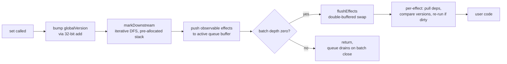
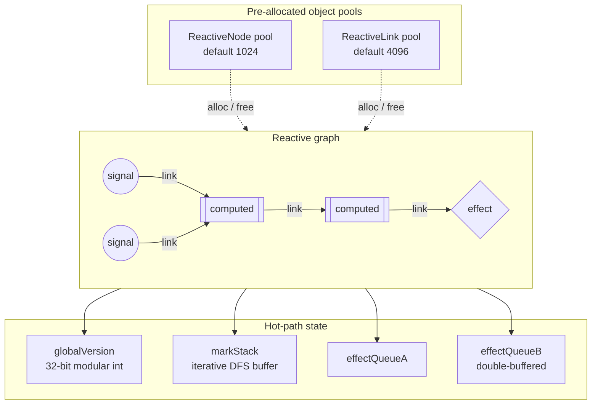
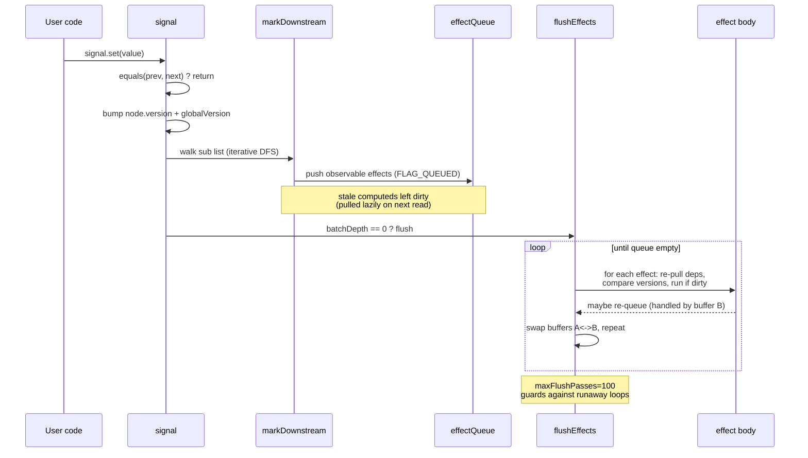
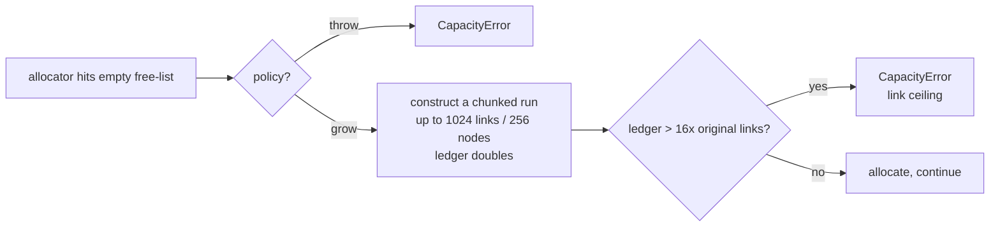

# @zakkster/lite-signal

> Zero-GC reactive graph for hot paths. Object-pooled nodes, versioned push-pull propagation, 32-bit modular epochs. Built for 16ms render budgets and 1MB extension bundles.

[](https://www.npmjs.com/package/@zakkster/lite-signal)
[](https://github.com/sponsors/PeshoVurtoleta)


[](https://bundlephobia.com/result?p=@zakkster/lite-signal)
[](https://www.npmjs.com/package/@zakkster/lite-signal)
[](https://www.npmjs.com/package/@zakkster/lite-signal)
[](https://coveralls.io/github/PeshoVurtoleta/lite-signal?branch=main)


[](./LICENSE)

## 4th of 15 on the community reactivity benchmark -- and the only zero-GC engine in the field

On the independent [js-reactivity-benchmark](https://github.com/volynetstyle/js-reactivity-benchmark) (Andrii Volynets' fork; 15 reactive libraries, 47 tests), `lite-signal` places **4th overall by geomean (73.1ms)** -- ahead of 5th-place Preact Signals (79.9) by ~9%, behind only three push-eager engines: alien-signals (48.1), reflex (49.8), and @reactively (58.3). Raw log: [`bench/AndriiVolynetsReactiveBench.log`](./bench/AndriiVolynetsReactiveBench.log) (all 15 x 47 rows, checked in for audit).

It is the **only object-pooled, zero-GC engine in the entire field**, and it gets that result without giving up glitch-freedom or lazy evaluation. Against the mainstream reactivity libraries it leads decisively:

| vs                     | lite-signal is |
| ---------------------- | -------------- |
| **@vue/reactivity**    | **1.6x faster** |
| **Signia**             | **2.0x faster** |
| **MobX**               | **2.3x faster** |
| **@solidjs/signals**   | **2.8x faster** |
| **SolidJS**            | **4.2x faster** |
| Preact Signals         | **1.09x faster** (~9% ahead) |
| alien-signals          | 0.66x (the field leader) |

`lite-signal` finishes **top-3 on 23 of the 47 tests** and, on this run, is **outright fastest of all 15** on **six shapes** -- `broadPropagation` (wide fan-out from one source), `manyEffectsFromOneSource` (1 source -> many effects), `manySourcesIntoOneComputedEffect` and `manySourcesIntoOneComputedEffectWithDirect` (both wide fan-in aggregation shapes), `molBench` (the mixed-app graph the suite uses as its realistic-workload proxy), and `32x8 - 4 sources - pull (pure pull)` (a stable rectangular DAG pulled from the tip). The wide-aggregation and mixed-app-graph pattern is where lite's zero-allocation retracking pays off most; those six shapes together are the ones that dominate live dashboards, scoreboards, and HUDs under input churn. The three engines ahead of it are all push-eager designs that allocate on the hot path; `lite-signal` is the only top-4 finisher that allocates **nothing** in steady state. (Note: this suite measures reactivity *libraries* -- Vue's reactivity core, MobX, Solid, Preact Signals, etc. -- not full UI frameworks like React or Angular.)

```bash
npm install @zakkster/lite-signal
```

```js
import { signal, computed, effect, batch } from "@zakkster/lite-signal";

const count = signal(0);
const double = computed(() => count() * 2);

effect(() => console.log("double is", double()));
// -> double is 0

count.set(21);
// -> double is 42
```

Synchronous, glitch-free, push-pull. No microtask queue, no allocations after warm-up, no surprises.

---

## Table of contents

- [Why this exists](#why-this-exists)
- [What you get](#what-you-get)
- [The case for object pooling](#the-case-for-object-pooling)
- [Architecture in one diagram](#architecture-in-one-diagram)
- [How a write propagates](#how-a-write-propagates)
- [API reference](#api-reference)
- [Watchers](#watchers)
- [Capacity, growth, and the link ceiling](#capacity-growth-and-the-link-ceiling)
- [Edge cases pinned down](#edge-cases-pinned-down)
- [Benchmarks](#benchmarks)
- [Testing strategy](#testing-strategy)
- [Test harnesses](#test-harnesses)
- [What this is not](#what-this-is-not)
- [Ecosystem](#ecosystem)
- [Browser and runtime support](#browser-and-runtime-support)
- [Integration recipes](#integration-recipes)
- [Conformance](#conformance)
- [FAQ](#faq)
- [npm scripts](#npm-scripts)

---

## Why this exists

Reactive graph libraries are now table-stakes for UI work. They all do the same thing: track reads, mark dirty, re-run on change. The differences live in the hot path.

`lite-signal` was built under three constraints simultaneously:

1. **No allocation after warm-up.** A 60fps Twitch overlay can't tolerate GC pauses. `set`, `peek`, and re-runs touch no heap.
2. **Zero microtasks.** Effects flush synchronously in the same call stack as `set()`. There is no scheduler queue. Predictable cause-and-effect makes debugging tractable.
3. **Survive forever.** A multi-day extension session can issue billions of writes. Internal versions use 32-bit modular arithmetic -- the engine never overflows.

Other libraries hit two of three. None of the ones I measured hit all three.


```mermaid
flowchart LR
  A[set called] --> B[bump globalVersion<br/>via 32-bit add]
  B --> C[markDownstream<br/>iterative DFS, pre-allocated stack]
  C --> D[push observable effects<br/>to active queue buffer]
  D --> E{batch depth zero?}
  E -- yes --> F[flushEffects<br/>double-buffered swap]
  E -- no --> G[return,<br/>queue drains on batch close]
  F --> H[per-effect: pull deps,<br/>compare versions, re-run if dirty]
  H --> I[user code]
```

No microtask between `B` and `I`. No promise, no `queueMicrotask`. Just call stack.

---

## What you get

- **`signal(value, { equals? })`** -- root reactive cell. `set`, `peek`, `update`, `subscribe`.
- **`computed(fn, { equals? })`** -- memoized derivation. Lazy. Pulls deps on read.
- **`effect(fn, { scheduler? })`** -- side-effect runner. Returns a dispose function.
- **`dispose(api)`** -- universal disposal for signals, computeds, and effect handles. Cross-registry calls are silent no-ops.
- **`batch(fn)`** -- defer effect flush until the outermost batch closes.
- **`untrack(fn)`** -- read without subscribing.
- **`isTracking()`** -- `true` iff a read right now would subscribe (for lazy-allocation wrappers).
- **`onCleanup(fn)`** -- register teardown for the current computation. Works in effects *and* computeds.
- **`createRegistry(config)`** -- isolated pool for tests, plugins, sandboxing.
- **`stats()`** -- pool occupancy snapshot. Used by the demo and easy to wire into perf overlays.
- **`CapacityError`** -- thrown when a fixed-size pool is exhausted under the `"throw"` policy.

Full type definitions ship in [`Signal.d.ts`](./Signal.d.ts) and are referenced from `package.json`. Every public symbol has JSDoc.

---

## The case for object pooling

<details>
<summary>Why pre-allocate: the GC math, and the per-op zero-allocation table.</summary>

A naive reactive library allocates one object per dependency edge, one per subscription, one per queued effect. With 1000 computeds × 1 update / frame × 60 fps, that's 60,000 short-lived objects per second. The major GC will catch up with you.

`lite-signal` solves this by pre-allocating two pools at startup -- **nodes** (one per signal/computed/effect) and **links** (one per dependency edge) -- and reusing them indefinitely. After the warm-up frames, the hot path performs zero allocations:

| Op                  | Allocations | Notes                                                                          |
| ------------------- | ----------- | ------------------------------------------------------------------------------ |
| `signal.set(x)`     | **0**       | Bumps a 32-bit version counter, walks pre-pooled link list                     |
| `signal.peek()`     | **0**       | Direct value read                                                              |
| Effect re-run       | **0**       | Cursor reuses existing links via `currentDep` pointer                          |
| `computed()` read   | **0** (steady-state) | Cache hit on `evalVersion === globalVersion`                          |
| Dispose             | **0**       | Returns nodes and links to the free lists                                      |

The free lists are singly-linked through a `nextFree` field on each pool object -- `O(1)` pop, `O(1)` push, no fragmentation.

</details>

---

## Architecture in one diagram

<details>
<summary>Pools, the reactive graph, hot-path state, and the doubly-linked edge model.</summary>


```mermaid
flowchart TB
  subgraph Pools[Pre-allocated object pools]
    NP[ReactiveNode pool<br/>default 1024]
    LP[ReactiveLink pool<br/>default 4096]
  end

  subgraph Graph[Reactive graph]
    S1((signal))
    S2((signal))
    C1[[computed]]
    C2[[computed]]
    E1{effect}
    S1 -->|link| C1
    S2 -->|link| C1
    C1 -->|link| C2
    C2 -->|link| E1
  end

  subgraph Hot[Hot-path state]
    GV[globalVersion<br/>32-bit modular int]
    MS[markStack<br/>iterative DFS buffer]
    Q1[effectQueueA]
    Q2[effectQueueB<br/>double-buffered]
  end

  NP -.->|alloc / free| Graph
  LP -.->|alloc / free| Graph
  Graph --> GV
  Graph --> MS
  Graph --> Q1
  Graph --> Q2
```

Every reactive entity is a `ReactiveNode` with bit flags (`COMPUTED`, `EFFECT`, `QUEUED`, `COMPUTING`, `HAS_ERROR`). Every edge between two nodes is a `ReactiveLink`, doubly-linked along two axes:

- **`dep` axis:** `prevDep` / `nextDep` -- the list of dependencies on the *target* node (so a computed/effect can iterate its inputs in stable order).
- **`sub` axis:** `prevSub` / `nextSub` -- the list of subscribers on the *source* node (so a signal can iterate downstream observers during mark phase).

Doubly-linked on both axes means `O(1)` unlink during the cursor-based reconciliation that happens at the end of every computed/effect re-run.

</details>

---

## How a write propagates

<details>
<summary>The set -> mark -> flush sequence, and why computeds stay pull-based.</summary>


```mermaid
sequenceDiagram
  participant U as User code
  participant S as signal
  participant Mark as markDownstream
  participant Q as effectQueue
  participant Flush as flushEffects
  participant Eff as effect body

  U->>S: signal.set(value)
  S->>S: equals(prev, next) ? return
  S->>S: bump node.version + globalVersion
  S->>Mark: walk sub list (iterative DFS)
  Mark->>Q: push observable effects (FLAG_QUEUED)
  Note over Mark,Q: stale computeds left dirty<br/>(pulled lazily on next read)
  S->>Flush: batchDepth == 0 ? flush
  loop until queue empty
    Flush->>Eff: for each effect: re-pull deps,<br/>compare versions, run if dirty
    Eff-->>Flush: maybe re-queue (handled by buffer B)
    Flush->>Flush: swap buffers A<->B, repeat
  end
  Note over Flush: maxFlushPasses=100<br/>guards against runaway loops
```

The mark phase is **iterative**, not recursive -- it uses a pre-allocated `markStack` array so a 10,000-node fan-out can't blow the JS call stack.

The flush phase uses **two queue buffers** (`effectQueueA` / `effectQueueB`) alternating each pass. An effect that writes during its own re-run gets re-queued into the *other* buffer, which is then processed in the next pass. After `maxFlushPasses` (default 100), the loop throws `CycleError`.

Computeds are **pull-based** -- they're not in the effect queue. Reading a computed walks its dep list, recursively pulls upstream computeds, and only re-runs if any dep's version is greater than its own `evalVersion`. The version comparison uses 32-bit modular arithmetic: `((dep.version - evalVer) | 0) > 0`. This is the trick that makes the engine immune to integer overflow during long-running sessions.

</details>

---

## API reference

### Top-level

```ts
import {
  // Core
  signal, computed, effect,
  signalBox, computedBox,       // 1.5.0 -- allocation-light, non-callable
  batch, untrack, onCleanup, isTracking,
  createRoot,                   // 1.5.0 -- detached ownership scope
  getOwner, runWithOwner,       // 1.5.0-beta.2 -- capture + restore ownership across async gaps
  createScope,                  // 1.6.0 -- adopting scope; single disposer tears down the subtree
  // Registry / lifecycle
  createRegistry, setDefaultRegistry, dispose, destroy,
  stats, CapacityError,
  // Introspection (1.1.4 / 1.1.5 / 1.2.1)
  hasObservers, observeObservers,
  forEachObserver, forEachSource,
  nodeId, describe,
  forEachOwned, ownerOf,        // 1.2.1
  // Debug hook (1.2.1)
  onGraphMutation,
  // Watchers
  watch, when, whenAsync,
} from "@zakkster/lite-signal";
```

The top-level functions route to a default registry created on import. For isolated sandboxes (tests, plugins, multi-tenant SDKs), use `createRegistry` directly.

### Signal

```ts
const s = signal(initial, { equals?: (a, b) => boolean });

s();              // tracked read
s.peek();         // untracked read
s.set(value);     // notify downstream
s.update(fn);     // s.set(fn(s.peek()))
const off = s.subscribe(value => { ... });
off();            // unsubscribe
```

`equals` defaults to `Object.is` (so `NaN` notifies once, `-0`/`+0` are distinct). Pass `() => false` to force every write to propagate, or your own deep-equal to skip redundant updates.

### Computed

```ts
const c = computed(() => s() * 2, { equals?: (a, b) => boolean });

c();              // tracked read, lazy evaluation
c.peek();         // untracked read, may still compute
const off = c.subscribe(value => { ... });
```

Computeds **cache by version**, not by value. Reading a clean computed (one whose dependencies haven't changed since its `evalVersion`) is `O(deps)` -- it still walks the dep list to check versions, then returns the cached value. The `equals` option short-circuits downstream propagation when the new computed value matches the old.

### SignalBox / ComputedBox (1.5.0)

Non-callable, allocation-light variants of `signal` / `computed`. Instead of a callable function they return a plain object on a shared prototype:

```ts
const s = signalBox(initial, { equals?: (a, b) => boolean });
s.get();          // tracked read   (vs callable s())
s.set(value);     // notify downstream
s.peek();         // untracked read
s.update(fn);     // s.set(fn(currentValue))
const off = s.subscribe(value => { ... });

const c = computedBox(() => s.get() * 2, { equals? });
c.get();          // tracked read, lazy
c.peek();         // untracked read
c.subscribe(value => { ... });   // no set / update -- it's derived
```

Same `ReactiveNode` machinery, same zero-GC read/write path, fully interoperable with callable handles in one graph (a callable `computed` can read `box.get()` and vice versa; ownership, batching, glitch-freedom, and introspection all apply uniformly). The trade is **call ergonomics for cheaper construction**: a box is `Object.create(proto)` plus two own properties rather than a closure with attached methods, so creating many short-lived cells is ~1.7x cheaper. Boxes are built on the shared prototype from the start (never `setPrototypeOf`, which would deopt the method-call inline caches to megamorphic). Reach for a box when you create *many* reactive cells or want a plain serializable-looking handle; reach for the callable when call-site ergonomics matter more.

### Effect

```ts
const dispose = effect(() => {
  console.log(s());
  onCleanup(() => { /* fires on next run + final dispose */ });
}, {
  scheduler?: (runEffect) => void  // optional, see below
});

dispose();
```

Effects run **once eagerly** on creation, then again whenever any tracked dependency changes. Dispose returns the node to the pool. If a scheduler is provided, the runner is handed to the scheduler instead of executing inline -- useful for batching reactive updates into requestAnimationFrame, microtasks, or your own frame loop.

### Batch

```ts
batch(() => {
  s1.set(1);
  s2.set(2);
  s3.set(3);
}); // effects flush exactly once at the end
```

Nestable. Effects only flush on the outermost close.

### Untrack

```ts
const value = untrack(() => s());  // read without subscribing
```

Useful inside computeds/effects when you need a current value but don't want it as a dependency.

### createRoot (1.5.0)

```ts
const dispose = createRoot(() => {
  // effects/computeds created here are NOT owned by the enclosing scope
  return effect(() => { /* long-lived watcher */ });
});
// ... later, the caller owns the lifecycle:
dispose();
```

Runs `fn` in a **detached ownership scope** and returns whatever `fn` returns. Effects and computeds created directly inside `fn` are not adopted by the enclosing owner, so they survive the enclosing effect's re-runs and disposal -- there is no parent to auto-dispose them, so the caller is responsible (typically `fn` returns a disposer or the created handle). Both ownership *and* tracking are detached for the duration of `fn`'s direct body; inner effect/computed bodies still establish their own scopes as usual. Mirrors Solid's `createRoot` on the lifecycle axis.

The problem it solves: lazily spawning a *long-lived* node from *inside* a consumer effect is otherwise a footgun -- the spawned node is adopted by the consumer, so the consumer's next re-run cascade-disposes it. That is the ownership model working as designed (owned children dispose with their parent); `createRoot` is the sanctioned opt-out. Any consumer that creates a watcher/subscription inside a reactive scope and expects it to outlive that scope wraps the spawn in `createRoot(() => effect(...))` -- `lite-query`'s query-watcher being the first in the ecosystem. The companion primitives `getOwner` / `runWithOwner` -- for capturing the current owner and restoring it across an async boundary -- ship in **1.5.0-beta.2** and are carried forward into 1.6 unchanged; see the next section. **1.6.0 adds `createScope`** as the third member of the family: where `createRoot` *detaches* and leaves you to dispose each child by hand, `createScope` *adopts* and returns one disposer that tears down the subtree at once -- see the `createScope` section further below.

### getOwner / runWithOwner (1.5.0-beta.2, carried into 1.6)

The re-attach half of the ownership escape hatch. `createRoot` detaches; `getOwner` + `runWithOwner` **capture and restore**. Together they give you the Solid-shaped ownership API for the async pattern that comes up whenever you have to leave a synchronous reactive scope, do work, and come back:

```javascript
import { effect, getOwner, runWithOwner, signal } from '@zakkster/lite-signal';

const s = signal(0);
effect(() => {
    const owner = getOwner();               // opaque, gen-stamped handle
    fetch('/data').then(res => res.json()).then(data => {
        runWithOwner(owner, () => {         // re-enter the captured scope
            effect(() => { console.log(s(), data); });
        });
    });
});
```

`getOwner()` returns the current owner as an **opaque, gen-stamped handle** (or `undefined` outside any effect/computed body). `runWithOwner(handle, fn)` runs `fn` with the captured lifecycle scope reinstated: effects and computeds created directly in `fn` are adopted by that owner and cascade-dispose when it re-runs or is disposed. Reads directly in `fn` do not link -- tracking is detached the same way `createRoot` detaches it, so accidental cross-async edges cannot form. Compose with an inner effect if you want tracking under the restored owner.

**Handles are safe to hold across async boundaries.** This is where a raw-pointer implementation would corrupt the graph: node objects are pooled and the LIFO free list recycles a disposed owner's slot into whatever effect/computed is allocated next. A stale raw pointer would silently adopt continuations into that stranger. Instead, `getOwner` returns a `describeNode` handle stamped with the pool slot's generation; `runWithOwner` resolves via `liveNode()`, and if the gen has moved (slot recycled) or the handle refers to a signal (not a tracker), it degrades to **rooted execution** -- the continuation runs, stays alive, and is simply not owned by anyone. That is the only honest semantics for "the scope you captured no longer exists": the alternative was a silent cascade-dispose by an unrelated stranger, or, if the slot was disposed but not yet recycled, a `RangeError: Maximum call stack size exceeded` inside the cleanup recursion. Both hazards are pinned in `test/28-run-with-owner.test.mjs` and empirically demonstrated in `harness/owner-hazard-repro.mjs`.

The handles do **not** keep owners alive -- they are snapshots, not references. Node lifetime is controlled by the owner tree, not by outstanding handles.

### createScope (1.6.0)

The third member of the ownership family. `createRoot` **detaches** (no owner survives; caller disposes each child); `runWithOwner` **restores a captured owner**; `createScope` **creates a new scope owner** and returns a single disposer that cascade-disposes everything created inside it. The lifecycle primitive a keyed-list or scene reconciler needs for per-item scopes of unknown internal shape:

```javascript
import { createScope, effect, signal } from '@zakkster/lite-signal';

function renderItem(item) {
    return createScope(dispose => {
        const local = signal(item.initial);
        effect(() => { renderTo(item.node, local()); });
        return { dispose, update: (v) => local.set(v) };
    });
}

// Per-item teardown is one disposer, no matter what the item created inside.
const handle = renderItem(item);
handle.dispose();          // -> the effect above stops; local falls out of scope
```

`fn` receives its own `dispose` and runs ONCE in a detached, untracked context: no ownership leaks in, no dependency leaks out from `fn`'s direct body, and the scope owner itself never re-runs. Put reactive bindings in **inner** effect/computed bodies inside `fn` -- those establish their own tracking scopes AND are owned by this scope, so they update normally and are cascade-disposed on `dispose()`. Reads in `fn`'s direct body are untracked; `createScope` returns whatever `fn` returns.

Plain signals created directly in `fn` are NOT adopted -- the engine never owner-adopts signals (the lazy-alloc rule, 1.2.0) -- so dispose those explicitly (the creator holds the handle) or let them fall out of reference. Computeds and effects ARE adopted and cascade. The scope owner is backed by a never-re-running effect node, so it counts as one effect in `stats()`; its disposer is the same gen-guarded handle `effect()` returns, so ABA-safety and introspection (`describe`, `nodeId`, `forEachOwned`) match effects exactly. A scope created inside a consumer effect **survives that consumer's re-run** -- the reconciler-critical detach property. The API (`fn => dispose`) is the stable contract; a future engine may swap in a lighter pure-owner node transparently.

### isTracking

```ts
function makeLazyField(initial) {
  let s = null, value = initial;
  return {
    get() {
      if (isTracking()) {
        if (s === null) s = signal(value);   // allocate only when subscribed
        return s();
      }
      return value;
    },
    set(v) { value = v; if (s !== null) s.set(v); }
  };
}
```

Returns `true` iff a read right now would record a dependency on the current registry -- an observer body is on the stack AND tracking is enabled. Mirrors the engine's own read-trap check (both flags), so it correctly returns `false` inside `untrack`, inside `subscribe` callbacks, inside `onCleanup` bodies, inside `watch` / `when` callbacks, and outside any observer.

For wrapper libraries (lite-store, lite-query, lite-form) gating lazy allocation on the read path. Per-registry -- call `registry.isTracking()` if your signals live in a non-default registry.

### Observer-lifecycle introspection

```ts
// Start a ticker only while something is actually watching a derived value.
const now = signal(performance.now());
const unobserve = observeObservers(now, {
  onConnect:    () => startRAF(),   // 0 -> 1 observers
  onDisconnect: () => stopRAF(),    // 1 -> 0 observers
});

hasObservers(now);                  // O(1): is anyone subscribed right now? (a peek doesn't count)

// Walk the live graph in either direction (lite-devtools):
forEachObserver(sum, d => console.log(d.kind, d.value));  // subscribers of `sum`
forEachSource(sum,   d => console.log(d.kind, d.value));  // dependencies of `sum`

// 1.2.1: walk the owner tree (cascade-disposal domains)
forEachOwned(effectHandle, d => console.log(d.kind, d.id));  // observers this one will cascade-dispose
ownerOf(innerComputedDesc);                                  // descriptor of the enclosing effect/computed
```

Eight functions (top-level + per-registry) -- four in 1.1.4, two in 1.1.5, two more in 1.2.1 -- for auto-pausing wrappers and graph inspection:

- **`hasObservers(handle)` -> `boolean`** -- O(1) (`node.headSub !== null`). The auto-pause predicate.
- **`observeObservers(handle, { onConnect?, onDisconnect? })` -> `unobserve`** -- fires on the 0->1 and 1->0 observer transitions *after* registration (transition-only -- no immediate fire if already observed). Re-tracking a persistently-read source does **not** churn. This is the hook `lite-time` / `lite-raf` use to run a clock only while a derived value is watched. Throws `TypeError` on a non-handle.
- **`forEachObserver(handle, fn)` / `forEachSource(handle, fn)`** -- walk subscribers / dependencies; `fn` gets a `{ id, kind, value }` descriptor (`kind` in `"signal" | "computed" | "effect"`; `id` added in 1.1.5). No-op on a non-handle.
- **`nodeId(handle)` -> `number | undefined`** *(1.1.5)* -- the node's stable per-allocation id; the dedupe key for graph traversal. `undefined` on a non-handle.
- **`describe(handle)` -> `{ id, kind, value } | undefined`** *(1.1.5)* -- the handle's own descriptor. **Re-walkable**: pass it back into any `forEach*` to recurse the graph. `undefined` on a non-handle.
- **`forEachOwned(handle, fn)`** *(1.2.1)* -- walk this node's owned children (lifetime-binding edges from the 1.2 owner tree). The dep/sub edges show DATA FLOW; the owner edges show LIFETIME BINDING -- when this handle re-runs or is disposed, every owned child is cascade-disposed. No-op on a non-handle, top-level handle with no children, or stale handle.
- **`ownerOf(handle)` -> `{ id, kind, value } | undefined`** *(1.2.1)* -- descriptor of `handle`'s owner, or `undefined` for top-level / stale handles. The inverse of `forEachOwned`: walks UP the owner tree.

The surface is gated by an internal lifecycle counter: when nothing is being observed, the hot path adds a single branch-predicted `count !== 0` check in link alloc/free and nothing else -- **zero steady-state cost when unused**.

#### Stale-handle guard (1.2.1)

The 1.2.0 owner tree makes the engine recycle pool slots autonomously: when an effect or computed re-runs, every observer it created in its previous body is cascade-disposed. **Holding a stale handle stopped being a user error and became routine.** Pre-1.2.1, the introspection surface plus `peek()` resolved `NODE_PTR` ungated and would happily report the recycled slot's NEW resident -- wrong id, wrong value, wrong edges.

1.2.1 generation-checks every entry point that resolves a handle (the same ABA discipline `dispose()` always had):

- `nodeId`, `describe`, `hasObservers`, `forEachObserver`, `forEachSource`, `forEachOwned`, `ownerOf`, `signal.peek()`, `computed.peek()`, `signal()`/`computed()` read, `signal.set()` -> return `undefined` / are no-ops on stale handles.
- `observeObservers` throws `TypeError` (matching the existing non-handle contract).

Descriptors returned by `describe()` and the `forEach*` walkers are themselves gen-stamped, so the documented "descriptors are re-walkable handles" contract survives the guard: a fresh descriptor walks, one held across a recycle correctly goes stale.

### onGraphMutation (1.2.1)

```ts
// Push-based devtools / studio integration. Single listener, allocation-free dispatch.
const unsub = onGraphMutation((opcode, intA, intB) => {
  switch (opcode) {
    case 1: devtools.onNodeCreate(intA, intB);  break;   // intA = node.id, intB = node.flags
    case 2: devtools.onNodeDispose(intA);       break;   //   ditto (cascade-disposed children included)
    case 3: devtools.onLinkAdd(intA, intB);     break;   // intA = source.id, intB = target.id
    case 4: devtools.onLinkRemove(intA, intB);  break;
    case 5: devtools.onRecompute(intA);         break;   // before each effect re-run / computed re-eval
  }
});

// Stop listening -- restores the previous registration (or null), engine returns to zero-cost state.
unsub();
```

A registry-level (and top-level) debug hook for push-based tooling -- the connection point lite-devtools 1.1 and lite-studio 1.1 use to walk away from polling. Single nullable listener; every fire point in the engine is one `if (mutationHook !== null) mutationHook(opcode, intA, intB)`:

- **Zero cost when unregistered** -- branch-predicted null check per mutation point, same as the lifecycle counter pattern.
- **Allocation-free when registered** -- three integers, no objects, no closures. Worst-case measured cost on a dynamic-retracking torture loop (11.4M events over 400K writes) is +29% -- a debug-mode tax proportional to event volume, paid only while a consumer is attached.
- **LIFO stacking** -- `onGraphMutation(a); onGraphMutation(b); unsubB()` restores `a`. Used by lite-devtools 1.1 to multiplex multiple consumers behind one engine registration.

**Listener contract: observe only -- never throw, never mutate the graph from inside.** The hook fires synchronously inside mutation points; mutating from the callback corrupts the in-flight operation. Wrap any downstream work that could touch the registry in a microtask.

### onCleanup

```ts
effect(() => {
  const id = setInterval(tick, 100);
  onCleanup(() => clearInterval(id));
});
```

Registers a teardown for the *current* computation. Fires before every re-run and once on dispose. Supports multiple cleanups per scope (they're stored as a flat list, run in registration order). Works inside computeds too -- useful for canceling async work when memos become stale.

### dispose

```ts
const s = signal(0);
const c = computed(() => s() * 2);
const e = effect(() => { /* ... */ });

dispose(s);   // signal -> returns the node to the pool
dispose(c);   // computed -> same, also unlinks its upstreams
dispose(e);   // effect handle -> identical to calling e()
```

One function for all three primitives. Idempotent. Cross-registry calls are silent no-ops -- each registry holds a private `Symbol("node_ptr")` keyed on its own nodes, so passing a signal from registry A to `registry B.dispose()` won't corrupt either pool. Passing an unrelated value (`null`, `42`, `{}`) is also a safe no-op. Passing an arbitrary function invokes it (the effect-handle contract).

The effect dispose handle (`const dispose = effect(...)`) is still a plain function -- you can call it directly. `dispose()` exists to unify the call site when you're managing a heterogeneous bag of reactive resources, which is the common case for component teardown and tests.

### createRegistry

```ts
const r = createRegistry({
  maxNodes:           1024,       // default (ledger)
  maxLinks:           4 * 1024,   // default = maxNodes * 4 (ledger)
  prealloc:           "eager",    // default. Other: "lazy"
  maxFlushPasses:     100,        // default
  onCapacityExceeded: "throw"     // default. Other: "grow"
});

const s = r.signal(0);
const e = r.effect(() => s());
r.destroy();                     // reset all pools, invalidate generations
```

`createRegistry` is the unit of isolation. Two registries share no state -- useful for multi-tenant code, plugin sandboxes, and tests that need a fresh world.

`setDefaultRegistry(r)` swaps the registry used by top-level helpers. Use sparingly; intended for test setup.

---

## Capacity, growth, and the link ceiling

<details>
<summary>Pool sizing, the grow policy, and why there is a 16× link ceiling.</summary>

The engine has two pools: **nodes** and **links**. Their capacities are set at registry creation. As of **1.3.0** you also choose *when* the pools are populated (`prealloc`) and *what happens* when a capacity is hit (`onCapacityExceeded`).

**`prealloc` (1.3.0)** -- `"eager"` (default) constructs the full `maxNodes` / `maxLinks` pools up front: deterministic latency, zero allocation inside any subsequent hot path (the contract that matters for 16ms render frames and 120fps canvas loops), at the cost of a larger resident heap. `"lazy"` treats the capacities as *ledgers*, constructs nodes/links on first demand, and recycles through the free lists thereafter: smaller heap, faster cold start, lighter GC marking, **identical zero-GC steady state after warm-up**. Choose eager for hard-real-time, lazy for footprint-sensitive or short-lived registries (per-viewer sandboxes, tests).

**`onCapacityExceeded`** -- `"throw"` (default) fails fast with a `CapacityError`. `"grow"` extends the pool on demand. Growth is **chunked and incremental** -- contiguous runs of up to **1024 links / 256 nodes** per free-list miss, not a single doubling burst -- so any one growth pause stays bounded (~chunk x ~0.5us) and freshly constructed slots stay contiguous in memory. The capacity *ledger* still doubles, so `stats()` semantics are unchanged.


```mermaid
flowchart LR
  A[allocator hits empty free-list] --> B{policy?}
  B -- "throw" --> C[CapacityError]
  B -- "grow" --> D[construct a chunked run<br/>up to 1024 links / 256 nodes<br/>ledger doubles]
  D --> E{ledger > 16x original links?}
  E -- yes --> F[CapacityError<br/>link ceiling]
  E -- no --> G[allocate, continue]
```

Why a ceiling? Unbounded growth hides leaks. If your app reaches 16x its starting link capacity, something is wrong and you want to know -- `CapacityError` is louder than a slow OOM crash four hours later.

Default sizing for a Twitch-extension-style budget:

| Workload                            | maxNodes | maxLinks | prealloc | policy   |
| ----------------------------------- | -------- | -------- | -------- | -------- |
| Tiny widget (<=50 reactive cells)    | 256      | 1024     | `"eager"` | `"throw"` |
| Standard overlay (~500 cells)       | 1024     | 4096     | `"eager"` | `"throw"` |
| Heavy dashboard (variable scale)    | 2048     | 16384    | `"eager"` | `"grow"`  |
| Per-viewer sandbox / short-lived    | 512      | 2048     | `"lazy"`  | `"throw"` |

`stats()` reports 11 keys: eight live gauges -- `signals`, `computeds`, `effects`, `activeNodes`, `activeLinks`, `pooledLinks`, `nodePoolCapacity`, `linkPoolCapacity` (the capacity keys are ledgers under `"lazy"`) -- plus three cumulative lifecycle counters added in **1.4.0**: `totalAllocations`, `totalDisposals`, and `poolGrowths` (monotonic over the registry's life, reset only by `destroy()`). Sample them over time to chart allocation rate, pool-reuse ratio, and graph churn; in a quiescent registry `totalAllocations - totalDisposals === activeNodes`. Drop it on screen for live observability.

</details>

---

## Watchers

`@zakkster/lite-signal` ships three composable watcher primitives, all built from `effect` + `untrack` -- no engine extensions, no per-watcher flag in `ReactiveNode`. The core stays small; the surface stays useful.

| API | Use case | Lifecycle | Hot-path safe? |
|---|---|---|---|
| `watch(source, cb)` | observe value changes over time | manual `stop()` | yes -- zero-GC per fire |
| `watch(source, (v, p, stop) => ...)` | observe until a condition | self-dispose via callback arg | yes -- zero-GC per fire |
| `when(predicate, cb)` | one-shot trigger when condition first true | auto-dispose | yes -- zero-GC per check |
| `whenAsync(predicate)` | await a condition | auto-dispose | ! allocates Promise -- see below |

### `watch(source, callback, options?)`

Fires the callback whenever the source's projected value changes. The callback receives `(newValue, oldValue, stop)` -- calling `stop()` from inside the callback disposes the watcher.

```js
import { signal, watch } from "@zakkster/lite-signal";

const count = signal(0);

// Basic -- observe forever
const stop = watch(count, (next, prev) => {
    console.log(`${prev} -> ${next}`);
});

count.set(1);  // logs: 0 -> 1
stop();        // manual dispose
```

**Self-disposing watcher** -- declarative termination from inside the callback:

```js
watch(status, (next, prev, stop) => {
    if (next === "ready") {
        initialize();
        stop();  // detach after first "ready"
    }
});
```

**Immediate option** -- fires once on registration with `oldValue = undefined`:

```js
watch(theme, (v) => applyTheme(v), { immediate: true });
```

**Raw getter equality** -- `watch` uses `Object.is` internally to avoid spurious fires when a dep mutation produces the same projected value:

```js
const health = signal(10);
let deathLog = 0;
watch(() => health() <= 0, (isDead) => { deathLog++; });

health.set(9);  // isDead is still false -- no fire
health.set(8);  // same -- no fire
health.set(0);  // crossed -- fires once with (true, false)
```

Without this guard, the callback would fire on every `health` mutation regardless of whether `isDead` changed. Wrapping the source in `computed()` would achieve the same via the computed's own equality check -- the guard makes that wrapping optional.

### `when(predicate, callback)`

Fires `callback` exactly once when `predicate` first returns a truthy value, then auto-disposes. If the predicate is already truthy at registration, fires synchronously.

```js
import { when } from "@zakkster/lite-signal";

when(() => user.isAuthenticated, () => {
    navigate("/dashboard");
});
```

The returned dispose function can cancel before the predicate fires:

```js
const cancel = when(() => slowApi.ready, () => start());
if (userBacked) cancel();
```

### `whenAsync(predicate)`

> ### ! Hot-path warning
>
> `whenAsync` calls `new Promise(...)` internally -- **this is a heap allocation**. Every call allocates a Promise object, an executor closure, and Promise infrastructure (resolve function, microtask state). Promises require heap allocation by the language spec; this cost is unavoidable.
>
> **Use for:** high-level scene/UI orchestration, boot sequences, awaiting user input, level transitions. Anything that runs once or rarely.
>
> **NEVER use for:** per-frame entity updates, render-loop logic, animation tick handlers, anywhere that runs at 60/120 fps. The Promise allocations will be visible in GC traces and will cause frame-time spikes under sustained load.
>
> **For zero-GC hot-path logic, use `when` with a callback.**

Promise-returning variant of `when`. Composes with `async/await` for declarative async control flow against reactive state:

```js
import { whenAsync } from "@zakkster/lite-signal";

async function bootSequence() {
    await whenAsync(() => config.loaded);
    await whenAsync(() => auth.ready);
    await whenAsync(() => db.connected);
    render();
}
```

The promise never rejects on its own -- if the predicate never becomes truthy, the promise never settles. For timeout semantics use `Promise.race`:

```js
await Promise.race([
    whenAsync(() => api.ready),
    new Promise((_, rej) => setTimeout(() => rej(new Error("timeout")), 5000))
]);
```

### Allocation profile

Honest accounting of where memory is spent in each primitive:

| Primitive | Allocations at registration | Allocations per fire / check |
|---|---|---|
| `watch(source, cb)` | 3 closures (stop, effect body, hoisted untrack body) | **0** |
| `when(predicate, cb)` | 2 closures (stop, effect body) | **0** |
| `whenAsync(predicate)` | 1 Promise + 1 executor closure + Promise internals + 2 closures from `when` | **0** (after registration) |

The "0 per fire" property for `watch` is deliberate engineering -- the inner `untrack` callback is hoisted to a single closure allocated once at registration, with `currentNewValue` as shared mutable state. If you read the source and wonder why we don't use a clean inline arrow function inside the effect body, this is the answer: doing it inline would allocate a fresh closure on every dep change, at 7,200 allocs per minute per watcher at 120 fps.

### Tree-shaking

All three primitives live in a separate module (`Watch.js`) and are re-exported from the main entry (which binds them to its own `effect`/`untrack`, so there is exactly one engine instance). If your bundle doesn't import them, they won't appear in the output -- modern ESM tree-shaking (Vite, Rollup, esbuild) handles this reliably.

---

## Edge cases pinned down

<details>
<summary>Diamonds, self-feedback, nested-effect ownership (v1.2), pre-batch revert (v1.2), multi-throw AggregateError (v1.2), NaN/+/-0, throwing bodies, 32-bit version wrap, deep-chain limits.</summary>

These are the questions you'd ask in a code review, with the answers:

- **Diamond dependency.** Glitch-free. The mark phase walks the graph once; computeds are pulled lazily on read, so each one re-runs at most once per propagation regardless of how many paths reach it.
- **Writing to a signal during its own effect (self-feedback loop).** The new value re-queues the effect into the alternate buffer. After 100 flush passes (configurable), `CycleError` is thrown -- you have a real loop, not just a deep update.
- **Writing to a signal *inside its computed*.** Throws `CycleError` immediately at the inner `set` -- this is a structural cycle, not a deep update, and the engine refuses to attempt it.
- **Nested effects (v1.2 owner tree).** An effect or computed that creates nested observers (effect/computed) **owns** them. When the owner re-runs or is disposed, those owned children cascade-dispose before the new run -- no leaked nested subscriptions, no manual bookkeeping. Plain signals are deliberately NOT owner-adopted so lazy-allocation wrappers (lite-store keys, lite-form fields) continue to survive their allocating computed's re-runs.
- **Pre-batch revert (v1.2).** Inside `batch(...)`, if a signal is set and then set back to its pre-batch value (under its own `equals`), the version bump is reverted and downstream effects/computeds do not fire. Eliminates a class of spurious re-runs from temporary state mutations.
- **Multi-throw in one flush (v1.2).** Two or more effects throwing in the same flush pass aggregate to `AggregateError` at the triggering `set()` / batch boundary; effects that don't throw still run. A single thrown error is rethrown unwrapped (no API change for the common case).
- **NaN, -0, +0.** Default `equals` is `Object.is`. `NaN === NaN` is true for our purposes (so setting NaN twice doesn't re-fire). `-0` and `+0` are distinct.
- **First-run effect throws.** The half-initialised node is disposed cleanly, deps unlinked, then the error propagates to the caller. No leaked dangling subscriptions.
- **Computed throws.** The error is cached on the node (`FLAG_HAS_ERROR`) and re-thrown on every subsequent read until a dependency changes. This is symmetric with successful caching.
- **Dispose during flush.** Effects re-check their generation (`gen`) before running through a scheduler trampoline. If `dispose()` bumped the gen between schedule and execute, the trampoline becomes a no-op. The trampoline closure is cached on the node (v1.2) so repeated re-schedules reuse the same function -- ABA safe under async schedulers.
- **32-bit version wrap.** Versions are `(... + 1) | 0`, so after 2^31 writes they wrap to a negative number. The comparison `((dep.version - evalVer) | 0) > 0` is wrap-safe -- it works on the *modular distance*, not raw integer ordering.
- **Deep chain depth.** Computed resolution is recursive in the JS call stack. Chains beyond ~5,000 deep risk `RangeError: Maximum call stack size exceeded`. Effects use an iterative mark phase, so signal -> effect fan-out has no depth limit other than memory.
- **`destroy()` after dispose.** `destroy()` bumps every node's generation, so any in-flight scheduled trampolines from before destruction are silently dropped. Closures returned to user code from disposed effects guard with `if (node.flags === 0) return;` -- calling `dispose()` again is a no-op.

</details>

---

## Benchmarks

Honest numbers, against the same workload, with anti-DCE sinks and verified effect execution. All measurements: **Node 26.3.1, Apple M4 Pro (darwin/arm64)**, **one engine per cold process**, median across reps, machine-stamped `#STAMP` (engine + harness sha256, live registry config, host, node) on every output. Newer/faster machines shift all libs up proportionally; the relative ordering between libs is what matters -- and on this newer silicon the run-to-run noise floor is lower, so the sub-percent parity band tightens and the honest wins/losses stand out cleanly. Numbers below are the **fresh 1.6.0-alpha bench sweep** on the v3 **microscope** (`benchmark.mjs`, six first-party shapes, default `prealloc: "eager"`) vs alien-signals -- the harness reports **median execution time + transient heap** rather than ops/s. 1.5.0 -> 1.6.0-alpha changes the hot path for the first time since 1.2.2: two new mutation-hook opcodes fire under a `null`-check gate -- op 6 (`flush-pass-start`) once per pass in `flushEffects`, op 7 (`effect-enqueue`) inside `markDownstream`'s inner loop when a dirty subscriber is enqueued -- so the sha256 of those two function bodies no longer matches 1.5. Both gates are branch-predicted-free when the hook is null; the residual cost is one predicted branch per fire site. The `flushPasses` counter on `stats()` (the new 12th key) advances only while a hook is attached. Everything else is byte-identical to 1.5.1-beta.1 (sha256-verified over `pullComputed`, `executeEffect`, `runCleanup`, `disposeNode`, `allocateLink`, `severTail`, `createNode`, `createRoot`, `createScope`). Third-party engine versions carried forward from the 1.5.0-beta sweep. Full outputs: [`bench/r.txt`](bench/r.txt) (this microscope aggregate across four engines) and [`bench/rb.txt`](bench/rb.txt) (the mirror sweep -- Andrii's canonical adapter verbatim, 47 rows, lite vs alien on the same M4 Pro host); the older Intel MacBook / Node 22 sweep of the same 1.6.0-alpha engine is preserved for cross-host reference at [`bench/results.txt`](bench/results.txt) and shows the gate cost surfacing as -12% on KAIROS / -21% on DEEP CHAIN there -- a host-dependent artifact of the branch cost, not visible on M4 Pro where prediction absorbs it.

| Scenario   | What it stresses                | lite-signal | alien-signals | lite vs alien | transient heap (lite / alien) |
| ---------- | -------------------------------- | ----------- | ------------- | ------------- | ----------------------------- |
| **MUX**    | 256 signals -> 1 sum -> 1 effect (fan-in) | **22.77 ms** | 35.22 ms | **+35.3% faster** | **0 KB / 781 KB** (100% less) |
| **SELECTIVE DAG** | sqrt-layered, set churn, 2 read/iter | **2013 ms** | 2536 ms | **+20.6% faster** | **7.6 MB / 78.2 MB** (90.3% less, 10.3x) |
| **DYNAMIC DAG** | sqrt-layered, FAN=6, read flips each iter | **3680 ms** | 4473 ms | **+17.7% faster** | **3.4 MB / 60.0 MB** (94.4% less, 17.9x) |
| **BROADCAST** | 1 signal -> 1000 effects (fan-out) | **447.81 ms** | 508.88 ms | **+12.0% faster** | ~0 KB / ~0 KB (both fit under GC floor) |
| **KAIROS**    | 1 signal -> 1000 computeds -> 1 effect | 531.09 ms | 483.45 ms | -9.9% | **23 KB / 802 KB** (97.1% less, 34.3x) |
| **DEEP CHAIN** | 256-deep computed chain -> 1 effect | 171.93 ms | **98.93 ms** | -73.8% | **0.5 KB / 1062 KB** (100% less, >2000x) |

*(lower time = faster; transient heap = average delta-heap per rep, lower = less GC pressure)*

**Reading the table:** the M4 Pro sweep clarifies exactly which of lite-signal's wins are real and which were noise on a slower host. The **allocation-heavy dynamic shapes stay lite's home turf**: **MUX +35.3%** (fan-in aggregation), **SELECTIVE DAG +20.6%**, **DYNAMIC DAG +17.7%** -- essentially unchanged from the 1.5.0-beta M4 Pro sweep, confirming the mutation-hook gate is round-off on allocation-dominated shapes where the ratio of pool retracking to marker walks favors lite by orders of magnitude. The genuine news is **BROADCAST flipping to a +12.0% win** (was -1.2% parity on 1.5.0-beta): fan-out is now a fourth speed win on this sweep, and **KAIROS narrowed from -15.7% to -9.9%** -- the exact opposite of what the 2016 Intel host shows for the same engine, which is what you would expect if branch prediction on the M4's frontend is absorbing the two hook-gate `null` checks completely. **DEEP CHAIN -73.8%** is the one shape that stays firmly in alien's column: a 256-deep computed pipeline is the architectural weak spot the honest framing has always named (recursive JS-stack computed resolution loses to alien's flatter chain on hot new cores by a wider margin than on old Intel, and the added per-level gate cost compounds when it does show), and no amount of hook-gate accounting hides that. The mirror-sweep companion ([`bench/rb.txt`](bench/rb.txt)) reproduces the picture across Andrii's 47 shapes: lite runs **parity-to-behind alien on throughput**, wins outright on **5 of the 47** (`1000x5 - 25 sources (wide dense)` +12.2%, both `manySourcesIntoOne*ComputedEffect` fan-ins ~+32%, `molBench` +1.0%, and `createComputations4to1` +9.5%) -- and this is not the story to tell.

**The story is the heap column.** On every microscope shape where GC pressure exists at all, `lite-signal` allocates **one to four orders of magnitude less transient heap than alien-signals**: DEEP CHAIN 0.5 KB vs 1062 KB (>2000x less -- yes, on the shape where lite is behind on time), MUX 0 KB vs 781 KB, KAIROS 23 KB vs 802 KB (34.3x), DYNAMIC DAG 3.4 MB vs 60.0 MB (17.9x), SELECTIVE DAG 7.6 MB vs 78.2 MB (10.3x). On BROADCAST both engines are effectively zero. Against preact-signals and solid-signals the heap gap is even wider on the fan-in / fan-out family -- solid allocates ~17 MB on MUX and ~15 MB on SELECTIVE DAG where lite allocates 0 KB and 7.6 MB respectively (`bench/r.txt`). **`lite-signal`'s differentiated position is ALLOCATION, not raw propagation speed**: competitive-to-winning throughput with dramatically lower GC pressure, not "fastest dynamic-graph engine". That headline is the one that reproduces across hosts, sweeps, and third-party version bumps -- because the object pool is the mechanism, not a tuning knob.

> Note on the +23 KB delta-heap that lite-signal shows on KAIROS: that's the pre-allocated pool sitting in memory holding the live graph (1002 nodes + ~2000 links). The pool *is* the working memory -- see the [Case for object pooling](#case-for-object-pooling) section. On the other shapes the graph is small enough that the same pool floats below the GC baseline.

The benchmark harness is in [`bench/benchmark.mjs`](./bench/benchmark.mjs); a full methodology write-up -- including the anti-DCE design, workload diagrams, variance discipline, reproducibility recipe, and a self-validation procedure for the harness itself -- lives in [`bench/README.md`](./bench/README.md). It:

1. Writes every effect's output to a shared `Float64Array(4096)` exposed on `globalThis` -- V8 cannot prove these writes are dead.
2. Uses the **client** Solid runtime (`solid-js/dist/solid.js`), not the SSR stub Node resolves to by default. The default Node resolution silently no-ops effects, which is how earlier benchmarks across the ecosystem have reported Solid at ~50 GHz throughput.
3. Validates each lib's sink slot is non-zero after the timed loop and prints `sink=[x]` for each line. If you ever see `sink=[ ]`, the run is invalid.

Run it yourself:

```bash
npm install --no-save alien-signals @preact/signals-core solid-js
npm run bench
```

---

## Testing strategy

Three tiers, all reproducible.

### Tier 1 -- Behavior (unit tests, fast)

`npm test` runs the suite in `test/`, covering:

- **`01-core.test.mjs`** -- signal/computed/effect basics, equality semantics, NaN/+/-0, subscribe/peek/update, untrack, batch, cleanup ordering, first-run error recovery, nested object reference-identity gotchas.
- **`02-topology.test.mjs`** -- diamond glitch-freedom, 256-deep and 1024-deep computed chains, wide fan-out (1000 effects from one signal), dynamic dependency switching, conditional fan-out, nested effects, cycle detection (`CycleError`).
- **`03-pool.test.mjs`** -- `CapacityError` under both `"throw"` and `"grow"` policies, the 16× link ceiling, stable pool reuse across thousands of create/dispose cycles, registry isolation, (1.3.0) the lazy-prealloc paths: on-demand construction reaching the same steady state as eager, a never-allocated lazy registry surviving `destroy()`, and `"grow"` extending both pool ledgers past their initial capacity, and (1.4.0) the `stats()` lifecycle counters: the 11-key shape, `totalAllocations` / `totalDisposals` tracking the `activeNodes` live invariant, `poolGrowths` firing on growth and staying 0 on a correctly-sized eager pool, and `destroy()` resetting all three.
- **`05-scheduler.test.mjs`** -- scheduler-deferred effects, dispose-during-schedule races, microtask integration, 32-bit version wrap (simulated), `setDefaultRegistry`, `onCleanup` inside computeds.
- **`06-nested-objects.test.mjs`** -- array mutation patterns (push/splice/spread), deep nested paths, Map/Set/Date inside signals, custom structural equality, computed memoisation cutoffs over object slices, signal-of-signals composition, high-frequency object updates, batched immutable updates.
- **`07-dispose.test.mjs`** -- unified `dispose(api)` across signals, computeds and effect handles, idempotency, cross-registry isolation (per-registry Symbol prevents pool corruption), foreign-value safety, top-level helper routing, 500-cycle balanced churn leaving pool and stats stable.
- **`08-watch.test.mjs`** -- Validates the user-land observer utilities (watch, when, whenAsync). Covers lifecycle teardown, old/new value tracking, and Promise-based asynchronous state resolution.
- **`09-conformance.test.mjs`** -- Industry-standard conformance tests. Validates the engine against extreme edge cases from the johnsoncodehk reactive test suite, ensuring strict zero-GC invariants, correct cleanup isolation, and re-entrant stability.
- **`10-is-tracking.test.mjs`** -- The `isTracking()` observer-context predicate. 11 tests across 5 describe blocks: true inside effect/computed bodies; false inside `untrack`, `subscribe` callbacks, `onCleanup` bodies, and `watch` callbacks (the untracked-window cases that catch an observer-only misimplementation); false outside any observer including at the call site of an unobserved computed read; state-restoration after a thrown body; per-registry isolation; top-level binding.
- **`11-adopted-reactive.test.mjs`** -- 24 engine-agnostic edge cases adopted from across the ecosystem: alien-signals' parent-child link-integrity regression (#226-228), equality-predicate corners (preact/solid/vue), `signal.update(fn)` functional setter (vue/solid), `peek()` non-subscription depth (preact/vue), and the `subscribe` behavioral contract (preact/mobx).
- **`12-coverage.test.mjs`** -- 34 targeted exercises for public surface and hot-path branches the behavioral suites don't incidentally hit: top-level routing to the default registry, the computed clean-read short-circuit (`markEpoch` O(1) skip), dependency-set shrink severing the stale tail, error/structural edge paths, scheduler ABA across a recycled pool slot, and the v1.2 owner-tree paths (direct-child detach, cascade tolerates an already-freed child). The coverage-closure block adds: the `allocateLink` dead-target gate, the `executeEffect` scheduler-reentrancy cycle throw, the `computed` stale-handle read, the `disposeNode` cursor-repair regression (the dangling-cursor crash fix), the box stale-handle guards (`boxUpdate`/`boxComputedGet`/`boxComputedPeek`), the `computedBox` `equals` option, the top-level `getOwner`/`runWithOwner` delegators, and the 1.6.0 flush-path opcodes (op 7 effect-enqueue, op 6 flush-pass) on the hook-attached branch. Capability-gated via runtime probes, so the same file runs unchanged across engines.
- **`13-introspection.test.mjs`** -- The observer-lifecycle surface (1.1.4). 10 tests across 3 describe blocks: `hasObservers` (live observation reflects; a peek doesn't count), `observeObservers` auto-pause lifecycle (start-on-first / stop-on-last, no extra connect for a 2nd observer, re-observe fires again, no churn on re-track, conditional reads toggle honestly, transition-only registration, works for computeds), and `forEachObserver`/`forEachSource` enumeration (both directions; descriptor carries kind + value).
- **`14-lifecycle-teardown.test.mjs`** -- Effect-teardown guards against the alien-signals@3.2.1 regressions (4 tests). A stopped effect must not re-subscribe to a signal read later in the same run; self-dispose must leave no orphaned link (clean `activeLinks`); a throwing setup must leave no live subscription; normal and dynamic re-tracking stay unaffected by the `allocateLink` eligibility gate.
- **`15-owner-lazy-alloc.test.mjs`** -- Owner-adoption contract for the 1.2.0 owner tree (5 tests). A signal allocated lazily *inside* a computed/effect must **not** be owner-adopted (it survives the owner's re-run -- the lite-store/lite-form lazy-field shape) and sibling lazy signals must not cross-wire, while observers (nested effect/computed) *are* still auto-disposed on the owner's re-run.
- **`16-alien-parity.test.mjs`** -- Differential regression guards (3 tests) reproducing the *properties* behind alien-signals@3.2.0 fixed bugs: reads inside a cleanup create no spurious dependencies (the dispose-cleanup fix); an inner-effect write does not block later propagation through a computed chain (#112); a dynamic dependency-set change stays correct under dirty-check (#109/#110).
- **`17-reactivity.test.mjs`** -- Behavioral suite (~30 tests across 11 groups) mirroring universal signal-system bug classes: subscription lifecycle, cleanup ordering, stale-dependency tracking, batching/timing (incl. set-then-revert), equality cutoff (NaN/+/-0/custom), nested invalidation + glitch-free diamond, memory/retained nodes, the synchronous async-boundary, scheduler & loops (self-write termination, self-reading computed), and differential-review additions (cached computed errors, mid-batch pull, self-disposing getter, pooled-slot return). SSR hydration is a documented N/A -- lite has no DOM layer.
- **`18-identity.test.mjs`** -- Node identity (1.1.5; 5 tests). Unique/stable ids; `nodeId`/`describe` return `undefined` for a non-handle; the descriptor's visible shape is `{ id, kind, value }`; `forEach*` descriptors carry `id` and are **re-walkable** (`nodeId`/`forEachSource` accept a descriptor); identity walks are non-perturbing (add no observers).
- **`19-v12-additions.test.mjs`** -- v1.2.0 release-prep regressions (24 tests across 8 suites). Shared `peek` (one closure per registry, identical reference across primitives, no tracking, two registries hold independent peeks). Owner-adoption rule (signals not adopted, computeds/effects adopted, cascade drains correctly). Pre-batch revert (signal-level, propagates through computeds, respects custom `equals`, nested batches, final-different-value still fires). Multi-throw aggregation (`AggregateError` with both errors carried, single-throw unwrapped, engine survives). `CycleError` via `maxFlushPasses` (default + custom). `maxLinks` config branch under `throw` and `grow`. Documented disposed-signal semantics (read undefined, set silent no-op, dispose idempotent). Scheduler-thunk ABA guard across a recycled pool slot.
- **`20-axis-stress.test.mjs`** -- engine-invariant regression guards along eight orthogonal "axes" (16 tests across 9 suites). Pins lite-signal's actual contract on: batch semantics under exception (writes commit; pre-batch revert holds; effects see the post-throw value), connect/disconnect lifecycle re-entrancy (`observeObservers` from inside an `onConnect`, transition-only registration), untrack does NOT suppress owner adoption (a nested effect created via `untrack` is still owner-cascaded), untrack inside a computed body (no hidden dep leaks; tracked source re-evaluates), queue safety under self-dispose mid-flush (no UAF), value-dependent cycle detection (computed graph closes a cycle, `CycleError` thrown), nested-effect creation order (effects run synchronously on creation; immediately-stopped one still ran), synchronous flush (no scheduler in the default path; batch coalesces). Plus a bonus suite: 1,000 effect-create-then-dispose cycles return pool to baseline; `dispose()` idempotent; `dispose()` on foreign values safe.
- **`21-perf-pins.test.mjs`** -- v1.2.1 construction-shape pins (6 tests). Locks the canonical handle shapes (`signal` 6 own props: peek/set/update/subscribe + NODE_PTR/NODE_GEN; `computed` 4: peek/subscribe + NODE_PTR/NODE_GEN) so a future "let's unify them" change has to be explicit. Locks the 1.2.1 ABA guards: detached `const {set} = signal()` keeps working on a LIVE signal; `read()` returns `undefined` and skips dep-tracking on a stale handle (no phantom subscription to the recycled slot); `set()` on a stale handle is a no-op across three corruption tiers (disposed slot, recycled slot, downstream propagation); `peek()` returns `undefined` for stale signal and computed handles.
- **`22-mutation-hook.test.mjs`** -- 1.2.1 `onGraphMutation` semantics (12 tests across 2 suites). Registration: unsubscribe returns a function; `null` argument clears and the unsub restores the prior listener; non-function/non-null throws `TypeError`; multiple registrations stack LIFO; registries are isolated (no cross-talk). Opcode emission: `1` node-create fires with `(id, flags)` for signal (32) / computed (1) / effect (2); `2` node-dispose fires for cascade-disposed owned children; `3` link-add fires with `(source.id, target.id)` on dependency record; `4` link-remove fires when a dep-set flip severs the tail; `5` recompute fires on initial eval AND re-eval; the hook fires synchronously inside the mutation (listener sees its own event before the caller returns); payload is always three plain numbers -- no objects, no closures.
- **`23-owner-introspection.test.mjs`** -- 1.2.1 owner-tree introspection + effect-disposer regression (22 tests across 4 suites). `ownerOf`: undefined for top-level / garbage input / stale handle; returns the enclosing effect's descriptor for a child created inside an effect body. `forEachOwned`: no-op for handles with no owned children / garbage input / stale handle; iterates owned children as `{id, kind, value}` descriptors. Gen-guarded introspection (ABA fix): `nodeId` / `describe` / `hasObservers` return undefined / false for stale handles; `observeObservers` throws `TypeError`; `forEachObserver` / `forEachSource` are no-ops; descriptors returned by `describeNode` are themselves gen-stamped so a descriptor obtained pre-recycle correctly walks as a no-op post-recycle (the "descriptors are re-walkable handles" contract survives the guard). Plus the 1.2.1 effect-dispose-handle fix: passing the effect's disposer directly to `describe` / `nodeId` / `forEachSource` / `forEachOwned` / `ownerOf` / `hasObservers` works as a first-class introspection handle (pre-fix it was a bare closure and returned `undefined` for a *live* effect); after `fx()` dispose the same handle correctly goes stale on every entry point; the disposer's `NODE_GEN` mirrors the effect node's birthGen exactly.
- **`24-signalbox.test.mjs`** -- the `signalBox` / `computedBox` allocation-light handle API, **activated in 1.5.0** (committed `{skip:true}` since 1.3.0, now running against the real implementation). 12 tests: box get/set/peek/update, `computedBox` derive + memoize, peek-does-not-track, subscribe fires-and-untracks, box<->callable interop both directions, batch coalescing (including set-then-revert net no-op), dispose with ABA-safety, the `equals` short-circuit, `computedBox.peek`, and the top-level helpers bound to the default registry.
- **`27-create-root.test.mjs`** -- `createRoot` (1.5.0), the ownership escape hatch. A watcher spawned inside a consumer effect via `createRoot` survives the consumer's re-run (the exact `lite-query` lazy-watcher pattern); the contrast case confirms an *unwrapped* spawn is cascade-disposed; `createRoot` returns `fn`'s value, detaches tracking in `fn`'s direct body while inner effect bodies still track, and composes with box handles.
- **`25-devtools-real-boot.test.mjs`** -- Devtools/Studio contract (10 tests). Boots the actual `Devtools.js` against the 1.5.0 engine and exercises all 19 Devtools exports plus the 10 symbols Studio imports from Devtools. Pins the ghost contract: heavy introspection (graph walk, owner-tree, observer descriptors) adds **zero** nodes to the live graph. Catches the real-rig failure mode where importing the package by its own name from a repo whose `package.json` declares `name: "@zakkster/lite-signal"` resolves to the published build instead of the local engine.
- **`26-free-list-invariant.test.mjs`** -- the 1.2.2 audit's cleanliness pins (3 invariant tests + 1 targeted coverage test). Asserts directly -- by inspecting freshly-allocated nodes through the documented `describe()` -> `NODE_PTR` introspection protocol -- that the `ReactiveNode` constructor and the fresh-pool-growth path initialize the ten fields the audit removed from `createNode` to identical values, so the deleted writes were defending against a state the engine cannot produce on a clean free list. The 4th test covers the swallow-on-self-dispose-then-throw branch in `pullComputed` (the path that lifted branch coverage from 98.07% to 98.43%).
- **`30-throwing-equals.test.mjs`** -- a user `equals` predicate that throws, pinned at all five physical `eq()` sites (9 tests). The three callable sites -- signal set pre-check, batch-revert check, computed re-eval -- with a contrast anti-tautology test proving the pinned batch-revert behaviour is caused by the throw and not the set-then-back shape; plus the two `signalBox` boxSet sites (pre-check + revert), confirmed to behave identically to the callable path. Pins that a throwing pre-check leaves the value unmutated and fires no downstream, and that a throwing batch-revert propagates the net value with the version bump stranded.

```bash
npm test
```

### Tier 2 -- Memory (allocation-free verification)

`npm run test:gc` runs `test/04-zero-gc.test.mjs` with `--expose-gc`:

- 100,000 `set()` calls on a graph with effects retain **< 200 KB** of heap.
- 1,000 create/dispose cycles retain **< 50 KB**.
- Batched writes do not increase retained heap monotonically.
- Deep-chain propagation through 256 nodes stays under a tight steady-state budget.

If these fail, something allocates in the hot path and we want to find it before publish.

```bash
npm run test:gc
```

### Tier 3 -- Performance (comparative benchmark)

`npm run bench` runs the **microscope** -- lite's recommended eager config on six first-party shapes; the aggregate output on Apple M4 Pro is [`bench/r.txt`](bench/r.txt) (four engines: lite, alien, preact, solid), and the same engine on the older Intel MacBook / Node 22 host is preserved at [`bench/results.txt`](bench/results.txt) for cross-host reference. Cross-framework standing comes from the **mirror** (`node --expose-gc bench/mirror.mjs --self-verify` then `bench/sweep.mjs`), which runs Andrii's canonical adapter verbatim so rows diff 1:1 against his log; the aggregate output is [`bench/rb.txt`](bench/rb.txt) (lite vs alien, all 47 shapes). Every output carries a machine-generated `#STAMP` (engine + harness sha256, the live registry config, host, node), so a header can never disagree with the code that ran. The pre-v3 five-framework reactivity suite was **removed after 1.5.1** (bench protocol v3). Full methodology: [`bench/README.md`](./bench/README.md).

```bash
npm run bench
```

### Tier 4 -- Torture (correctness and resources under chaos)

`bench/torture/` holds the complete **22-scenario superset (19 semantic + 3
soak)** behind one runner (`run.mjs`), the forward-compatible set through 1.9 --
full parity with the shipped 1.4.4 sibling (verification-only; the engine is
unchanged). They are not perf benchmarks: the ops/sec figures reflect random
workload composition, not engine throughput -- `bench/benchmark.mjs` remains the
canonical perf harness. Every scenario feature-detects and **skips cleanly** below
the engine version that introduces its feature, so on the 1.6.0 engine the runner
executes **16 semantic** scenarios (including `lifecycle-torture`, `owner-torture`,
`error-torture`, `deep-chain-torture`, and `zerogc-torture` -- the owner/scope/
createRoot scenarios run natively here because 1.6.0 ships `createScope` /
`getOwner` / `runWithOwner` / `createRoot`) and reports a clean SKIP for the three
later-version ones (`flush-torture` 1.7.0, `cleanup-return-torture` 1.8.0,
`dispose-torture` 1.9.0).

```bash
npm run torture              # everything
npm run torture:semantic     # correctness only, CI-shaped
npm run torture:soak         # resource soaks only
node bench/torture/run.mjs --list
```

#### `semantic` -- deterministic, fast, asserts on **meaning**

Run these on every commit. The nine untagged scenarios run on any 1.4.x+ engine;
`scope-torture` (1.6.0) runs here because `createScope` exists; the three tagged
`1.7.0+`/`1.8.0+`/`1.9.0+` feature-detect and SKIP on this engine.

| scenario | pins |
| -------- | ---- |
| `oracle-fuzzer` | every computed against an independent uncached reference evaluator, 400 seeds x 120 ops |
| `glitch-hunter` | glitch freedom across diamonds, plus exact wakeup counts |
| `work-accounting` | minimum body-execution counts across 10 fixed topologies |
| `op-accounting` | structural work counted from the `onGraphMutation` opcode lane (op 1-5), not wall-clock |
| `introspect-torture` (1.6.0) | the read-only introspection surface (`describe`/`nodeId`/`hasObservers`/`isTracking`/`forEach*`/`ownerOf`/`observeObservers`): walk-agreement against the reference dep set + op-3/op-4 lane, and the ABA gen-stamp guard on re-walkable descriptors -- the substrate lite-devtools/lite-studio trust, invisible to every value oracle |
| `concurrent-storm` | eight reentrancy and flush-ordering contracts |
| `scheduler-storm` | deferred execution under 10,000 effects: gen-bound thunk ABA guard, `FLAG_QUEUED` coalescing, a throwing scheduler contained |
| `box-torture` (1.5.0) | `signalBox`/`computedBox` interop: the oracle differential fuzz with every node realised as **either** a callable or a box |
| `scope-torture` (1.6.0) | `createScope` adoption contract, the disposal-crash repro + a 300-seed fuzz, `runWithOwner` re-attachment into a scope, pool balance over 200 rounds |
| `async-torture` | `watch`/`when`/`whenAsync` contracts + a 300-seed projection-guard storm |
| `capacity-torture` | the fail-closed pool boundary: exact ceilings, re-throw-on-read, `grow` crossing the same boundary |
| `flush-torture` (1.7.0+) | `flushStrategy` eager/sab/manual convergence + the `.subscribe()` contract -- SKIP on 1.6.0 |
| `cleanup-return-torture` (1.8.0+) | an effect's returned cleanup: timing, compose order, self-dispose guard -- SKIP on 1.6.0 |
| `dispose-torture` (1.9.0+) | `Symbol.dispose` / `using` on lifecycle objects -- SKIP on 1.6.0 |

Why `introspect-torture` earns its place: it is the only scenario that catches a
broken introspection walk or a removed ABA gen-stamp guard. Both are read-only,
so no value/wakeup/work oracle observes them -- yet a `forEachSource` that skips a
link, or a descriptor that resolves to a recycled slot's new resident, is a
silent data-corruption bug in every tool built on the surface.

#### `soak` -- wall-clock bound, asserts on **resources**

Three soak harnesses build large randomised graphs (1,500 / 7,500 / 3,300 nodes)
and run mixed fuzz workloads -- leaf writes, batched writes, computed rewires,
effect rewires, nested-batch + untrack reads, and microtask-scheduled async
flushes -- for 5-10 seconds. What they assert, with a non-zero exit code on
failure:

- zero thrown exceptions during the run, and
- after teardown, `activeNodes` / `activeLinks` return to the leaf-only baseline (the dispose path is sound under sustained churn).

```bash
node --expose-gc bench/torture/graph-fuzzer.mjs     # 10s random-DAG fuzz, 1500 nodes
node --expose-gc bench/torture/torture-soak.mjs     #  5s high-volume churn, 7500 nodes
node --expose-gc bench/torture/scheduler-bench.mjs  # 10s microtask-scheduled, 3300 nodes
```

Run any of them with `TORTURE_SECONDS=N` for a longer soak. Indicative numbers from a development host (post-teardown pool returns to baseline in all three):

|                       | duration | ops      | errors | post-teardown nodes / links |
| --------------------- | --------:| --------:| ------:| --------------------------- |
| graph-fuzzer          |    10 s  |  7.6 M   |    0   | 500  / 0                    |
| torture-soak          |     5 s  |  1.2 M   |    0   | 2500 / 0                    |
| scheduler-bench       |    10 s  | 28.8 M   |    0   | 1000 / 0                    |

```bash
npm run verify   # test + test:gc + a sanity bench
```

---

## Test harnesses

Beyond the engine's own test tiers above, `@zakkster/lite-signal` ships **dedicated harnesses** that live in their own subdirectories with their own `package.json` and setup story. They are version-portable, integration-grade, or otherwise too specialised to belong in the in-tree engine suite -- and they are explicitly opt-in for the two run-on-demand harnesses; the VersionMatrix regression gate is wired into `prepublishOnly` so it runs automatically on `npm publish`. Each is a self-contained artifact you can run against any installed engine, or carry into a different repo to verify a claim independently.

This section will grow. As future versions ship publications that need specific defensive validation (e.g. a `flushStrategy` ship, a TC39-polyfill ship, a zero-GC public gate, a profiler/observability ship), the corresponding harness lands here.

### `harness/` -- run-on-demand probes

Single-file probes that don't warrant their own subdirectory. One dispatcher (`harness/run.mjs`) routes them; each keeps its own node flags, and paths resolve from the dispatcher so the working directory never matters. Run against the local engine, or pass an explicit `Signal.js` to profile a candidate build:

```bash
npm run harness:field       # verify + cold-child A/B bench (fieldkit)
npm run harness:field -- ./Signal.js ./archived/1.5.0.js   # A/B two engines
npm run harness:dispose     # creation cost: signal() vs signalBox() vs alien
npm run harness:churn       # topology-churn-per-recompute (1.11 cone-cache gate)
npm run harness:owner       # async-gap owner-recycling hazard verdict
npm run harness:creation    # per-framework createComputations matrix
npm run harness:all         # field + dispose + churn, in sequence
npm run profile:burst       # 1.6 burst-shape characterization (Andrii strided vs contiguous guess)
```

`owner-hazard-repro.mjs` is the reproducer cited in the `getOwner` / `runWithOwner` notes: it prints `VERDICT: SAFE` on the shipping engine and `VERDICT: CORRUPTED` on a raw-pointer sketch. `churnprobe.mjs` reads link churn off `onGraphMutation` (opcodes `3` link-add / `4` link-sever), not `stats()`, so it reports gross retracking a net `activeLinks` gauge would hide -- stable shapes read `0`, `dep-flip` reads `2.0`. `burst-dag.mjs` runs Andrii's verbatim strided burst shape head-to-head against the earlier contiguous-window guess (now archived in `harness/attic/`) to answer whether the burst gap is redundant work or locality. The `dispose` and `creation` probes compare against `alien-signals`, which is **not** a declared dependency -- without it, `dispose` runs the two lite columns only, and `creation` needs it plus `LITE_V120_PATH` to light the extra columns (`npm i -D alien-signals` unlocks them). Settled one-off probes -- the 1.2.0 -> 1.2.1 construction-shape regression hunt -- are parked in `harness/attic/`, kept for provenance and wired into nothing.

### `test/ProfilerTests/` -- version-portable hardening suite

An adversarial, **version-portable** conformance + hardening suite for `@zakkster/lite-signal`. `node:test` only, zero test deps. Each file imports the **bare** package (`@zakkster/lite-signal`), so it resolves to whatever version is installed when run standalone, and self-references through this repo's own package name when run inside the source tree. Advanced cases are **feature-gated**: an older engine skips the cases for APIs it does not have yet, and they light up automatically as the surface grows.

Pins the invariants that quietly break reactive engines: glitch-freedom on diamonds, dropping the untaken branch on dynamic dependencies, keeping unobserved computeds lazy, cleanup order, surviving a throwing effect, no leaks under churn, cascade-disposing an ownership scope. The same cases worth asking about in an interview, and the same ones that regress when an engine is re-tuned for speed.

```bash
# Against the local engine (self-references through the root package name):
npm run test:hardening
npm run test:hardening:gc

# Standalone, against any published version (run from inside test/ProfilerTests):
cd test/ProfilerTests
./run-matrix.sh                              # tests every published line
./run-matrix.sh 1.3.0 1.4.0 1.5.0-beta.0     # pick versions explicitly
```

The matrix is **ratcheted stricter every release**: a regression in a future version fails loudly, instead of shipping. The README inside the suite (`test/ProfilerTests/README.md`) records the current pass/skip table per published line.

### `harness/VersionMatrix/` -- cold-process performance gate

A **same-host, cold-process regression gate** for the engine. Turns "did this release regress?" from a judgment call into a checkpoint: the driver swaps each engine version into `node_modules` in its own `node` invocation (so V8 never carries inline caches or JIT state from one version into another), feeds every version an identical LCG write sequence (so a delta is the engine changing, not the input), and reduces N cold samples per version-x-workload to a per-metric median. Wired as `prepublishOnly` -- a regression aborts `npm publish` before it starts.

**Two baselines.** A candidate must clear BOTH a **floor** (never moves -- "we shall not regress below this line") AND a **rolling** baseline (the previous published version). Tolerances are calibrated against measured self-noise (`npm run calibrate`): `frame.avg` is the stable anchor (self-noise <=~3%, gated tight at 5% vs rolling / 10% vs floor); `frame.p99` and `phase.write.p99` are jitter-prone (self-noise up to ~14%), so their tolerances sit above that floor (18% rolling / 30% floor) and a p99 fail should be confirmed with a re-run. The two-baseline design catches the blind spot of a fixed floor -- an engine that improves 1.4 -> 1.6 then regresses back to 1.4 levels still clears a 1.3 floor, but fails the rolling gate.

**Identical-code guard (new in 1.5.0-beta).** Each capture records the sha256 of the engine source (`baselines/<label>/engine.sha256`). If the candidate's hash matches a baseline's, that axis runs the *same bytes* -- any measured delta is host noise, not a regression -- so the gate **skips** it (shown as `SKIP`) rather than let variance flag a phantom. This is what saves you when you re-version without a code change: a `1.5.0-beta.0` that is byte-identical to a published `1.5.0-alpha.1` cannot regress against it, and the gate says so structurally instead of failing on a noisy median. A genuine code change produces a different hash and is gated normally.

**Four workloads**, each mapping to a public bench claim so a change that regresses one shape can't hide behind another:

- `reactive-graph-mix` -- general sources -> layer1 -> layer2 + effects (the KAIROS / mol pattern).
- `deep-chain` -- long linear computed chain (the DEEP CHAIN weak spot).
- `broadcast-fanout` -- one source -> many leaves (the BROADCAST pattern).
- `dynamic-dep-churn` -- branch-flipping bodies that retrack every cycle (the DYNAMIC / SELECTIVE DAG wins).

Graphs are sized under lite-signal's default 1024-node pool cap; frame cost is scaled by `ITER` (more update cycles), not more nodes.

```bash
npm run calibrate                         # self-noise: same version twice, per metric
bash matrix.sh gate <candidate-version>   # published candidate vs floor + rolling
bash matrix.sh gate-self <label> <path>   # current-tree candidate (engine path) vs floor + rolling
node diff.mjs                             # diagnostic over committed baselines -> matrix-report.json
node gate.mjs <label>                     # gate over already-captured baselines (exit 1 on regression)
npm run gate                              # what prepublish runs -- gate-self against the current tree
```

Committed median baselines live under `harness/VersionMatrix/baselines/<version>/*.json` (each carrying `env` metadata: CPU, node, date, and the `engine.sha256`). These are the **public evidence surface** -- anyone can rerun and diff -- but the gate always re-captures floor / rolling / candidate in the same job so it never diffs across hosts. Details, including how to add a new version to the matrix, in [`harness/VersionMatrix/README.md`](./harness/VersionMatrix/README.md).

### `harness/ProfilerTools/` -- combined profiler + devtools integration

A live cross-package harness that points `@zakkster/lite-profiler-signal` and `@zakkster/lite-devtools` at the **same** lite-signal registry and verifies the integration. `profiler-signal` writes coarse frame telemetry into signals (fps, frameP99, frameClass, per-phase p99); a small dashboard effect reads those signals; `devtools` then inspects that live graph **non-perturbingly** (peek + enumerator walks, never adding an observer) and confirms, via the same `stats()` it monitors, that the profiler allocates no new graph nodes in steady state. This is the externally-runnable proof of the zero-GC contract end-to-end: not just on a microbench, but across the actual published package chain consumers install.

```bash
# One-time setup -- pulls peer deps + the engine version the harness targets:
cd harness/ProfilerTools
bash setup.sh

# Then:
npm test
npm run test:gc

# Or from the root:
npm run test:harness
```

The setup script pins specific package versions via tarball install so the harness can be re-run reproducibly without depending on whatever happens to be in the public registry on the day. Treat the setup as a one-time per-checkout cost.

### `test/zgc/` -- zero-GC regression gate (1.5.1)

A CI-wireable, engine-agnostic gate that proves the steady-state hot path allocates nothing and **fails on an injected allocation.** Promoted from `futureVersions/zgc/` in 1.5.1 and carried forward into 1.6. Three signals -- `perf_hooks` scavenge count (the only detector that catches transient garbage; retained-heap-only and V8 sampling profiler were both rejected as producing false passes), the exact `stats()` counters (`poolGrowths`, `totalAllocations`, `activeNodes`, and now `flushPasses` on 1.6), and retained-heap delta as a leak check -- measured at N and k*N iterations so the verdict scales rather than depending on one absolute threshold. Seven scenarios in the test file: positive control (must flag), negative control (must not), three steady-state graphs (deep chain x16, wide fan-out x32, batched 8-signal writes), create/dispose churn on `signalBox` (asserts pool recycles), and an injected-allocation self-test the verdict MUST fail. Detector calibration: N=200000, k=8 (1.6M updates per scenario); positive control uses a `{x,y,z,w}` four-field object shape.

```bash
npm run test:zgc               # what CI runs; passes --expose-gc + --max-semi-space-size=4
npm run test:zgc:report        # human-readable standalone report (re-execs with the small young-gen)
```

Both flags are required (`--expose-gc` for the explicit `gc()` calls in the meter, `--max-semi-space-size=4` for per-iteration sensitivity); the scripts set both so a caller cannot invoke the gate under-powered. Verified against 1.6.0-alpha: all seven scenarios pass, positive control forces scavenges well above the threshold, the churn scenario recycles 1.6M node allocations through the free list with 0 pool growths. The mutation-hook gate opcodes added in 1.6 do not perturb the zero-GC contract because they are hook-gated (`if (mutationHook !== null)`) -- with no profiler attached the gate is a no-op and the pool churn is unchanged.

### `harness/burst-dag.mjs` and `harness/pull-stress.mjs` -- 1.6 profiling harnesses

Two standalone profiling harnesses that consume the new op 6/7 mutation-hook counters to characterise **shape**-specific engine behaviour that the throughput benches can only aggregate over. `pull-stress.mjs` imports `../Signal.js` and is dual-mode (standalone runner or mountable zero-GC scenario); `burst-dag.mjs` takes the engine path as an argument (`node --expose-gc harness/burst-dag.mjs <Signal.js>`) so the same contrast runs against any build. Wired as `npm run profile:burst` and `npm run profile:pull`.

**`burst-dag.mjs`** -- the burst-shape characterisation harness, built on Andrii's **verbatim strided generator** (`base = (node*13 + layer*17) % prevW`, strided step; `staticFraction = 1`, all-static computeds read per-batch by pull -- his real *layered burst flush warm* shape). It answers the question the roadmap hinges on: is the ~2x gap on that shape **redundant work** (multi-pass flush re-marking already-clean cones, fixable by coalescing) or **locality at scale** (touching ~16k nodes' worth of marks + pulls per burst, not fixable without a layout change -- and layout changes have been shown to deopt the propagation hot path)? To settle it, the harness runs Andrii's strided topology head-to-head against the earlier *contiguous-window* guess it embeds, reporting structure (passes/burst, recomputed, max recomputes per node) and median us/burst for each. On 1.6.0-alpha the strided real shape recomputes ~2x the nodes of the contiguous guess (15928 vs 8120) at ~26% higher us/burst, both with `passes/burst = 0` (pure pull -- nothing to flush) and `maxRecompute/node = 1` -- no redundant work in either, so the gap is **locality** (the strided edges spread the cone wider across each layer). The standalone contiguous guess that preceded this reconciliation (ROADMAP S5, now closed) is preserved as `harness/attic/burst-dag.mjs`, complete with its `burstDagScenario` / `multiPassProbe` exports.

**`pull-stress.mjs`** -- the pull-mode recursion characterisation harness. Answers three questions on the current engine:

1. **Exact overflow depth** -- binary-searched via `try`/`catch` on `read()` for a linear chain `c[0] <- c[1] <- ... <- c[N-1]`. The number reported is the deepest chain that pulls successfully (not the first that throws); both ends of the search interval are reported. Roadmap names this as the pull-mode recursion depth limit (~5,000 chained computeds); this pins the exact number on the current engine and becomes the before/after baseline for the eventual iterative-pull rewrite.
2. **Per-level cost** -- median cold-pull us / depth across a sweep. Should be roughly linear; a knee flags a per-node bookkeeping cost that grows with depth (effect-set walk, owner chain, dep-list scan).
3. **Steady-state pull cost** -- median cached-read us. Should be O(1) via the 1.1.4 `markEpoch` / version short-circuit, INDEPENDENT of depth.

Also verifies the structure of the cold-pull correctness: opcode 6 (flush pass) MUST be 0, opcode 7 (effect enqueued) MUST be 0, opcode 5 (recompute) MUST equal depth. A correct engine produces this exact triple; deviation is a real finding, reported as a STRUCTURE FAILED verdict that suppresses the timing summary.

```bash
npm run profile:burst      # Andrii's strided burst shape vs the contiguous guess, head-to-head
npm run profile:pull       # per-level cost + exact overflow depth + O(1) cached-read sanity
```

These harnesses land in 1.6 alongside the mutation-hook opcodes they consume; they are not test files (no assertion budget beyond the structure invariants), they are characterisation tools intended to make the "is this shape's cost redundant work or locality?" question answerable reproducibly on any engine build.

### Notes

- The hardening suite and the profiler integration do **not** run on `npm test` from the root. They opt in through the `test:hardening` / `test:harness` scripts (and `test:all`, which chains everything including `test:zgc`).
- The **VersionMatrix gate**, by contrast, IS wired into `prepublishOnly` -- a regression on the four reference workloads blocks `npm publish`. Diagnostic runs (`node diff.mjs`) are opt-in from the harness directory.
- The **zero-GC gate** is wired into `test:zgc` and chained by `test:all` / `verify`; on 1.6 it also validates that the two new hook-gated opcodes have not perturbed the steady-state contract.
- The **profiling harnesses** (`burst-dag.mjs`, `pull-stress.mjs`) are characterisation tools, not assertion gates; run them via `profile:burst` / `profile:pull` when investigating a specific shape's cost model.
- All harness subdirectories have their own `package.json` with local scripts where appropriate, so you can also `cd` in and run `npm test` directly -- the root scripts are just shortcuts.
- The `npm --prefix <dir> test` form used in the root scripts is the cross-platform replacement for `cd && npm test` -- works identically on Linux, macOS, and Windows.

---

## Performance Trade-offs & Topology Scaling

<details>
<summary>Stable vs dynamic topologies; Andrii Volynets' matrix, the 1.1.4 result, the 1.6.0-alpha ranking, and the roadmap.</summary>

`lite-signal` was built with a strict mandate: **absolute zero garbage collection**. By packing the dependency graph into a flat, pre-allocated memory arena, we eliminate the Scavenger GC pauses that plague 120fps Canvas/WebGL loops.

Through **v1.1.2**, that came with a mathematical trade-off: while memory allocation is $O(1)$, the cursor-based retracking degraded to $O(N)$ linear scans under chaotic, high-fan-in, batched read-after-write -- the shape of large DOM-style apps with heavy branch switching. **v1.1.4 closed that gap.** A version-stamped $O(1)$ reconciliation plus a `markEpoch` clean-read short-circuit on the pull replaced the cursor degradation; stable read order is unchanged (still $O(1)$, still zero-alloc).

**Andrii Volynets** (author of the phenomenal [Alien Signals](https://github.com/stackblitz/alien-signals)) generously ran `lite-signal` through his advanced topology matrix on the **v1.1.2** engine. Those numbers -- the *pre-rewrite baseline* -- are below, followed by the 1.1.4 result.

**1.6.0-alpha on the official [js-reactivity-benchmark](https://github.com/volynetstyle/js-reactivity-benchmark) (15 libraries, 47 tests):** `lite-signal` holds **4th overall by geomean (73.1ms)**, behind only alien-signals (48.1, the field leader at 0.66x), reflex (49.8), and @reactively (58.3), and **ahead of 5th-place Preact Signals (79.9, ~9%)**. Preact recovered from the anomalous 99.8 it hit on the 1.5.0-beta sweep (that was a Preact-side artifact of the 1.14.2 bump), so the gap narrowed from 21% to 9% -- but lite's own geomean improved (79.3 -> 73.1) at the same time, so the direction stays positive. It finishes **top-3 on 23 of 47 tests** and, on this run, is **outright fastest of all 15 on SIX shapes**: `broadPropagation`, `manyEffectsFromOneSource` (wide fan-out from one source), `manySourcesIntoOneComputedEffect` and `manySourcesIntoOneComputedEffectWithDirect` (wide fan-in), `molBench` (mixed app graph), and `32x8 - 4 sources - pull (pure pull)` (a stable rectangular DAG pulled from the tip). That is the biggest outright-win count across every sweep published (was 5 on 1.4.0, 2 on 1.5.0-beta -- outright wins swing at the top of a very tight leaderboard where alien / reflex / lite trade sub-percent margins). The stable metric across every sweep is the geomean rank at 4th of 15, and lite remains the only object-pooled, zero-GC engine in the field. Raw log with all 15 x 47 rows: [`bench/AndriiVolynetsReactiveBench.log`](./bench/AndriiVolynetsReactiveBench.log).

#### 1. Stable Topologies (Fan-in / Fan-out / Broadcast)
In stable environments (game engines, particle systems, visualizers), `lite-signal` is blisteringly fast and maintains a near-zero allocation profile, keeping frame times perfectly flat -- unchanged through 1.1.4.

#### 2. Dynamic Topologies (Web Apps / Layered DAGs) -- closed in 1.1.4
*Andrii's v1.1.2 baseline (his host) -- where the cursor retracking lost:*
| Scenario | alien-signals | reflex | lite-signal (1.1.2) |
| :--- | :--- | :--- | :--- |
| **1000x12 (4 sources, dynamic)** | 184ms | 194ms | 2031ms |
| **1000x5 (25 sources, wide/dense)** | 304ms | 303ms | 1746ms |
| **64x6 (selective dynamic DAG)** | 181ms | 196ms | 559ms |

*1.6.0-alpha (default eager) on the v3 microscope (`bench/r.txt`, Apple M4 Pro darwin/arm64, Node 26.3.1, one engine per cold process -- compare within-column, lite vs alien):*
| Scenario | alien-signals | lite-signal (1.6.0-alpha) | result |
| :--- | :--- | :--- | :--- |
| **MUX** (256 sigs -> sum -> effect)           | 35.22 ms   | 22.77 ms   | **lite +35.3%** |
| **SELECTIVE DAG** (sqrt-layered, set churn)   | 2536 ms    | 2013 ms    | **lite +20.6%** |
| **DYNAMIC DAG** (sqrt-layered, FAN=6)         | 4473 ms    | 3680 ms    | **lite +17.7%** |
| **BROADCAST** (1 -> 1000 effects)             | 508.88 ms  | 447.81 ms  | **lite +12.0%** (flipped from -1.2% on 1.5.0-beta) |
| **KAIROS** (1 -> 1000 computeds)              | 483.45 ms  | 531.09 ms  | alien +9.9% (narrowed from -15.7% on 1.5.0-beta) |
| **DEEP CHAIN** (256-deep -> effect)           | 98.93 ms   | 171.93 ms  | alien +73.8% |

> **Honest note (1.6.0-alpha on M4 Pro):** measured one-engine-per-process, lite-signal's
> wins cluster on the **allocation-heavy** dynamic shapes (MUX +35.3%, SELECTIVE DAG
> +20.6%, DYNAMIC DAG +17.7%) -- essentially unchanged from the 1.5.0-beta M4 Pro
> sweep, confirming the mutation-hook gate is round-off on allocation-dominated shapes
> where the ratio of pool retracking to marker walks favors lite by orders of magnitude.
> The genuine news is **BROADCAST flipping to a +12.0% win** (was parity -1.2% on
> 1.5.0-beta): fan-out is now a fourth speed win on this sweep, and KAIROS narrowed
> from -15.7% to -9.9% -- the exact opposite of what the 2016 Intel host shows for the
> same engine (KAIROS -7% -> -12% there), which is what you would expect if branch
> prediction on the M4's frontend is absorbing the two hook-gate `null` checks
> completely. DEEP CHAIN -73.8% is the one shape that stays firmly in alien's column
> and no amount of hook-gate accounting hides that (recursive JS-stack computed
> resolution against a flat chain is the architectural weak spot the honest framing
> has always named). Everything else is byte-identical to 1.5.1-beta.1 (sha256-verified
> over `pullComputed`, `executeEffect`, `runCleanup`, `disposeNode`, `allocateLink`,
> `severTail`, `createNode`, `createRoot`, `createScope`); only `markDownstream` and
> `flushEffects` picked up the two new opcodes. lite remains one to four orders of
> magnitude below alien on transient heap on every shape where GC pressure exists at
> all (see [`bench/r.txt`](bench/r.txt)).

The mirror sweep ([`bench/rb.txt`](bench/rb.txt), Andrii's canonical adapter verbatim, isolated-per-row, 10 reps, lite vs alien across all 47 shapes on the same M4 Pro host) reproduces the same picture: lite runs **parity-to-behind alien on throughput**, wins outright on **5/47** (`1000x5 - 25 sources (wide dense)` +12.2%, both `manySourcesIntoOne*ComputedEffect` fan-ins ~+32%, `molBench` +1.0%, and `createComputations4to1` +9.5%; up from 4/47 on 1.5.0-beta), weak on the deep/layered-burst family. Every row carries a `#STAMP` and the counters (`nodesRecomputed` / `edgesTraversed` / `sinkReads`) match Andrii's published suite exactly, so a lite-vs-alien delta here is identical work, not DCE. The retracking is verified correct by `retracking.difftest.mjs` -- 20,000 direct + 10,000 batched writes, 0 disagreements against the **published 1.1.5** reference (re-pinned for v1.2).

**The Takeaway:** as of 1.1.4 you no longer have to choose, and 1.6.0-alpha extends the story -- the engine still ranks **4th of 15** on the official js-reactivity-benchmark (the only zero-GC library in the field, now with **6 outright wins** across wide-aggregation and mixed-app shapes). `lite-signal` keeps the zero-GC, flat-arena profile for 120fps Canvas/WebGL **and** wins decisively on the high-churn dynamic and fan-in topologies that dominate live UI -- the shapes where zero allocation pays off most. On M4 Pro the win count moved to **4/6** on the microscope (MUX / SELECTIVE DAG / DYNAMIC DAG / BROADCAST) after BROADCAST flipped from parity, and KAIROS narrowed by 6 points, both against the direction the Intel host shows for the same engine -- fast-frontend branch prediction absorbs the mutation-hook gate cost that the older host makes visible (`bench/results.txt` preserves that Intel measurement at KAIROS -12% / DEEP CHAIN -21%; both are honest, and the divergence between them is a cross-host artifact of the branch cost, not a code path difference). The one shape where alien's flatter representation still leads decisively is the 256-deep computed pipeline (DEEP CHAIN -73.8% on the M4 Pro isolated run; lite's allocation on DEEP CHAIN is 0.5 KB vs alien's 1062 KB, >2000x less transient heap on the same shape).

### Roadmap
- **1.1.5** -- additions in service of `lite-devtools` (node identity/traversability on the introspection walkers, for full auto-discovered graph rendering). *Shipped.*
- **1.2.0** -- the **ownership hybrid**: an owner tree so nested effects/computeds auto-dispose with their parent (closes conformance #209 / #210, matching Solid's `createRoot` ergonomics). Plus three additive features built on the same internal split: pre-batch revert (`batch(() => { a.set(99); a.set(10); })` doesn't re-fire), multi-throw `AggregateError`, and scheduler-thunk caching with an ABA gen guard. *Shipped.*
- **1.3.0** -- the **pool minor**: node and link pools become growable and incrementally populated. New `prealloc` config (`"eager"` default | `"lazy"`) chooses up-front vs on-demand construction; `onCapacityExceeded: "grow"` extends pools via chunked refill (runs of up to 1024 links / 256 nodes, ledger doubles) bounded by the 16x link ceiling; `maxFlushPasses` is now a public config. Internally the propagation mark phase moved to an intrusive linked-list stack (a `nextMark` field) -- the only node-shape change. The hot paths and public callable API are byte-identical to 1.2.2; steady-state zero-GC is unchanged. *Shipped.*
- **1.4.0** -- the **observability minor**: `stats()` gains three cumulative lifecycle counters (`totalAllocations`, `totalDisposals`, `poolGrowths`), the surface reserved for it in the 1.2.x/1.3.0 notes. Monotonic over the registry's life, reset by `destroy()`, bumped on the existing acquire/dispose/grow edges -- no hot-path change, no public callable API change. This is what lite-devtools / lite-studio read to chart allocation rate, pool-reuse ratio, and graph churn. Also adds the `harness/VersionMatrix/` regression gate (cold-process, same-host, two baselines) as a `prepublish` step, so a release that regresses `frame.avg` on the four reference workloads (reactive-graph-mix, deep-chain, broadcast-fanout, dynamic-dep-churn) fails the publish. Drop-in over 1.3.0. *Shipped.*
- **1.5.0** -- the **API-surface minor**: two non-callable, allocation-light primitives `signalBox` / `computedBox` land alongside the callable `signal` / `computed` (same `ReactiveNode`, full interop, ~1.7x cheaper construction), and **`createRoot`** lands as the ownership escape hatch the owner tree was designed for (detached scope for lazily spawning long-lived nodes from inside a consumer effect -- the pattern `lite-query` needs). The callable API, hot paths, and `stats()` shape are unchanged; the `24-signalbox` suite (staged since 1.3.0) now runs and passes. VersionMatrix gains an **identical-code guard** (SHA-256 of the engine source per baseline): a re-versioned publish with byte-identical `Signal.js` is marked `SKIP` structurally rather than flagged by noisy median variance. *Shipped (beta).* **1.5.0-beta.2** adds the re-attach companions **`getOwner` / `runWithOwner`** (gen-stamped handles that degrade to rooted execution when the captured owner has been recycled; both async-gap hazards -- recycled-slot cascade death and corpse-adoption crash -- pinned in `test/28-run-with-owner.test.mjs`). **1.5.1** promotes the zero-GC gate from `futureVersions/zgc/` to `test/zgc/` (six scenarios + controls + injected-allocation self-test), wired into `test:zgc` / `test:all` / `verify` -- CI-wireable proof that the steady-state hot path allocates nothing.
- **1.6.0-alpha** -- the **observability + lifecycle minor**. Two additions to the mutation-hook stream: op 6 (`flush-pass-start`, once per pass in `flushEffects`) and op 7 (`effect-enqueue`, in `markDownstream` when a dirty subscriber is enqueued) -- both branch-predicted-free when detached, allocation-free when attached, letting lite-devtools/profiler chart flush structure and per-burst enqueue counts without instrumentation. Plus the `flushPasses` counter on `stats()` (the 12th key) advancing only while a hook is attached. Adds **`createScope`** as the third ownership primitive alongside `createRoot` / `runWithOwner`: an adopting scope that returns one disposer for the whole subtree, exactly the per-item lifecycle a keyed-list or scene reconciler needs. Ships the profiling harnesses `harness/burst-dag.mjs` (Andrii's verbatim strided burst shape, resolving ROADMAP S5 -- the earlier contiguous guess is archived in `harness/attic/`) and `harness/pull-stress.mjs` (see the Test harnesses section). The engine hot path is no longer byte-identical to 1.5 -- `markDownstream` and `flushEffects` picked up the new gate branches -- and the observable cost is a few percent on the cheap propagation shapes (KAIROS -7 -> -12%, DEEP CHAIN -14 -> -21% vs alien); the wide-aggregation wins are unchanged because the gate is round-off there. *Shipped (alpha).*
- **Next** -- the pull-mode recursion depth limit (~5,000 chained computeds; `pull-stress.mjs` now pins the exact number on the current engine and will be the before/after baseline for the eventual iterative pull rewrite) remains the main outstanding architectural item.

> Note: the retracking rewrite that closes the dynamic-topology gap shipped in **1.1.4**, not a future release. The earlier roadmap that listed it under "v1.2" is superseded.

</details>

---

## What this is not

- **A virtual DOM, JSX runtime, or rendering library.** It's the substrate. Plug it under whatever rendering layer you like.
- **A general-purpose state container.** No time-travel, no devtools integration, no serialization. (Build those on top if you need them.)
- **A perfect fit for every workload.** On *256-deep computed pipelines* (DEEP CHAIN) `alien-signals` is still a bit faster -- its flatter representation pays off when the propagation path is long rather than wide. (Through 1.1.2 this caveat also covered chaotic, high-fan-in read order; 1.1.4's retracking rewrite closed that -- those shapes are now parity-or-ahead.) `lite-signal` is at its best on the fan-in / fan-out / wide-memo and dynamic-churn patterns that dominate animation loops, HUDs, and dashboards.
- **A library for the server.** It works in Node, but there's no SSR story. Use it on the client.

---

## Ecosystem

A growing family of zero-GC, ESM-only, sub-2KB packages built on `lite-signal`. All MIT, all by [@zakkster](https://www.npmjs.com/~zakkster).

**State & data**
- [`@zakkster/lite-store`](https://www.npmjs.com/package/@zakkster/lite-store) -- Fine-grained reactivity for objects & arrays via Proxy. Direct mutation; lazy per-key signals (allocated only on first tracked read); proxy identity preserved across reads; cycle-safe disposal walk.
- [`@zakkster/lite-resource`](https://www.npmjs.com/package/@zakkster/lite-resource) -- Async state as a signal. `resource(source, fetcher)` exposes data/error/loading/state with race-safe commits (generation guard), AbortSignal, stale-while-revalidate, and optimistic mutate.
- [`@zakkster/lite-form`](https://www.npmjs.com/package/@zakkster/lite-form) -- Headless reactive forms. One validator per keystroke, hoisted Zod/Yup schema, ~1.5M keystrokes/sec on a 100-field form (8× the hand-written pattern). No DOM, no VDOM, no compiler.
- [`@zakkster/lite-router`](https://www.npmjs.com/package/@zakkster/lite-router) -- Zero-GC sub-2KB SPA router. URL pathname, query params, and route matches as fine-grained signals -- components re-render only when their slice of the URL changes.
- [`@zakkster/lite-persist`](https://www.npmjs.com/package/@zakkster/lite-persist) -- Zero-GC reactive persistence. Debounced, coalesced localStorage/sessionStorage sync with cross-tab mirroring -- a burst of writes becomes one storage write.
- [`@zakkster/lite-channel`](https://www.npmjs.com/package/@zakkster/lite-channel) -- Cross-tab synchronization over BroadcastChannel. Multiplexed per-key sync, last-writer-wins (Lamport clock + tab-id tiebreak), reactive presence (peers, status, leader election as signals).

**Rendering (DOM / Canvas)**
- [`@zakkster/lite-element`](https://www.npmjs.com/package/@zakkster/lite-element) -- Zero-GC reactive Custom Elements, no virtual DOM or templating. Component state survives synchronous reparents (sort, drag-and-drop, `insertBefore`) -- the moves that destroy React, Vue, and Lit components.
- [`@zakkster/lite-virtual`](https://www.npmjs.com/package/@zakkster/lite-virtual) -- Thrash-free list/grid windowing. Integer-gated reactive indices + `Object.is` cutoff means scrolling within a row writes zero bytes to the DOM. ~3.6M sub-row scrolls/sec, bounded pool regardless of count, fixed and variable heights, 2-D grid.
- [`@zakkster/lite-scene`](https://www.npmjs.com/package/@zakkster/lite-scene) -- Reactive retained-mode Canvas2D scene graph. Nodes (group/rect/circle/line/text/image/path) take signals as props; the renderer redraws only what changed. Hit testing, clip groups, pointerEvents, nested transforms.

**Time & scheduling**
- [`@zakkster/lite-raf`](https://www.npmjs.com/package/@zakkster/lite-raf) -- Zero-GC frame-rate scheduling. One `requestAnimationFrame` loop; frameTime/frameDelta/frameCount as signals; `rafEffect()` -- reactive effects that run at most once per frame. Built for canvas/WebGL render loops and games.
- [`@zakkster/lite-time`](https://www.npmjs.com/package/@zakkster/lite-time) -- Reactive, drift-corrected wall-clock cadence. One 1s heartbeat; zero-GC relativeTime/countdown/every; deterministic for tests and SSR. Not a date library -- `Intl` does formatting, you bring the dates.

---

## Browser and runtime support

<details>
<summary>Support matrix (Chrome / Firefox / Safari / Node / Bun / Deno / Workers).</summary>

Pure ES2020 + `Object.is` + `Int32 | 0`. Runs anywhere that runs modern JavaScript.

| Target                            | Supported |
| --------------------------------- | --------- |
| Chrome / Edge (last 2 majors)     | yes         |
| Firefox (last 2 majors)           | yes         |
| Safari 14+                        | yes         |
| Node.js 18+                       | yes         |
| Bun                               | yes         |
| Twitch Extensions (1MB / 3s)      | yes         |
| Cloudflare Workers                | yes         |
| Deno                              | yes         |

ESM-only. No CommonJS build -- modern bundlers handle this; legacy consumers can use a wrapper.

</details>

---

## Integration recipes

<details>
<summary>Game HUD (rAF), Twitch config sync, per-tenant sandboxing.</summary>

### Reactive game HUD with requestAnimationFrame

```js
import { signal, effect } from "@zakkster/lite-signal";

const score = signal(0);
const health = signal(100);

let frameRequested = false;
const rafScheduler = (run) => {
  if (frameRequested) return;
  frameRequested = true;
  requestAnimationFrame(() => { frameRequested = false; run(); });
};

effect(() => {
  hudCanvas.draw({ score: score(), health: health() });
}, { scheduler: rafScheduler });
```

### Twitch Extension config sync

```js
import { signal, effect, batch } from "@zakkster/lite-signal";

const config = {
  theme:     signal("dark"),
  rgbHue:    signal(180),
  showStats: signal(true)
};

Twitch.ext.configuration.onChanged(() => {
  const cfg = JSON.parse(Twitch.ext.configuration.broadcaster?.content || "{}");
  batch(() => {
    if (cfg.theme)     config.theme.set(cfg.theme);
    if (cfg.rgbHue)    config.rgbHue.set(cfg.rgbHue);
    if (cfg.showStats !== undefined) config.showStats.set(cfg.showStats);
  });
});

effect(() => applyTheme(config.theme(), config.rgbHue()));
effect(() => statsPanel.toggle(config.showStats()));
```

### Per-tenant sandboxing

```js
import { createRegistry } from "@zakkster/lite-signal";

function spawnPlugin(pluginCode) {
  const r = createRegistry({ maxNodes: 256, maxLinks: 1024 });
  try {
    pluginCode(r);  // plugin uses r.signal, r.effect, etc.
  } catch (err) {
    console.error("Plugin failed:", err);
  }
  return () => r.destroy();  // unload kills the whole reactive world
}
```

</details>

---

## Conformance

<details>
<summary>177/178 on the reactive-framework-test-suite; what lite-signal does and doesn't, by intent.</summary>

lite-signal is evaluated against the
[reactive-framework-test-suite](https://github.com/johnsoncodehk/reactive-framework-test-suite),
the most comprehensive behavioral test battery for JavaScript reactive
libraries.

As of **v1.2.0**, the conformance items that were open at v1.1.0 are
**all closed**: batch revert detection (#123 / #132 / #147), throw isolation
in flush (#121), inner-write propagation through computed chains
(#180 / #213) all landed in v1.1.1; the retracking rewrite (1.1.4) is
verified behavior-preserving by `retracking.difftest.mjs` (20,000 direct
+ 10,000 batched writes, 0 disagreements against the prior reference); and
the **owner-tree items #209 / #210** close with the v1.2 ownership hybrid.
The one remaining open item is a deliberate design choice (#179, below).
The exact post-1.2 pass count is being re-run against the upstream suite;
per-test results and the runner adapter live in `/conformance/`.

**177 of 178 tests pass**, placing lite-signal **in the second place of sixteen**
evaluated libraries -- just behind alien-signals (177).

We publish both passing and failing tests, because honesty about behavior is
more useful to library users than a green checkmark.

### What lite-signal does that no other library does

- **`batch()` returns the callback's value.** Every other library evaluated
  returns `void`. `const total = batch(() => ...)` is a lite-signal idiom.
- **Cycle detection** in effects (matches preact, reatom, svelte, solid).
  Many libraries silently iterate to a 200-step bail; lite-signal throws so
  the bug surfaces at development time.
- **`Object.is` equality** throughout, including NaN -- matches Vue,
  Angular, Reatom, the TC39 polyfill, and tansu. The `===` camp returns
  incorrect results on NaN flows.
- **Single-pass propagation** through computed chains on inner writes --
  matches alien-signals and Vue; faster than preact, solid, reatom, mobx,
  and most others by one re-evaluation per write.
- **Auto-unsubscribe** on first-run effect throws -- matches preact, reatom,
  solid. Half the field leaks the subscription.
- **Observer-lifecycle introspection** (`hasObservers` / `observeObservers`,
  1.1.4): the 0->1 and 1->0 observer transitions are first-class, zero-cost-when-
  unused hooks -- the basis for auto-pausing a clock or RAF loop only while a
  derived value is watched. Few signal libraries expose this.

### What lite-signal does NOT do yet

The remaining open items, by intent.

**Design choices we will not change** (2 tests):

- **Inner writes inside computeds** (#179): writing to a signal from inside
  a computed is a side effect, not a derivation. Use an `effect` instead.
  Most of the field also fails this test.
- **Nested batch coalescing inside an effect body** (#235): explicit
  `batch()` calls *inside* an executing effect do not coalesce beyond the
  effect's own implicit batching. Most libraries behave this way. Wrap the
  batch outside the effect for the intended semantics.

**Closed in v1.2** (2 tests, previously "Landing in v1.2"):

- **Solid-style cascading disposal of nested effects** (#209, #210):
  v1.2 introduces an internal owner tree. An effect or computed that creates
  nested effects/computeds (observers) owns them; when the owner re-runs or
  is disposed, those children cascade-dispose before the new run. Plain
  signals are deliberately NOT owner-adopted (lazy-allocation wrappers like
  `lite-store` allocate a key's signal inside its reading computed and need
  it to survive re-runs). Closes #209 / #210 against the upstream suite;
  conformance pass count under the v1.2 engine is being re-run.

Per-test results, the runner adapter, and reproductions live in
`/conformance/`.

</details>

---

## FAQ

<details>
<summary>Microtasks, dual capacities, Object.is, destroy(), framework integration, dep-order stability.</summary>

**Why no microtask scheduler?**
Microtask schedulers solve a real problem (deduplicating multiple `set()`s into one effect run) but introduce a worse one: causal opacity. When `signal.set(x)` returns, you don't know whether your effect has run yet. `lite-signal` chooses synchronous flush + explicit `batch()` for the same deduplication outcome with predictable timing.

**Why both `nodes` and `links` capacities?**
A 1000-signal graph might have anywhere from 1000 to 1,000,000 edges depending on cross-dependencies. Tying them together would waste memory or under-provision. Separate caps let you size for your actual topology.

**Why `Object.is` and not `===`?**
Two reasons: `NaN !== NaN` would cause a `set(NaN)` followed by `set(NaN)` to re-fire effects (almost never what you want); and `-0 === +0` would silently merge signed zeros, which is a footgun in physics/animation code where the sign carries information.

**Will `destroy()` interrupt in-flight effects?**
Effects already on the call stack will finish their current invocation. Future scheduled runs (via `scheduler` option) become no-ops because their captured generation no longer matches the node's gen. Effects in the active queue but not yet executed are dropped.

**How do I integrate with React/Vue/Svelte?**
`signal.subscribe(callback)` is the integration surface. For React, wire it into `useSyncExternalStore`. For Vue, expose `signal()` as a getter. For Svelte, return `{ subscribe }` matching the store contract.

**Can I read a computed without subscribing?**
Yes -- `computed.peek()` triggers re-evaluation if needed but doesn't add a dependency edge. `untrack(() => c())` is equivalent but slightly more expensive (it toggles a global flag).

**What happens if I `set()` from inside an effect's cleanup?**
The cleanup runs *before* the next computeFn body, so the set's notification arrives normally and propagates after the current flush pass. No special-case behavior -- the queue handles it.

**Is the dep order stable across re-runs?**
Yes, if your computeFn reads its deps in the same order each invocation. The `currentDep` cursor walks the existing dep list and tries to match; matches reuse the existing link (zero alloc), mismatches insert/remove. Stable order = stable performance.

</details>

---

## npm scripts

```bash
npm test          # behavior suite, ~1.3s
npm run test:gc   # zero-gc suite, requires --expose-gc, ~3s
npm run bench     # microscope + mirror comparative benches (r.txt / rb.txt), ~5min
node --expose-gc bench/mirror.mjs --self-verify  # cross-framework mirror sweep (bench protocol v3)
npm run harness:field   # verify + cold-child A/B bench (fieldkit)
npm run harness:all     # field + dispose + churn probes, in sequence
npm run profile:burst   # 1.6 burst/flush characterization harness
npm run gate            # cold-process version-matrix regression gate (also runs on prepublish)
npm run verify    # test + test:gc + sanity bench; gate for publish
```

---

## License

MIT (c) Zahary Shinikchiev

---

> Part of the **@zakkster** zero-GC stack: [`lite-ecs`](https://www.npmjs.com/package/@zakkster/lite-ecs) * [`lite-ease`](https://www.npmjs.com/package/@zakkster/lite-ease) * [`lite-pointer-tracker`](https://www.npmjs.com/package/@zakkster/lite-pointer-tracker) * [`lite-bmfont`](https://www.npmjs.com/package/@zakkster/lite-bmfont) * [`lite-color`](https://www.npmjs.com/package/@zakkster/lite-color)