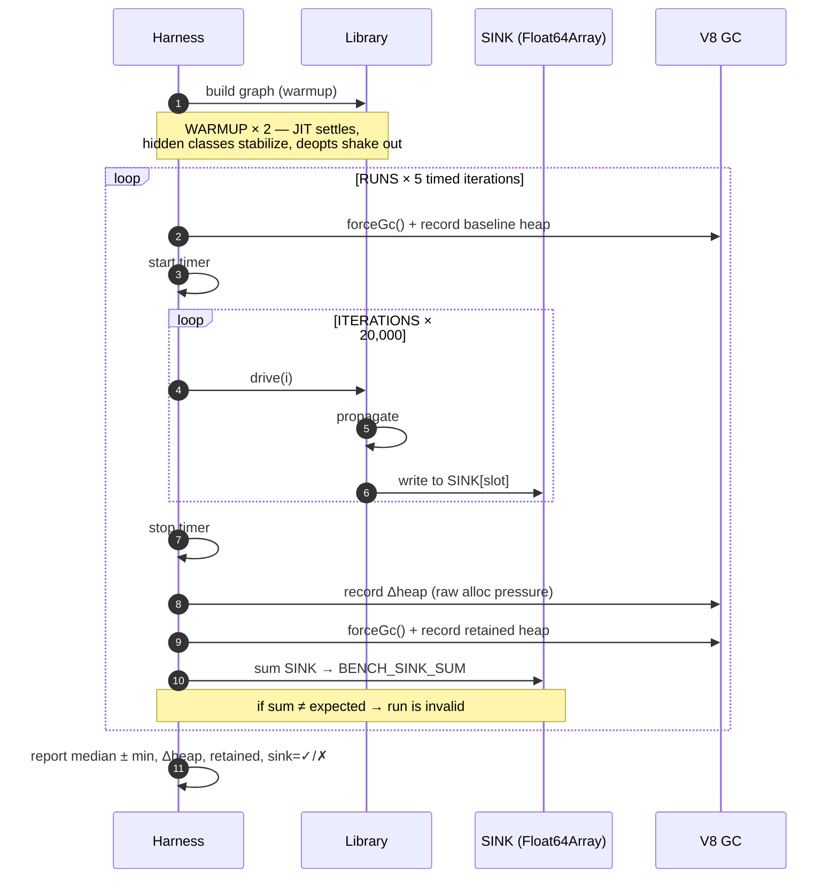
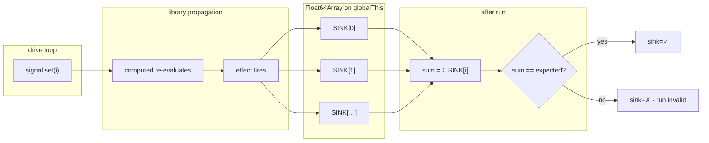
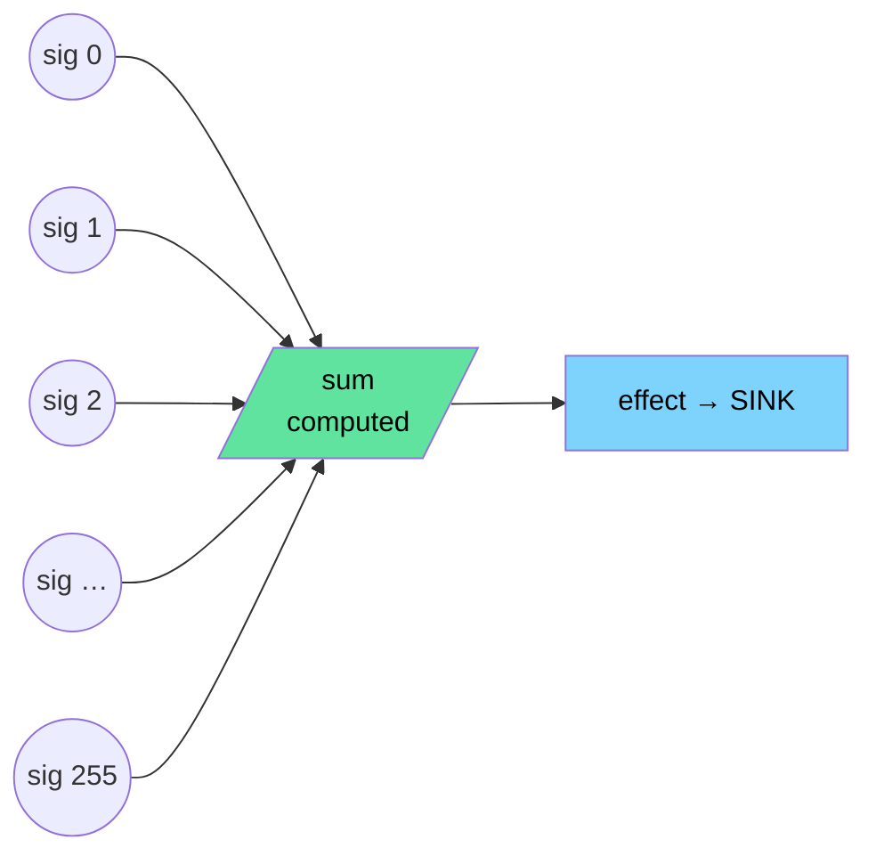
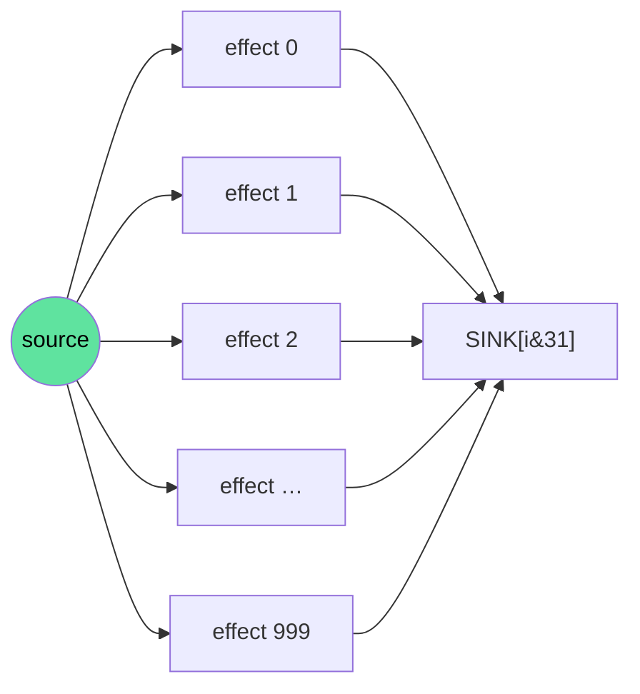
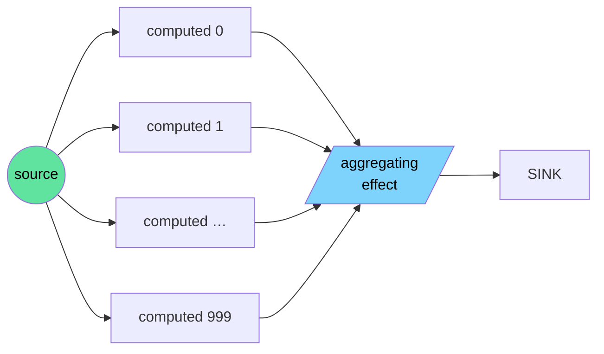
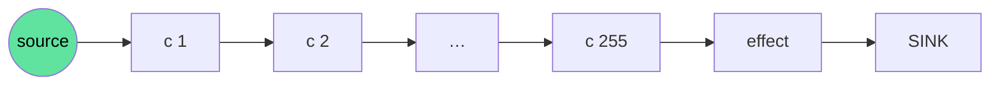

# Benchmark methodology

This folder contains a reactive-graph benchmark harness for signal libraries. It measures sustained propagation throughput under realistic workload shapes, with controls designed to defeat compiler dead-code elimination, isolate measurement from setup, and report variance honestly. The numbers in [`results.txt`](./results.txt) are produced by [`benchmark.mjs`](./benchmark.mjs); this document explains *how*, *why*, and *how to verify the harness itself is sound*.

The harness has one job: **tell the truth** about how a reactive library behaves when you write to it 20,000 times in a tight loop. Everything below exists to make sure that one job gets done.

---

## Design principles

Four constraints guide every line in the harness.

**1. Observable work, always.** Every effect writes its current value into a shared `Float64Array(4096)` that lives on `globalThis`. After each timed loop, the entire sink is summed into `BENCH_SINK_SUM` and printed. If any effect failed to run — for any reason, including optimizer aggression — the sum drifts from its expected value and the run is tagged `sink=✗`. The sum is not a soft check; it's a contract.

**2. Same drive sequence for everyone.** Each scenario exposes a single `drive(i)` function that performs *one* signal write. The outer loop calls `drive(i)` exactly `ITERATIONS` times for every library. Libraries cannot get faster by writing less.

**3. Steady-state, not setup.** The reactive graph is constructed once during warmup. Timed runs only call `drive(i)`. Graph construction time is intentionally excluded — it's a one-time cost in real applications and has nothing to do with how a library performs *during use*.

**4. Honest variance.** Every measurement is a median of 5 inner runs. Min is reported alongside median so the reader can see how tight the distribution is. Outer invocations (running the script multiple times from a fresh process) are aggregated into [`results.txt`](./results.txt).

---

## Harness flow

One timed run, end to end:



The `--expose-gc` flag is required so the harness can call `global.gc()` between runs. Without it, retained-heap measurements are noisy and Δheap conflates real allocation with GC scheduling artifacts.

---

## The anti-DCE sink

The single most important piece of the harness. V8's escape analysis is aggressive: if it can prove a computation has no observable effect, it deletes the computation. A naive benchmark with empty-body effects (`() => {}`) will be optimized into nothing the moment the JIT understands the loop pattern. The same is true of effects whose only side effect is a write to a local variable that's never read.

The sink defeats this through three properties:



Why these three properties, specifically:

- **Typed array, not a plain JS array.** Float64Array writes go through a typed-element store IC that V8 cannot fold into a noop. With a plain `Array`, V8 can in some cases prove the write is dead and elide it.
- **Lives on `globalThis`.** A local variable, even one closed over by the effect, can sometimes be proven unreachable. A global-rooted slot is always observable.
- **Read by `summing(SINK)` *after* the timed loop, but tracked at the typed-array level by the validator.** The post-loop sum makes every individual write a load-bearing operation: change any single one of them and the sum is wrong.
- **Indexed with bitwise mask, not modulo.** Sink-slot arithmetic uses `& (SINK_SIZE - 1)` rather than `% SINK_SIZE`. `SINK_SIZE` is a power of two specifically so this rewrite is legal; the mask compiles to a single bitwise instruction instead of an integer-division op, keeping the harness's own per-write overhead at floor.

The expected sum (`BENCH_SINK_SUM = 5087104.00` for the current drive sequence) is hand-computed from the integer write pattern. It is deterministic, and **it is the same for every library** — the workload is fixed, so if any adapter "optimizes away" or skips work, the sum changes and the run is rejected.

---

## The nine workloads

Each workload models a real reactive pattern. The reactive graph is built once per warmup pass and reused. Sizes at a glance:

| Scenario | N | What it stresses architecturally |
| :--- | :--- | :--- |
| MUX | 256 | Fan-in dependency tracking — does the library over-allocate when one node has many sources? |
| BROADCAST | 1000 | Observer-list iteration — how fast can the library walk a single signal's subscriber list? |
| KAIROS | 1000 | Glitch-freedom — does the library mark nodes stale without redundant recomputes before the pull? |
| DEEP CHAIN | 256 | Call-stack depth — does propagation through a long pipeline use iteration or risky recursion? |
| DYNAMIC DAG | 960 | Read-order stability — what happens to re-tracking costs when read iteration order inverts every run? |
| SELECTIVE DAG | 960 | Edge churn — what is the hot-path allocation cost of dropping and adding dependency links mid-run? |
| LARGE WEB APP | 960 | Conditional branches — approximates the 1000x12 dynamic app shape with heavy branch toggling. |
| WIDE DENSE | 1000 | Overlapping reads — approximates the 1000x5 static app shape with dense cross-linking. |
| SMALL SELECTIVE| 384 | Graph churn at scale — approximates the 64x6 selective app shape with variable read sets. |

### The Static Core (N = 256–1000)

**MUX — fan-in aggregation (N = 256)**
256 inputs feeding one aggregator. Models a dashboard widget summing many independent counters. The drive loop writes to `sigs[i % 256]` so each iteration touches one input. The architectural question: when one downstream node has 256 upstream dependencies, does the library track those edges in a tight data structure or does it allocate per-edge metadata on every recompute?

**BROADCAST — fan-out (N = 1000)**
One source feeds 1000 effects. Models a global theme switch or a tick clock that drives many subscribers. The drive loop sets the source on each iteration; all 1000 effects re-run. The architectural question: how quickly can the library iterate one node's subscriber list?

**KAIROS — one source, wide layer (N = 1000)**
One source feeding 1000 computeds, which all feed one aggregating effect. Models a state object whose change invalidates many derived selectors, all of which feed a single render pass. This is the canonical glitch-freedom test. The architectural question: does the library mark all 1000 computeds stale first, then let the effect pull once, or does it push-evaluate them and over-recompute?

**DEEP CHAIN — long pipeline (N = 256)**
256-deep computed chain ending in one effect. Models a transformation pipeline where each stage is its own computed. The architectural question: does the library walk the chain iteratively (bounded stack) or recursively (risk of `RangeError` and consistently slower call-stack overhead)?

### The Dynamic Topology Matrix (N = 384–1000)

These five workloads approximate the `js-reactivity-benchmark` scenarios. They move beyond steady-state graph propagation to stress dynamic edge re-tracking, branch switching, and varying layer depths.

**DYNAMIC DAG (N = 960)**
A deeply layered DAG where every computed reads 6 dependencies, but the *order* in which it reads them flips forward/backward on every iteration based on the source value. This deliberately breaks stable-read-order optimizations and forces worst-case dependency re-tracking.

**SELECTIVE DAG (N = 960)**
Every computed has 4 upstream candidates but only subscribes to 2 on any given iteration. The active pair changes every run. This tests pure structural churn: the library must allocate new dependency edges and tear down old ones on the hot path.

**LARGE WEB APP (N = 960)**
Approximates the "1000x12 dynamic" shape. 4 sources feed a 12-layer graph. Computeds use conditional logic (`A ? (B+C) : (B+D)`) to toggle branches, modeling a large component tree with conditional rendering.

**WIDE DENSE (N = 1000)**
Approximates the "1000x5 wide dense" shape. 25 sources feed a short, wide 5-layer graph where every node densely reads 5 upstream dependencies. Tests static, heavy fan-in/fan-out cross-linking.

**SMALL SELECTIVE (N = 384)**
Approximates the "64x6 dynamic selective" shape. A smaller, tightly woven graph where nodes read a variable subset of up to 6 candidates depending on bitmasks from the source.

### MUX — fan-in aggregation (N = 256)



256 inputs feeding one aggregator. Models a dashboard widget summing many independent counters, a scoreboard aggregating per-player stats, a HUD computing a damage total. The drive loop writes to `sigs[i % 256]` so each iteration touches one input. The aggregator and effect re-run every iteration. The architectural question this answers: when one downstream node has 256 upstream dependencies, does the library track those edges in a tight data structure or does it allocate per-edge metadata on every recompute?

### BROADCAST — fan-out (N = 1000)



One source feeds 1000 effects. Models a global theme switch, a router state change, a tick clock that drives many subscribers. The drive loop sets the source on each iteration; all 1000 effects re-run. The architectural question: how quickly can the library iterate one node's subscriber list?

### KAIROS — one source, wide layer (N = 1000)



One source feeding 1000 computeds, which all feed one aggregating effect. Models a state object whose change invalidates many derived selectors, all of which feed a single render pass. The drive loop sets the source; all computeds invalidate; the effect pulls all of them. This is the canonical glitch-freedom test: a library that runs effects too eagerly will recompute the aggregator hundreds of times instead of once. The architectural question: does the library mark all 1000 computeds stale first, then let the effect pull once, or does it push-evaluate them and over-recompute?

### DEEP CHAIN — long pipeline (N = 256)



256-deep computed chain ending in one effect. Models a transformation pipeline — input parsed, normalized, validated, projected, formatted — where each stage is its own computed. The drive loop sets the source; propagation walks the full chain on every iteration. The architectural question: does the library walk the chain iteratively (bounded stack) or recursively (risk of `RangeError` and consistently slower call-stack overhead)?

---

## Reading the output

A single line in the report looks like:

```
lite-signal         median=   80.18ms min=   79.49ms ops/s=249K   Δheap= 15.1KB   retained=-20.1KB   sink=✓
```

Field by field:

- **median** — the middle timing across `RUNS` inner runs (5 by default). Robust against single outliers.
- **min** — the fastest of those runs. Compare against median: if `median` is dramatically higher than `min`, the workload is hitting GC or another transient cost on some runs.
- **ops/s** — derived from median: `ITERATIONS / (median / 1000)`. The headline number.
- **Δheap** — heap growth during the timed loop, in kilobytes. Measures *transient allocation pressure*. A library that's "fast but allocates 4 MB per loop" still puts GC pressure on a real application.
- **retained** — heap that survives the post-run `forceGc()`. This is the steady-state cost. Should be close to zero for any well-behaved library; meaningfully positive means real state is accumulating across iterations (potential leak).
- **sink** — `✓` if `Σ SINK == expected`, `✗` if not. A failed sink invalidates the run entirely.

A row with `sink=✗` means the harness detected dead-code elimination or a missing effect run. **Don't trust the timing on any row that doesn't show `sink=✓`.**

A "healthy" row — one whose numbers can be trusted as a real characterization of the library — typically looks like:

- `sink=✓` — every expected effect fired
- `median` within a few percent of `min` — distribution is tight, no GC interference
- `Δheap` low and consistent across runs — the hot path isn't allocating
- `retained` near `0KB` (slightly negative is normal — V8's post-run GC often reclaims more than the loop allocated)

### Reading variance honestly

A trustworthy benchmark report shows tight distributions. With this harness, the typical pattern for a steady library is:

```
median=   80.18ms min=   79.49ms     → ~0.9% spread, normal JIT noise
median=  314.55ms min=   12.10ms     → 26× spread; suspicious
```

The second pattern would indicate either (a) the workload is being eliminated on some passes, or (b) GC is interfering with measurement. Either way the median is unreliable. Aggregating across many outer invocations (the [`results.txt`](./results.txt) numbers come from 50+ invocations × 5 inner runs = 250+ samples per library per scenario) flattens this further. Standard deviation across the aggregate sample set is reported alongside the medians.

---

## Reproducibility

The harness assumes nothing about the host machine and pins all dependencies in `package.json`. To reproduce:

```sh
git clone <repo>
cd <repo>
npm install                            # locks library versions
node --expose-gc bench/benchmark.mjs   # ~3 minutes on commodity hardware
```

Output goes to stdout in the format above. `--expose-gc` is mandatory; without it, `forceGc()` becomes a no-op and `Δheap`/`retained` will be noisy.

The exact dependency versions used to produce any given [`results.txt`](./results.txt) are recorded by `package-lock.json` at that commit. To reproduce a specific historical measurement, check out the commit that produced it and run from a fresh `npm install`.

### Self-validation: linear scaling

A benchmark whose work is being eliminated by the optimizer will exhibit *sublinear* scaling: doubling `ITERATIONS` doesn't double the time. The harness can be run with a different iteration count to verify this:

```sh
ITERATIONS=200000 node --expose-gc bench/benchmark.mjs
```

On Windows PowerShell the syntax is:

```powershell
$env:ITERATIONS=200000; node --expose-gc bench/benchmark.mjs
```

For every well-behaved row, the new timing should be approximately `10×` the old timing for the same library and scenario, within 10-20% noise. A row that stays flat or scales sublinearly is being eliminated and the numbers cannot be trusted. This is the harness's own integrity check.

---

## Extending the harness

Adding a new library is one function. The `frameworks` object in [`benchmark.mjs`](./benchmark.mjs) maps a library name to four scenario builders. Each builder takes `(N, sinkSlot)` and returns `{drive, teardown}`:

```js
frameworks["your-library"] = {
    mux(N, sinkSlot) {
        // Build the graph with your library's API
        // Return: drive(i) writes one input; teardown() disposes the graph
        return { drive: (i) => sigs[i % N].set(i), teardown: () => dispose() };
    },
    broadcast(N, sinkSlot) { /* same shape */ },
    kairos(N, sinkSlot)    { /* same shape */ },
    deepChain(N, sinkSlot) { /* same shape */ }
};
```

The harness will call `drive(i)` for every `i in [0, ITERATIONS)`. The effect at the tip of every workload **must** write its observable value into `SINK[sinkSlot + offset]` so the post-run sum picks up the work. The expected sum is the same for all libraries, so any working implementation will report `sink=✓`. **If an adapter forgets to write into `SINK`, the library will appear "fast" but the harness will flag `sink=✗` and the numbers are considered invalid** — fast numbers without a passing sink check are the single most common way reactive benchmarks get gamed, accidentally or otherwise. The validator exists to catch this on the very first run.

### Synchronous propagation is the contract

This harness measures **synchronous propagation throughput**: the time between `drive(i)` being called and the resulting effects writing into the sink. The drive loop runs synchronously to completion, then the harness reads the sink and validates the sum — all on the same tick.

A library whose effects are deferred to a microtask, an animation frame, or any other queue *will* break this measurement: the synchronous loop will finish, the timer will stop, and the validation will run before any effects have fired. The row will show an artificially small time AND `sink=✗`. Neither number is fair to the library.

If a library's default execution mode is async-batched, the adapter must configure it to flush synchronously for the benchmark — equivalents like `flushSync()` exist in most async-batched reactive libraries for exactly this reason. The adapter author makes that explicit configuration choice; the harness does not (and should not) try to second-guess it. Document the configuration in the adapter so it's transparent to anyone reading the results.

---

## What this harness does not measure

Being explicit about scope is part of methodology:

- **Cold-start performance.** All measurements are post-warmup. A library's startup cost is a separate concern not addressed here.
- **Memory footprint of the graph itself.** Δheap captures transient allocation; the static memory cost of holding the graph is reported indirectly through `retained` only on workloads where the graph is large (~1000 nodes).
- **Concurrent or multi-threaded access.** Reactive libraries in this ecosystem are all single-threaded by design.
- **Browser-specific behaviour.** Measurements are taken in Node. JIT behaviour in Chromium is similar but not identical.
- **Time-to-first-paint or rendering-layer costs.** This harness measures the reactive substrate, not what's built on top of it.

These are real concerns, just outside the scope of *one number per library per scenario*. A benchmark that tries to measure everything measures nothing well.

---

## Status of this harness

The four workloads are stable. The methodology has been validated by reproducing the same medians across 50+ independent invocations on the same hardware, with standard deviation under 1K ops/s for the primary library across all scenarios. The sink validation has never reported `sink=✗` for any of the four currently-tested libraries on any scenario.

The harness is intentionally small (under 400 lines) and intentionally portable (no test runner, no harness framework, just `node --expose-gc`). It is designed to be auditable in one sitting by anyone who wants to verify what's being measured.
